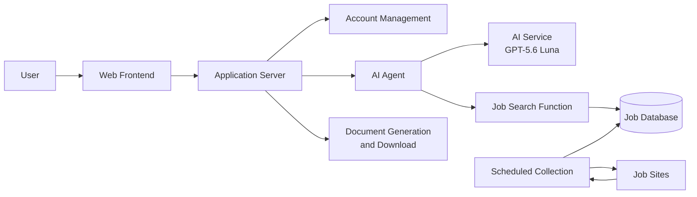
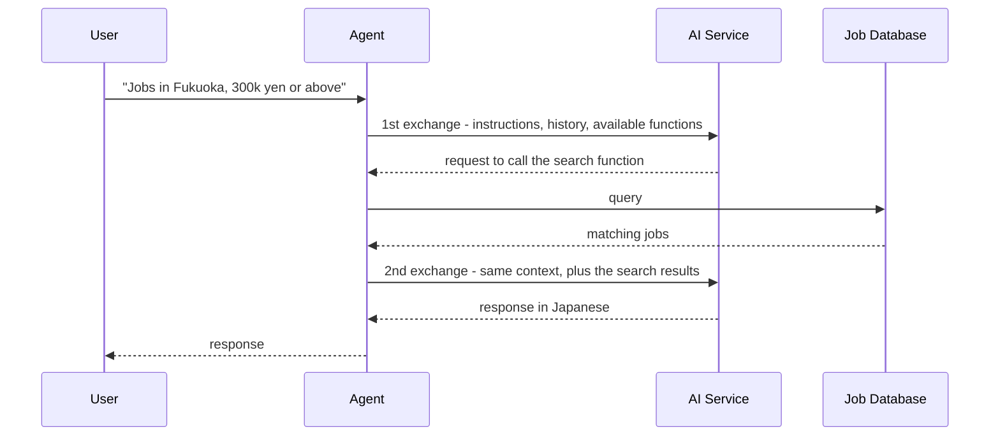
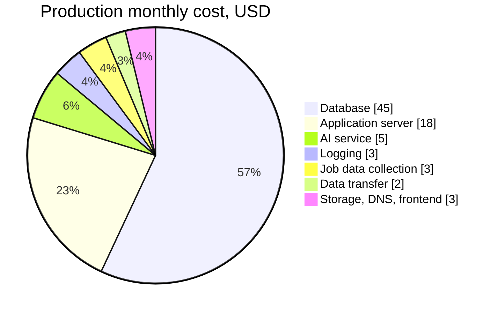
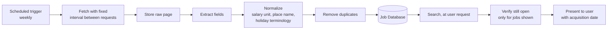
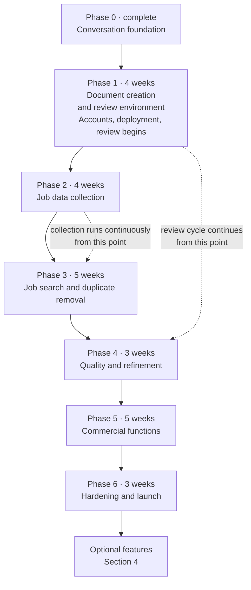
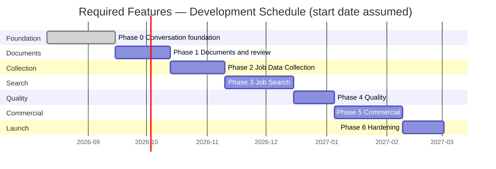
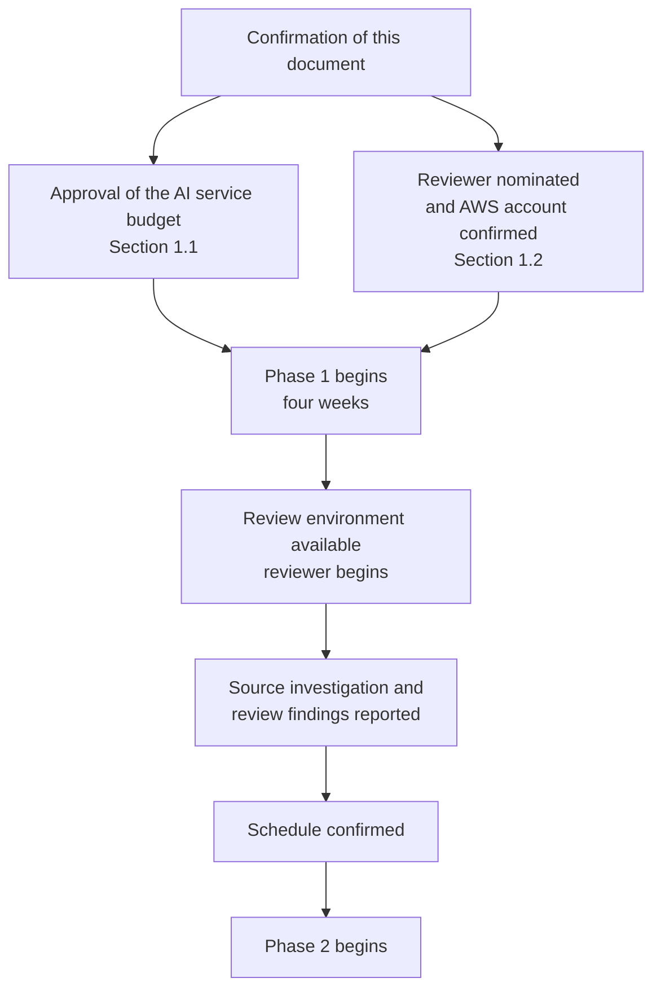

# AI Job Navigator — Project Schedule and Requirements

**Subject document:** AI_Job_Navigator_Client_Requirements_Engineering_Specification_EN_Updated.docx
**Date: 6 September 2026**
**Version: v6.0**

---

## 0. Purpose of This Document

This document sets out four things:

1. What we require from your side, and at which point in the project each item is needed
2. The expected cost of development and of running the service
3. The proposed development schedule for the **required** features
4. A separate list of **optional** features, to be scheduled only after the required work is complete

### Required and optional

The features described in this document are divided into two groups.

**Required features** are those defined across the MVP phases of the requirements specification. These form the product, and are the only features in the schedule in Section 3.

**Optional features** are additions that may be built once every required feature is complete. They are listed in Section 4 with their own estimates, and are deliberately excluded from the Section 3 schedule so that the timeline reflects only what the product needs in order to function.

### Development resourcing

Development is carried out by one developer. The timeline in Section 3 is calculated on that basis.

### System overview

### Job data acquisition policy

We have received your guidance that when acquiring data by scraping, care must be taken not to place a load on the other party's servers. This is reflected in the design.

Collection runs on a schedule with a fixed minimum interval between requests, and is never triggered by user activity. The volume of access to each source is therefore determined by our schedule and stays constant, rather than rising with the number of users. Where a source offers a structured data endpoint we will use it in preference to parsing pages, as it is lighter on their servers and more stable in operation.

### Current implementation status

| Layer | Status |
|---|---|
| Conversation infrastructure — response streaming, concurrent access safety, data persistence, conversation history summarization | **Complete.** Production quality |
| AI agent framework — function invocation loop, context assembly, AI service abstraction | **Complete.** Now driving the document generation functions rather than a single trivial one |
| Web interface — chat screen, conversation list, theming, sign-in screen | **Complete for chat and sign-in.** No other screens exist |
| Account management — login, sessions, roles, administrator permissions | **Largely complete.** Session-based sign-in, role separation and permission-controlled administration are in place. Self-registration, password reset and email verification remain |
| Document creation — templates, generation, file output | **Substantially complete, ahead of schedule.** The 履歴書 is produced as an Excel file filling the approved JIS-style form, and the 職務経歴書 as a Word file, both built from the formats supplied by your side. The AI conducts the interview and the finished document is downloaded from the chat screen. Document upload and text extraction remain |
| Operational settings — adjusting AI behaviour without restarting the service | **Complete.** Backend only; no screen yet |
| Job data — collection, storage, search, duplicate removal | **Not started** |
| Payment, human support, admin dashboard | **Not started** |

Approximately 30 to 35 percent of the total build is complete. Phase 0 of the schedule in Section 3 — the foundation that allows a reliable AI conversation to take place — is finished, and a substantial part of Phase 1, the creation of the 履歴書 and 職務経歴書, has been built early against the real formats supplied by your side.

**The phase order has been revised in this version.** Document creation has been brought to the front of the plan and job data collection moved behind it, so that working software reaches a reviewer on your side in the first phase rather than in the fifth month. Section 3.3 sets out why.

---

## 1. Required from the Client

### 1.1 AI service — the one item required immediately

**This is the only request in this document that is needed now rather than at a later phase.**

The application requires a commercial AI service. We propose **GPT-5.6 Luna**, charged at **USD 0.20 per million input tokens** and **USD 1.20 per million output tokens**.

**Why the current development environment is not sufficient.** Development is presently running against two stopgap options, and neither can carry the project forward:

| Current option | Problem |
|---|---|
| A locally hosted model | Too slow for practical iteration, and the response quality is not sufficient to judge whether a feature works |
| A free-tier hosted model | Intermittently blocked by usage limits. Automated testing cannot be relied upon to complete |

**Which parts of the project depend on it:**

| Phase | Feature requiring the AI service | Without it |
|---|---|---|
| Phase 1 | AI interview, document content generation, and the review cycle with your reviewer | This is the substance of the phase. It cannot be developed, and cannot be put in front of a reviewer |
| Phase 1 | Response quality evaluation framework | No quality baseline can be established |
| Phase 3 | Natural-language condition structuring | Cannot be developed or verified |
| Phase 4 | Japanese response quality work | This is the purpose of the phase |
| Phase 5 | Judgement of when to hand over to a human operator | Cannot be verified |

Phase 1 cannot begin in earnest without it, and it is required continuously from that point. Phase 2 is the one phase that does not depend on it, as data collection performs no AI processing.

#### Cost per operation

Measured against the current system configuration:

| Operation | Cost |
|---|---|
| First message of a conversation | \$0.0010 |
| A normal conversational turn | \$0.0016 |
| A turn that performs a job search | \$0.0033 |
| One conversation history summarization | \$0.0009 |
| **A complete 30-turn consultation** | **approx. \$0.08** |

A job search costs roughly twice a normal turn because it requires two exchanges with the AI service.

**Figure 1 — Example flow: a user asking for job listings**

#### Monthly cost during development

Cost is not constant. It concentrates in the phases where AI behaviour is built and tuned:

| Phase | Duration | AI service per month |
|---|---|---|
| **Phase 1 — Document creation and review environment** | 4 weeks | **\$50** |
| Phase 2 — Job data collection | 4 weeks | \$15 |
| **Phase 3 — Job search** | 5 weeks | **\$45** |
| **Phase 4 — Quality and refinement** | 3 weeks | **\$40** |
| Phase 5 — Commercial functions | 5 weeks | \$10 |
| Phase 6 — Hardening and launch | 3 weeks | \$20 |
| **Total across the remaining project** | 24 weeks | **approx. USD 165** |

**We propose a ceiling of USD 50 per month, expected to be reached only during Phase 1 and Phases 3 to 4.**

For context: reaching USD 100 in a month would require approximately 4,400 full-length AI requests every day. Manual testing by one developer cannot approach that volume, so the limit functions as a safety measure rather than an expected cost.

**The principal risk is a software defect rather than usage.** A fault causing the AI to call the same function repeatedly would consume approximately USD 5 per hour if left unattended. Two safeguards are put in place when the service account is created, before any development work uses it: a hard spending limit on the account, and a maximum-iteration guard within the agent itself.

### 1.2 Items required at later phases

Each item is listed against the phase at which it becomes necessary, so that it can be prepared in advance rather than requested at short notice. **Two of them fall in Phase 1**, which begins as soon as this document is agreed, and are therefore near at hand rather than distant.

| Required by | Item | Purpose |
|---|---|---|
| ~~Phase 2~~ **Received** | Real 履歴書 / 職務経歴書, with personal details removed | Three separate purposes — see below. The documents provided have been used to build the templates and are reflected in the current implementation |
| ~~Phase 2~~ **Received** | The 履歴書 / 職務経歴書 format to be used as the base | Document template development. Complete |
| **Phase 1** | An AWS account, or your approval for us to create one and bill it to you | The review environment described in Section 3.3 is hosted there. Its cost is set out in Section 2.2 |
| **Phase 1 onward** | **A nominated Japanese-speaking reviewer** | Ongoing review of the AI's Japanese and of the generated documents. See 1.3 |
| **Phase 5** | Payment system credentials and integration details | See 1.4 |
| **Phase 6** | Production domain and DNS control | TLS certificates and the production environment |

**On the request for real documents.** These are needed for three distinct reasons, and no invented example can substitute for any of them:

1. **To build the template.** We need to see the actual layout of the format in use — which sections appear, in what order, under what headings, with what spacing. A fill-in template cannot be built from imagination.
2. **To show the AI what good output looks like.** Providing the AI with real, approved examples is the most effective way to make its Japanese read naturally. This is the direct remedy for the register issue described in Section 1.3.
3. **To measure quality.** Judging whether the AI's output is acceptable requires something to compare it against. Without real examples, the question of whether output is good enough has no answer.

Real documents also carry variety that invented ones do not — career gaps, career changes, part-time periods — which is exactly what the system must handle correctly.

Personal details are not needed and should be removed. What is required is the structure and the writing style.

### 1.3 AI response quality review — begins at Phase 1

This is a request for ongoing involvement rather than a one-off deliverable. Under the revised phase order it begins in the first phase, and the value of that reordering depends on it.

The AI model produces grammatically correct Japanese. The risk is not correctness but **register** — whether a 職務経歴書 reads as something a Japanese hiring manager or company officer would find appropriate. This cannot be measured by any automated benchmark.

We therefore ask that a Japanese-speaking reviewer be nominated on your side from Phase 1 onward. Once the review environment described in Section 3.3 is available, they use the software as a user would and report on three things:

1. Whether the AI's Japanese reads naturally, at an appropriate level of politeness
2. Whether the information they gave during the conversation was captured correctly and in full
3. Whether the generated 履歴書 and 職務経歴書 files are correct — placement, wording, and anything a Japanese reader would find out of place

Approximately two hours per review cycle is expected.

**How that feedback is used.** Every point raised is first recorded as a test case, so that it is re-checked automatically on every subsequent change. A single observation becomes a test case; a pattern observed repeatedly becomes a change to the AI's instructions. The distinction matters in practice — instructions edited in response to each individual comment grow long and self-contradictory, and quality falls rather than rises.

Beyond that, feedback is applied in escalating steps: first by adjusting the AI's written instructions, then by adding approved examples for the AI to follow, and if necessary by retrieving relevant approved examples automatically for each case. Only if those measures reach their limit and quality is still short of acceptable would we recommend moving to a higher-grade AI model. That is a configuration change requiring no modification to the application, though the running cost rises by approximately a factor of ten to fifteen — from approximately USD 0.08 per consultation to approximately USD 0.80–1.20 per consultation. At ten users this remains modest; we would recommend reassessing before any significant increase in user numbers.

### 1.4 Payment system — required at Phase 5

We understand the payment system to be the environment indicated at the reference provided, which is a GMO Payment Gateway environment rather than a general-purpose international provider.

To size and build this work we will need the following, by Phase 5:

| Item | Note |
|---|---|
| Which integration method is to be used | GMO offers a hosted redirect type (リンクタイプ), a server module type (モジュールタイプ), and a direct protocol type (プロトコルタイプ). The effort involved differs substantially between them |
| Test environment credentials (shop ID, shop password) | Issued under your GMO contract. No payment code can be written or tested before these are available |
| Which payment methods are in scope | Credit card only, or also convenience store payment, bank transfer, carrier billing. Each is a separate integration, and non-card methods complete asynchronously rather than immediately |
| Whether 3-D Secure is required | Adds an additional bank verification step to the payment flow |
| Pricing plans, free-tier scope, and cancellation rules | Still listed as undecided in the specification |

**The Phase 5 estimate is provisional until the integration method is known.** A hosted redirect integration is approximately two weeks; a direct protocol integration is approximately four. The schedule in Section 3 assumes an intermediate figure.

---

## 2. Costs

All figures are in US dollars and assume the AWS Asia Pacific (Tokyo) region. They are estimates and should be confirmed with the AWS Pricing Calculator before being treated as final.

### 2.1 Development approach — local first

Development is carried out on a local machine, and cloud infrastructure is provisioned only when a feature requires it. Provisioning a full production environment from the first week would mean paying for it months before it is needed.

The points at which cloud infrastructure becomes necessary:

| Requirement | Phase | Reason |
|---|---|---|
| A development environment your reviewer can reach | Phase 1 | The reviewer must be able to use the software themselves. A machine on our desk cannot be reached from your side |
| Unattended scheduled collection | Phase 2 | A development machine is not continuously available; the job corpus must accumulate without interruption |
| Payment gateway callbacks | Phase 5 | The payment provider must be able to reach the application server directly. A local machine cannot receive these |
| TLS, production domain, session security | Phase 6 | Required before any public use |
| Load testing at ten concurrent users | Phase 6 | Cannot be measured locally with confidence |

**The first of these is new in this version and is the reason the cost profile has changed.** Under the previous plan the first cloud environment appeared in Phase 5. Bringing the review environment forward to Phase 1 costs approximately USD 25 per month from an earlier point, and in exchange the reviewer's feedback arrives in the first month rather than the fifth. Deploying in the first phase also means any deployment problem is found at the start of the project rather than at the end, when remedy is most costly.

### 2.2 Development period cost

| Phase | Duration | Environment | AWS | AI service | **Monthly rate** |
|---|---|---|---|---|---|
| Phase 0 — Conversation foundation | complete | Local only | \$0 | — | **incurred** |
| Phase 1 — Document creation and review environment | 4 weeks | Local + review environment | \$25 | \$50 | **\$75** |
| Phase 2 — Job data collection | 4 weeks | + collection instance | \$30 | \$15 | **\$45** |
| Phase 3 — Job search | 5 weeks | Same | \$32 | \$45 | **\$77** |
| Phase 4 — Quality and refinement | 3 weeks | Same | \$32 | \$40 | **\$72** |
| Phase 5 — Commercial functions | 5 weeks | + staging | \$55 | \$10 | **\$65** |
| Phase 6 — Hardening and launch | 3 weeks | Production + staging | \$85 | \$20 | **\$105** |

**Total cost of development across the remaining project: approximately USD 400.** Of this, approximately USD 235 is AWS and USD 165 is the AI service.

This is higher than the USD 330 given in the previous version, and the difference is the review environment. It runs from Phase 1 rather than Phase 5, so approximately four additional months of a small AWS environment are paid for. We consider that a good exchange: it is what allows the AI's Japanese and the generated documents to be judged by a Japanese reader at the beginning of the project, when acting on their feedback is still inexpensive.

Development servers are assumed to run during working hours only and to be stopped overnight and at weekends, which reduces their cost by approximately seventy percent against continuous operation. The review environment is the exception — it is left available during your reviewer's working hours as well as ours, and the figures above allow for that. If every environment were instead left running continuously, the AWS portion would rise to approximately USD 600 for the project, while the AI portion would be largely unchanged, since AI cost is determined by the volume of testing performed rather than by elapsed time.

### 2.3 Production at launch

Assumes ten concurrent users, as specified.

| Item | Specification | Monthly |
|---|---|---|
| Application server | EC2 t4g.small (2 vCPU / 2 GB) | \$18 |
| Database | RDS PostgreSQL db.t4g.small, 50 GB, single-AZ | \$45 |
| Job data collection | Fargate scheduled task, approx. 24 hrs/month | \$3 |
| Document storage | S3 | \$1 |
| Frontend delivery | CloudFront + S3 | \$1 |
| DNS | Route 53 | \$0.50 |
| Logging | CloudWatch | \$3 |
| Data transfer | | \$2 |
| **Infrastructure subtotal** | | **\$74** |
| AI service | 10 concurrent users | \$5 |
| **Total** | | **approx. USD 79 / month** |

Adding a load balancer for redundancy raises this by approximately USD 20 per month. It is not recommended at ten concurrent users, and is the natural first upgrade once traffic grows.

### 2.4 On reserved pricing

AWS offers discounts of approximately 30 to 40 percent in exchange for a one-year commitment to a given level of usage.

**We recommend against committing at this stage.** At ten concurrent users the total infrastructure cost is approximately USD 74 per month, so the saving would be around USD 25. Securing it would require fixing the server configuration for a year, before any real usage has been observed, and while user numbers are expected to change.

We propose running on standard on-demand pricing for the first three to six months after launch, measuring actual usage, and purchasing a one-year commitment against the observed baseline at that point.

### 2.5 Two cost items to be aware of

**NAT Gateway.** A commonly used AWS network component charged at approximately USD 32 per month regardless of usage. Many standard reference architectures include it by default. At this scale it is unnecessary, and the design proposed here avoids it. Were it included, it would be the largest single line item in Section 2.3.

**Database storage growth.** Server capacity will not be strained by ten users, as the AI service performs the processing. Storage will grow: approximately 100,000 job records with search indexes require around 600 MB for the index alone. We recommend budgeting for 50 to 100 GB within the first year. Retaining uploaded and generated documents indefinitely, as currently intended, adds to this over time and is worth reviewing annually.

---

## 3. Development Schedule — Required Features

### 3.1 Method

Development proceeds in seven phases, of which **Phase 0 is already complete**. **Each phase concludes with a demonstration of working software and a written progress report.**

From Phase 1 onward the demonstration takes place in the review environment, which your reviewer can reach themselves, rather than as a presentation given by us.

Phase length varies according to the work involved rather than being fixed, since the phases differ considerably in size. Automated testing is carried out within each phase rather than deferred to a single stage at the end.

### 3.2 Scope of the initial release

The following are delivered in a defined initial form at launch, with the remainder addressed afterwards. This is set out explicitly so that the scope behind the timeline is clear, and so that any item can be brought forward if you would prefer it included.

| Item | At launch | Addressed afterwards |
|---|---|---|
| Job sources | Two sources | Remaining two sources added |
| Duplicate removal | Exact matching on company, title and location | Cross-source matching, once a large body of real data exists |
| Document format | One 履歴書 / 職務経歴書 format; Excel output for the 履歴書 and Word output for the 職務経歴書, matching the approved samples | Additional formats and PDF output |
| Admin dashboard | The functions required for operation | Remaining functions, as operational need appears |

The principle applied is to limit breadth rather than depth. Additional sources and additional templates are straightforward to add to a working system. Duplicate removal is the one item that becomes harder to address the longer it is deferred, which is why it is reduced rather than omitted, and why collection starts in Phase 2 and runs continuously from then on.

### 3.3 Two principles in the plan

**Phase 1 delivers a complete feature into an environment your side can use.** By the end of it, a user registers, signs in, is interviewed by the AI, and downloads a finished 履歴書 and 職務経歴書 — running on AWS rather than on a developer's machine, so that your Japanese-speaking reviewer can exercise it directly.

This is the reordering that distinguishes this version of the plan from the previous one, and the reason for it is that three questions can only be answered by a Japanese reader looking at real output:

1. Does the AI's Japanese read naturally?
2. Is what the user said during the conversation captured correctly?
3. Is the produced file correct as a document?

None of these can be settled by us, by any automated test, or by a demonstration we drive ourselves. Answering them in month one rather than month five is the single largest reduction of risk available in this plan: the same feedback arriving late would mean reworking a document pipeline that later features already depend on. It also proves the deployment path at the start of the project rather than at the end.

**Job data collection begins in Phase 2 and runs continuously thereafter.** Duplicate removal depends on having a substantial body of real data, and that data accumulates over calendar time rather than through effort. By the time duplicate removal is built in Phase 3 and refined in Phase 4, approximately one to three months of collected data will be available to work against. Raw pages are stored before any field extraction, so that when extraction logic is improved it can be re-run over data already held rather than requiring the sources to be accessed again.

Collection is deliberately the first job-data work carried out, ahead of search, for that reason. It is also the one part of the system that does not need the AI service at all.

### 3.4 The job data pipeline

**Figure 2 — Job data flow, from collection through to presentation**

### 3.5 Schedule

| Phase | Content | Duration |
|---|---|---|
| **Phase 0** | Conversation foundation | **Complete** |
| | Conversation infrastructure: streaming replies, persistence, history summarization | |
| | AI agent framework, AI instruction set, AI service abstraction | |
| | Chat interface and conversation list | |
| | Sign-in, sessions, and permission-controlled administration | |
| **Phase 1** | Document creation and review environment | **4 weeks** |
| | AI interview for the 履歴書 / 職務経歴書 — **built** | |
| | Excel and Word generation and download — **built** | |
| | Reliable retention of what the user has already given, over a long conversation | |
| | User accounts: registration, password reset, email verification | |
| | **Review environment on AWS: deployment, TLS, session security** | |
| | Controlled database change management, required once an environment holds data that cannot be discarded | |
| | **Review cycle with your reviewer, and the quality evaluation framework built from it** | |
| | Investigation of the job sources, carried out alongside the review cycle | |
| **Phase 2** | Job data collection | **4 weeks** |
| | Job data structure and database design | |
| | Collection framework with request rate control | |
| | Raw page storage and field extraction | |
| | First two sources collecting continuously | |
| **Phase 3** | Job search | **5 weeks** |
| | Normalization of salary units, place names, holiday terminology | |
| | Duplicate removal | |
| | Natural-language condition structuring | |
| | Search function and AI integration | |
| | Verification that every listing the AI quotes exists in the database | |
| | Document upload and text extraction | |
| **Phase 4** | Quality and refinement | **3 weeks** |
| | Japanese response quality, against accumulated reviewer feedback | |
| | Posting currency verification, acquisition date display | |
| | User confirmation screen, result presentation | |
| | Duplicate removal tuning | |
| **Phase 5** | Commercial functions | **5 weeks** |
| | Payment integration, plans, cancellation | |
| | In-app human support and handover | |
| | Admin dashboard | |
| **Phase 6** | Hardening and launch | **3 weeks** |
| | Performance, security, load testing at 10 concurrent users | |
| | Production environment, acceptance testing support | |
| **Total remaining** | | **24 weeks** |

**Approximately five and a half months from the start of Phase 1.**

The previous version gave 25 weeks for seven phases. Phase 0 and a large part of the document creation work are now delivered, and the effort that recovers is spent bringing the review environment and the account system forward into Phase 1 — which is why the remaining total is 24 weeks rather than substantially less. What has changed is not the amount of work but its order: the part of the product that only a Japanese reader can judge is now built and reviewed first.

Phase 1 keeps its full four weeks even though the document generation within it is built, because what remains there cannot be sized with confidence until the review cycle begins. Any time recovered will be reported at the phase boundary in the usual way.

**Figure 3 — Phase sequence. Each phase concludes with a demonstration.**

### 3.6 On the original three-month estimate

The original three-month figure was produced before the requirements specification existed, and covered a smaller scope. The specification as written represents approximately twice that work.

The increase comes from work that was not present in the original outline: account management, payment processing, the administrative dashboard, human support, security hardening, acceptance testing, and the removal of duplicate job listings appearing across multiple sources.

### 3.7 Schedule confirmation

Two items cannot be estimated with full confidence until real data has been examined: the stability of collection from the job sources, and the accuracy achievable in duplicate removal. A third, the payment integration, depends on the method described in Section 1.4. A fourth is new to this version: how much refinement the AI's Japanese requires cannot be known until your reviewer has seen it.

**We therefore ask that the schedule above be treated as provisional, and that firm dates be agreed at the end of Phase 1.** Phase 1 includes the investigation of the job sources and the first review cycles, so at its conclusion — four weeks from the start — both of the largest unknowns will have been examined and a confirmed schedule can be provided.

Where a phase runs longer than estimated, this will be reported at the phase boundary rather than at the end of the project, and the scope items in Section 3.2 remain available as adjustments in either direction.

If a shorter timeline is required, the most effective single change is to defer Phase 5 — payment, human support, and the admin dashboard — which brings a complete and demonstrable product forward by five weeks.

---

## 4. Optional Features

The following are **not included in the schedule in Section 3** and are not required for the product to function. They are recorded here with estimates so that they can be scheduled deliberately, as a separate piece of work, once every required feature is complete.

| Feature | Duration | Depends on |
|---|---|---|
| **Notification system** — saved search conditions, daily matching against new postings, email delivery infrastructure, notification preferences | 3 weeks | Phase 3 |
| **Remaining two job sources** | 2 weeks | Phase 2 collection framework |
| **Refined duplicate removal** — cross-source matching rather than exact matching | 3 weeks | A large body of real data |
| **Career Advancement Assessment** — assessment of a completed 職務経歴書, with administrator review | 3 weeks | Phase 1 and the admin dashboard |
| **LINE integration** — official account, Messaging API, and linking a LINE account to a service account | 2.5 weeks | Notification system |
| **OCR** — reading scanned images and photographs of documents | 2 weeks | Phase 3 |
| **Full admin dashboard** — the remaining functions | 2 weeks | Phase 5 |
| **Additional document formats and PDF output** | 1 week | Phase 1 |
| **Document delivery by email** | 3 days | Notification system |
| **Social media job sources** | 3 weeks | Investigation first; may prove infeasible |
| **Total, if all are built** | **approx. 22 weeks** | |

These are listed in the order in which we would recommend building them. None needs to be decided now.

### 4.1 Notes on individual items

**The notification system is the item most likely to be wanted first.** It is the reason saved search conditions appear in the specification. Until it is built, a user re-runs a search themselves rather than being informed of new matches. The product functions without it; it is less convenient.

**Email is not otherwise required.** With notifications excluded from the required scope, generated documents are delivered by download from the browser. A minimal email capability is still built in Phase 1 for account functions — password reset and address verification — as an account system without them is not usable in practice. That is infrastructure supporting accounts, and is distinct from the notification feature.

**Social media sources may prove infeasible rather than merely costly.** For several platforms, no means of searching public posts is made available to third parties. The estimate above assumes a route exists, and investigation should precede any commitment.

**Career Advancement Assessment cannot be built earlier** regardless of priority. It operates on a completed 職務経歴書 and requires an administrator review flow. Document creation is now in place, so the remaining dependency is the admin dashboard in Phase 5.

---

## 5. Assumptions

Where any of these proves incorrect, the affected figures will change.

- One developer for the duration of the project
- Ten concurrent users at launch
- Two job sources at launch, with the remaining two added afterwards
- Duplicate removal by exact matching at launch, refined once sufficient real data exists
- One 履歴書 / 職務経歴書 format at launch, output as Excel and Word to match the approved samples; additional formats and PDF output added later
- Admin dashboard limited at launch to the functions required for operation
- Everything listed in Section 4 is excluded from the schedule in Section 3
- Human support via in-app chat only
- Generated documents delivered by download; email is used only for account functions
- Uploaded and generated documents retained indefinitely, per current intent
- Development conducted locally, with cloud infrastructure provisioned per Section 2.1
- A review environment on AWS from Phase 1, reachable by your nominated reviewer
- A Japanese-speaking reviewer available for approximately two hours per review cycle from Phase 1 onward
- Phase length varies according to the work involved
- User interface and screen design determined by us, subject to your review
- The Terms of Service and Privacy Policy are produced by your side

---

## 6. Next Steps

The only item required in order to begin is the AI service approval in Section 1.1. Two further items — the AWS account and the nominated reviewer — are needed within Phase 1 and are best settled at the same time. Everything else in Section 1 falls at a later phase and is listed so that it can be prepared in good time.

We look forward to your confirmation.
