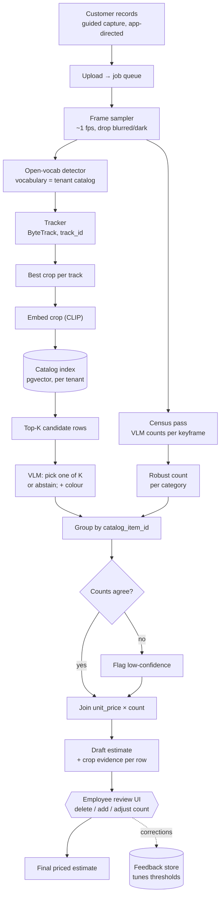

```mermaid
flowchart TD
    A["Customer records<br/>guided capture, app-directed"] --> B["Upload → job queue"]
    B --> C["Frame sampler<br/>~1 fps, drop blurred/dark"]

    C --> D["Open-vocab detector<br/>vocabulary = tenant catalog"]
    D --> E["Tracker<br/>ByteTrack, track_id"]
    E --> F["Best crop per track"]
    F --> G["Embed crop (CLIP)"]
    G --> H[("Catalog index<br/>pgvector, per tenant")]
    H --> I["Top-K candidate rows"]
    I --> J["VLM: pick one of K<br/>or abstain; + colour"]
    J --> K["Group by catalog_item_id"]

    C --> P["Census pass<br/>VLM counts per keyframe"]
    P --> Q["Robust count<br/>per category"]
    Q --> K

    K --> R{"Counts agree?"}
    R -->|yes| L["Join unit_price × count"]
    R -->|no| S["Flag low-confidence"]
    S --> L

    L --> M["Draft estimate<br/>+ crop evidence per row"]
    M --> N{{"Employee review UI<br/>delete / add / adjust count"}}
    N --> O["Final priced estimate"]
    N -.corrections.-> T[("Feedback store<br/>tunes thresholds")]
```