# AI Job Navigator — System Glossary and Architecture Primer

**Audience:** project members who need a shared vocabulary for the technical discussions.

**Purpose:** to establish precisely what is being built, what each component does, and where the boundaries between them lie.

---

## 0. The Core Distinction

The single most important point in this document:

> **We are not building a large language model. We are building an application that uses one.**

The language model is a component — a replaceable one. It is supplied by an external provider (or run locally), it is called over a network interface, and it can be exchanged for a different model without rewriting the application.

Everything that makes AI Job Navigator a product — user accounts, conversation history, job data, resume generation, payment, the decision of *when* to search and *what* to do with the results — is our own software. The model contributes language understanding and generation. It contributes nothing else.

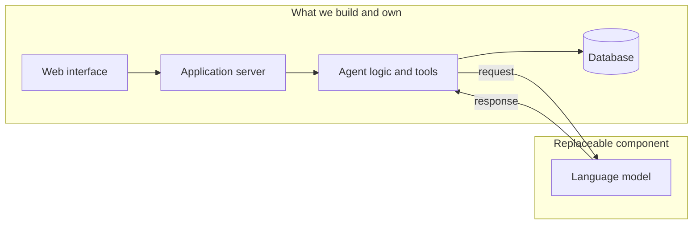

A useful comparison: a company that builds an accounting system uses a database engine, but is not in the database business. We use a language model, but we are not in the language model business.

---

## 1. Terminology

### 1.1 About the models themselves

**LLM (Large Language Model)**
A statistical model trained on very large volumes of text, which predicts what text should follow a given input. It has no memory between calls, no access to the internet, and no ability to take action on its own. Every call is independent. GPT, Claude, Gemma, and Qwen are all LLMs.

**Token**
The unit an LLM reads and writes — roughly a word fragment. English averages about four characters per token; Japanese is considerably denser, at roughly one to one and a half characters per token. All API pricing is per token, so token count is the unit of cost.

**Context window**
The maximum number of tokens a model can consider in a single call — the system instructions, the conversation history, and the new question, all together. When a conversation exceeds it, older content must be removed or summarized. Our system handles this automatically through rolling summarization.

**Inference**
The act of running a model to produce output. "Inference cost" and "inference speed" refer to running the model, not training it. We do not train models.

**Prompt / System prompt**
The text given to the model. The *system prompt* is the persistent instruction block defining the assistant's role, tone, and output format — in our system, the file that defines the career-advisor persona.

**Fine-tuning**
Further training of an existing model on specialised data to change its default behaviour. This is expensive, slow, and creates a model we must then maintain ourselves. **It is not part of this project.** We shape behaviour through prompting and tools instead, which is adjustable in minutes rather than days.

**Hallucination**
When a model produces confident but factually incorrect output. This is inherent to how LLMs work and cannot be eliminated by prompting. It is mitigated architecturally: the model is given real data to work from rather than being asked to recall facts. This is precisely why our job search reads from our own database rather than asking the model what jobs exist.

### 1.2 About the architecture

**Agentic / Agent**
A system in which the LLM does not merely reply, but is given a set of *tools* it may call, and runs in a loop: think, call a tool, read the result, think again, and repeat until the task is done. The distinguishing property is that the number and order of steps are decided at runtime by the model, not fixed in advance by the programmer.

**Tool (or Function Calling)**
A capability we expose to the model — a function it may request. The model does not execute anything; it returns a structured request such as `search_jobs(location=Fukuoka, salary_min=250000)`. **Our code executes it**, validates the arguments, and returns the result. The model can only ask; the application decides and acts. This boundary is where all security and business rules live.

**Agnostic**
Independent of any specific implementation. Our system is *provider-agnostic*: it is written against a generic interface, so OpenAI, OpenRouter, and a locally run Ollama model are all interchangeable behind a single configuration setting. This is a deliberate design property, not an accident — it is what allows development on a local model and production on a commercial one, using identical code.

**Orchestration**
Coordinating the multiple steps of a task: which step runs next, what happens on failure, when to stop. In our system this is what LangGraph does.

**RAG (Retrieval-Augmented Generation)**
Fetching relevant real data first, then giving it to the model along with the question, so that the answer is grounded in facts we control rather than in the model's training data. Our job search follows this pattern.

**Checkpointing**
Saving the agent's state at each step so a conversation can be resumed exactly where it left off, across server restarts. Our checkpoints are stored in PostgreSQL, keyed by conversation.

**SSE (Server-Sent Events)**
A one-way streaming channel from server to browser. It is how the assistant's reply appears progressively rather than after a long pause.

**Idempotency**
The property that repeating the same request produces the same result rather than duplicating work — so a user who taps "send" twice does not pay twice or receive two replies.

---

## 2. What This System Is, and How It Differs from a ChatGPT-Style App

### 2.1 A ChatGPT-style application

A thin layer over a model. The user types, the text is forwarded to the model with some history attached, the reply is displayed. The application holds no domain knowledge and takes no actions. Its entire value is convenient access to the model.

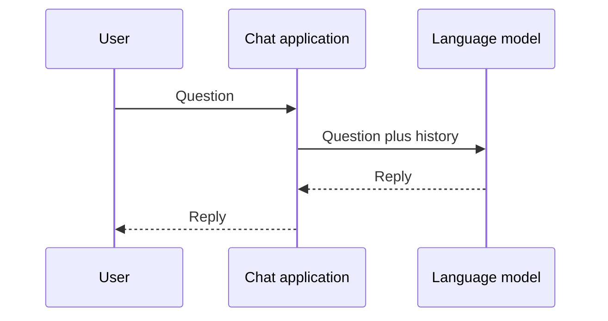

Ask it about Fukuoka jobs and it produces something plausible from its training data. It cannot know what is actually posted today, because it has no access to any job data at all.

### 2.2 An agentic application

The model becomes the *reasoning component* of a larger system that holds real data and can act.

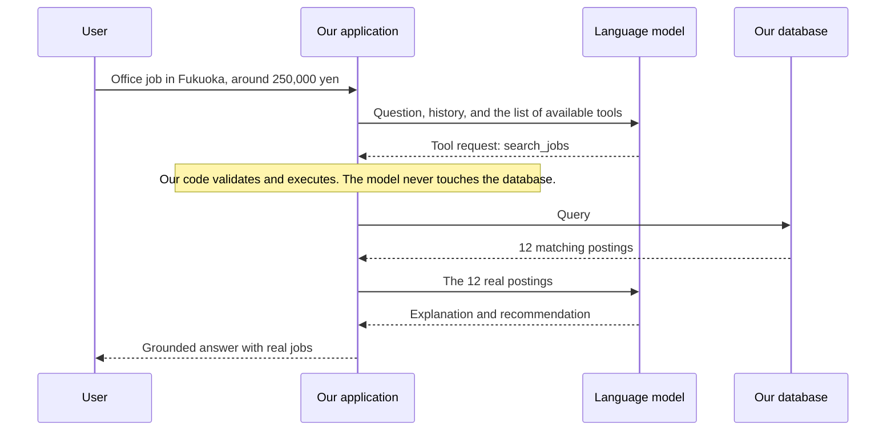

The difference in one sentence: **a chat application talks about jobs; an agentic application looks them up, reasons over what it found, and produces a document from it.**

### 2.3 The distinction stated as a table

| | ChatGPT-style app | AI Job Navigator |
|---|---|---|
| Source of facts | The model's training data | Our own job database, collected and maintained |
| Can take action | No | Yes — searches, generates documents, saves records |
| Domain knowledge | None | Japanese resume conventions, employment vocabulary |
| Persistence | Chat log only | Users, resumes, applications, job history |
| Correctness | Plausible-sounding | Verifiable against real records |
| Replaceable by a better model? | It **is** the model | No — the model is one part of it |

The last row matters most. If a better model is released tomorrow, a ChatGPT-style app is obsolete. Our system changes one configuration line and becomes better.

---

## 3. Ollama versus a Public API

This is a frequent source of confusion, so it is worth stating carefully. They are two ways of obtaining the *same kind of component*, with very different operational characteristics.

### 3.1 What each one is

**Ollama** is software that runs a language model on a machine you control. The model file is downloaded onto that machine, loaded into the graphics card's memory, and served over a local network port. There is no external communication and no per-request cost. You are paying in hardware and electricity instead.

**A public API** (OpenAI, OpenRouter, Anthropic, and so on) is a hosted service. You send an HTTPS request and receive a reply. The provider operates the hardware — typically racks of datacentre GPUs — and bills per token consumed.

Critically, **both present the same interface to our application.** Ollama speaks the OpenAI-compatible protocol, which is why our code can switch between them with a single environment variable.

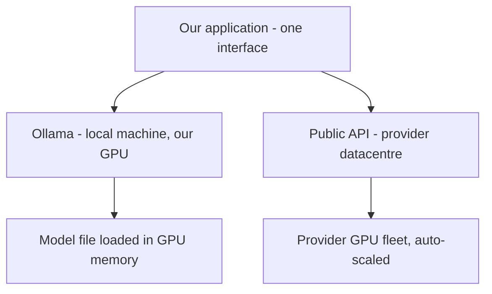

### 3.2 Concurrency — the decisive difference

This is the point that most often gets missed.

A GPU processes one batch of work at a time. A single machine running Ollama holds one copy of the model in its graphics memory and serves requests essentially in sequence. Two users asking questions simultaneously do not get answers simultaneously — the second waits for the first. With ten concurrent users, the tenth waits for the other nine.

A public API provider runs thousands of GPUs behind a load balancer. Concurrent requests are distributed across that fleet. Ten simultaneous users are handled in parallel because there is spare hardware for each of them.

To serve ten concurrent users from our own hardware, we would need to buy and operate roughly ten times the hardware — and it would sit idle whenever traffic was lower.

### 3.3 Comparison

| | Ollama (self-hosted) | Public API |
|---|---|---|
| Where it runs | A machine we own | The provider's datacentre |
| Cost model | Fixed: hardware plus electricity | Variable: per token used |
| Concurrent users | Effectively one per machine | Hundreds, transparently |
| Response latency | Depends entirely on our GPU | Consistent, professionally tuned |
| Model quality available | Limited by GPU memory | The largest available models |
| Data leaves our control | No | Yes — sent to the provider |
| Scaling to more users | Buy more machines | Nothing to do |
| Availability | We are responsible for uptime | Covered by the provider's SLA |
| Failure at 3 a.m. | Our problem | The provider's problem |

### 3.4 Our position

**Development uses Ollama; production uses a public API.** These are not competing choices — they are the same component in two settings.

During development there is one user (the developer). Concurrency is irrelevant, and a local model costs nothing per request, which makes the heavy iteration and repeated testing of prompt engineering free.

In production there are many users at unpredictable times. Per-request billing is precisely the right cost model: we pay for what is used, and capacity is the provider's concern rather than ours.

Because the application is provider-agnostic, moving between the two is a configuration change, not a rewrite. **This flexibility is the reason the abstraction exists**, and it is worth protecting in future design decisions.

---

## 4. The Technology Stack

### 4.1 Layer overview

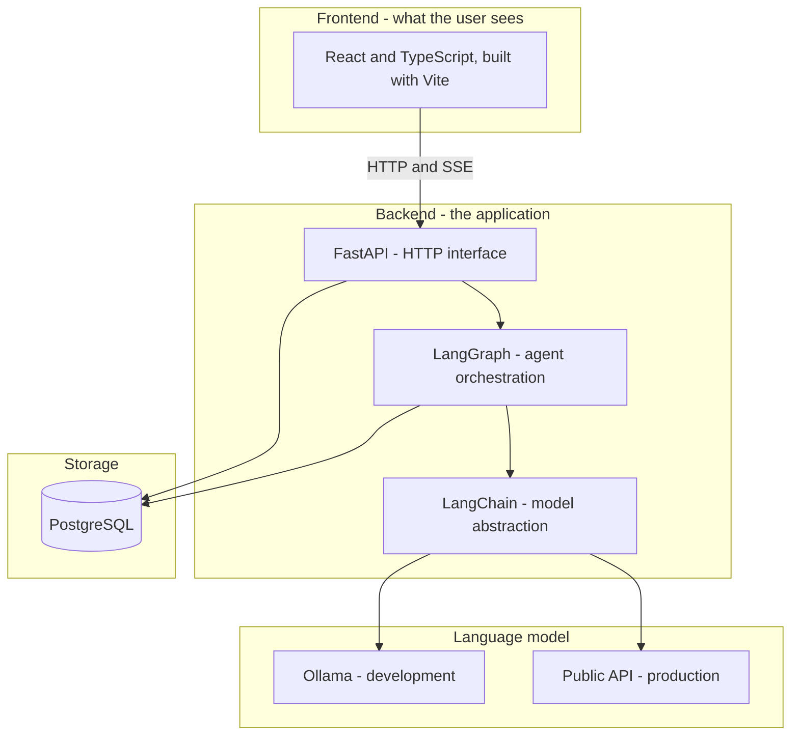

### 4.2 Component by component

**React with TypeScript, built by Vite** — the browser interface. React structures the page as components; TypeScript adds type checking so mistakes surface while writing code rather than in front of a user; Vite is the build tool and development server.

**FastAPI** — the Python web framework providing the HTTP interface. It handles requests from the browser, authenticates them, and streams replies back over SSE. It is the boundary between the outside world and our logic.

**LangChain** — a library of adapters over language model providers. Its role here is deliberately narrow: it gives us one uniform way to call any model, so that OpenAI, OpenRouter, and Ollama differ only by configuration. **This is the component that makes us provider-agnostic.**

**LangGraph** — the agent orchestration layer, built on LangChain. It defines the agent as a graph: nodes are steps, edges are the routing between them. It runs the loop of "call the model, execute the requested tool, call the model again with the result" until the task completes, and it saves state at every step so a conversation survives a restart.

Our graph is currently:

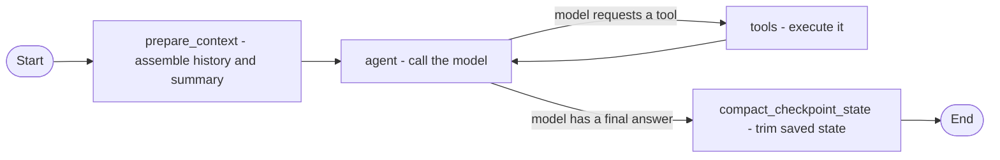

**PostgreSQL** — the relational database. It holds users, conversations, messages, rolling summaries, runtime settings, and LangGraph's checkpoints. It will hold the job data and generated documents. It is the system's memory; the model has none of its own.

**Ollama** — the local model runtime used during development, described in section 3.

**A note on LangChain and LangGraph.** These are libraries we call, not a framework that takes over our program. Our code decides the flow and invokes them; they do not own the application. That distinction is intentional — it keeps the cost of replacing them bounded, should that ever become necessary.

---

## 5. Data Flow

### 5.1 A complete conversational turn

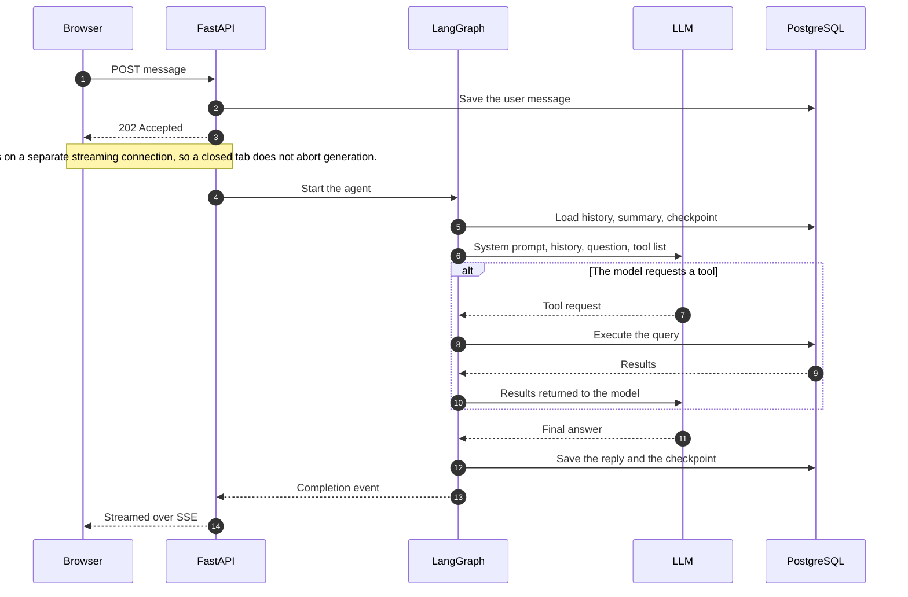

### 5.2 The target architecture for job search

The job data is collected and stored by us on a schedule, entirely separately from any user conversation. When a user asks a question, the search runs against our own stored data — never against a live external site, and never against the model's recollection.

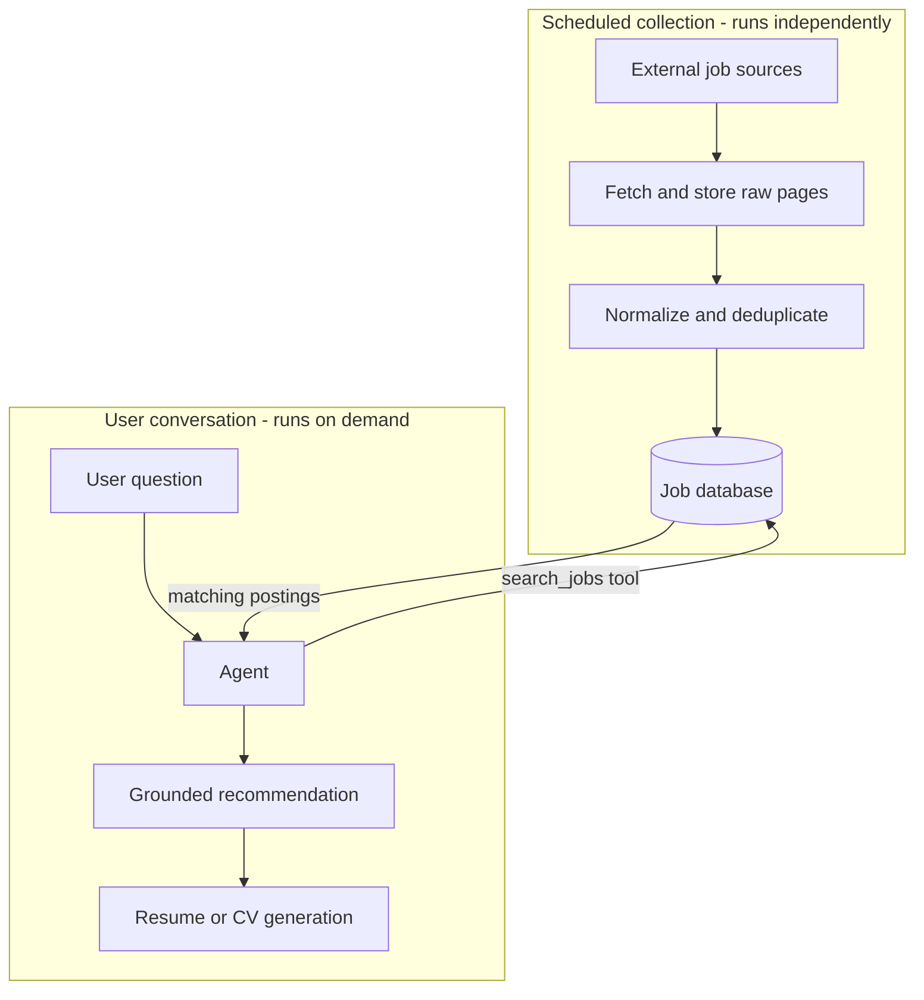

The separation is deliberate and load-bearing. Collection is slow and must be respectful of the source sites; conversation must be fast. Keeping them apart means a user never waits on a website, and the sources are never subjected to traffic proportional to our user count.

---

## 6. Why This Becomes a Baseline

Very little of what is described above is specific to job searching.

The user interface, the streaming, the accounts and sessions, the conversation persistence, the summarization of long histories, the provider abstraction, and the agent loop with its tool boundary — none of that knows what a job posting is. What makes this system a *job* navigator is a narrow layer on top: the system prompt, the tools it is given, and the data in the database.

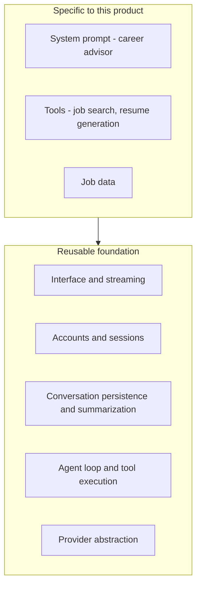

A second agentic product — in a different domain entirely — would reuse the foundation and replace only the top layer. That is why effort spent on the foundation now is not effort spent solely on this one product, and why the provider-agnostic design is worth the small amount of extra structure it costs.

---

## 7. Summary

| Point | Statement |
|---|---|
| What we build | An application that uses a language model, not a language model |
| The model's role | Language understanding and generation — one replaceable component |
| Source of truth | Our database, never the model's memory |
| Who acts | Our code. The model may only request; it never executes |
| Ollama | Local, fixed cost, effectively single-user — for development |
| Public API | Hosted, per-token, genuinely concurrent — for production |
| Why both work | The application is provider-agnostic by design |
| LangChain | Uniform access to any model provider |
| LangGraph | Runs the agent loop and persists its state |
| Long-term value | The foundation is reusable; only the top layer is job-specific |

---

# Appendix A: Development Tooling — Claude Code and AI-Assisted Development

This appendix concerns how the software is *written*, which is a separate matter from what the software *is*. Sections 0 through 7 describe the product. This section describes the tools used to build it.

The distinction matters because the two are easily confused. Both involve an LLM. Both are "agentic." They are nonetheless different things, aimed at different users, with different licensing and different economics.

## A.1 What Claude Code Is

Claude Code is a coding assistant produced by Anthropic. It runs on the developer's own machine — as a command-line tool, a desktop application, or an extension inside an editor — and it operates directly on the project's source code.

Architecturally it is the same pattern described in section 2.2 of this document: an LLM given a set of tools, running in a loop. The difference lies entirely in what the tools are. Where our product gives the model tools for searching jobs and generating resumes, Claude Code gives it tools for reading files, editing files, running shell commands, searching a codebase, and operating version control.

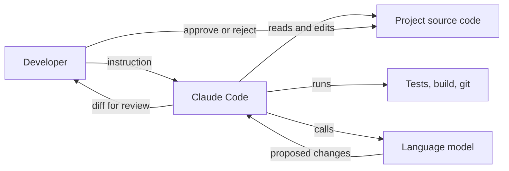

The final two steps are the important ones. Claude Code proposes changes; the developer reviews and accepts them. It is a tool operated by a developer, not an autonomous replacement for one.

## A.2 What It Costs

Claude Code is included with a Claude subscription rather than billed per request.

| Plan | Approximate monthly cost | Suited to |
|---|---|---|
| Pro | USD 20 (approximately USD 21 including tax) | Individual developers; the plan used on this project |
| Max | USD 100 to USD 200 | Heavy daily use, larger codebases, higher usage limits |

This is a flat subscription with usage limits that reset periodically, not per-token billing. It is a **development-side operating expense**, entirely separate from the production AI cost described in section 2 of the schedule document. The two appear on different lines of the budget and behave differently: the subscription is fixed regardless of how much is built, while production AI cost scales with the number of users.

## A.3 What It Is Capable Of, and What It Is Not

Realistic expectations matter more here than enthusiasm.

**It performs well at:**

- Navigating an unfamiliar codebase and explaining how existing code works
- Writing routine, well-specified code: data access layers, API endpoints, form handling, tests
- Mechanical refactoring across many files at once
- Producing documentation from source code
- Debugging, when the error can actually be reproduced and observed
- Translating a clearly stated intention into a working first draft

**It performs poorly at, or cannot do:**

- Deciding what should be built. It has no access to the client, the requirements, or the commercial context
- Architectural judgement whose consequences appear months later
- Anything it cannot verify — it will produce plausible code against an API it has misremembered
- Knowing when its own output is wrong. It does not signal uncertainty reliably
- Taking responsibility. Every line it writes is the developer's responsibility once accepted

The practical effect is a substantial speed increase on work that is already understood, and no help at all on work that is not yet understood. It compresses the typing, not the thinking.

## A.4 Why It Cannot Simply Build This Product

A reasonable question, given the above, is why a tool this capable does not simply replace the project. The answer is that Claude Code is a developer's tool, not a product runtime.

| The product requires | Claude Code provides |
|---|---|
| Many end users, isolated from one another | A single operator on a single machine |
| A web interface usable by a Japanese jobseeker | A terminal or an editor |
| User data in a database, accounts, sessions | Files in a working directory |
| Payment, usage metering, per-user cost control | Billing to one developer's subscription |
| A licence permitting use as a commercial backend | A developer tool licence |

There is also a security consideration: Claude Code has full access to the filesystem and the shell by design, because it is operated by a trusted developer on their own machine. That is an appropriate posture for a development tool and an unacceptable one for a service exposed to the public.

## A.5 Vibe Coding versus Tool-Assisted Development

The term "vibe coding" entered common use in 2025. It describes generating code from natural-language prompts and accepting the result **without reading or understanding it** — judging the output by whether it appears to work rather than by whether it is correct.

The category of tools involved includes Claude Code and similar editor-integrated assistants, as well as prompt-to-application builders such as Base44, Lovable, and Bolt, which generate an entire working application from a description.

**The critical point is that the tool does not determine the practice.** The same tool can be used either way. What separates the two is the process surrounding it, and specifically whether a competent person reviews and understands the output before it ships.

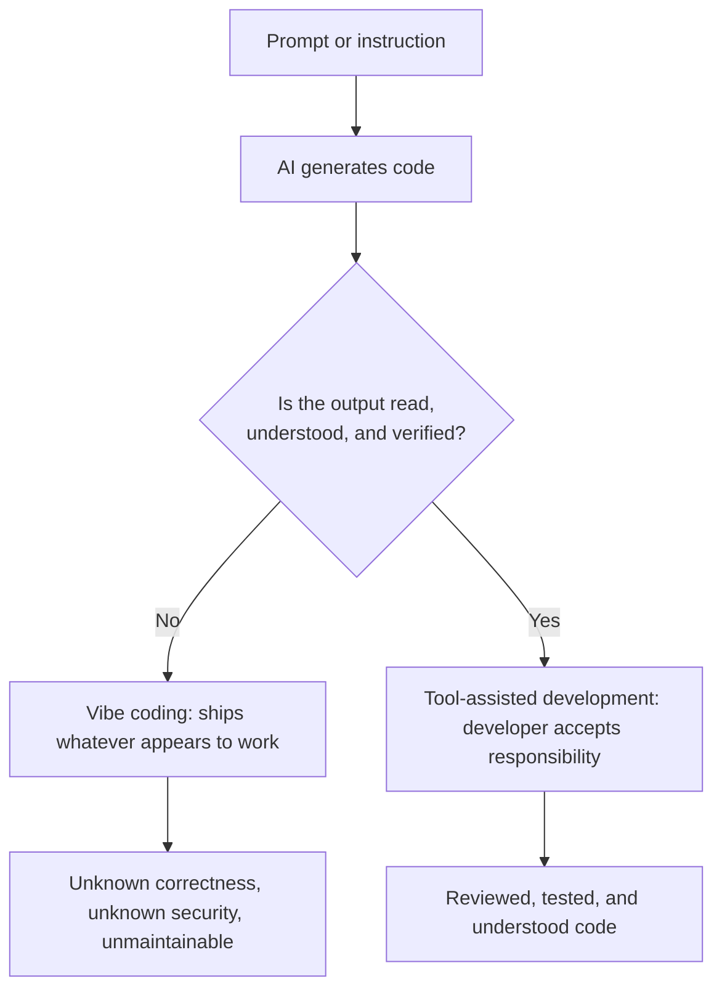

### A.5.1 Comparison

| | Vibe coding | Tool-assisted development |
|---|---|---|
| Code is read before acceptance | No | Yes, every change |
| Who understands the system | Nobody | The developer |
| Architecture | Whatever the tool produced | Decided by the developer |
| Response to a bug | Re-prompt until the symptom disappears | Diagnose the cause and fix it |
| Security | Unassessed | Reviewed at the points that matter |
| Behaviour under an edge case | Unknown | Considered and tested |
| Maintainability after six months | Very poor — no one can explain the code | Normal |
| Suitable for | Prototypes, demonstrations, throwaway internal tools | Production systems handling real user data |

### A.5.2 On reliability

The honest position is this.

**Vibe-coded software is not reliable for production use**, but the reason is often misstated. The generated code is frequently correct in isolation. The failure is that **no one knows which parts are correct.** Nobody can say what happens when two users act at once, whether a payment can be charged twice, whether one user can read another's data, or which assumptions the code silently depends upon. When something eventually breaks — and something always breaks — there is no one who understands the system well enough to repair it.

**Tool-assisted development is as reliable as the developer doing the reviewing.** The tool does not raise or lower the ceiling on quality; it changes how quickly the developer reaches it. A rigorous developer produces rigorous software faster. A careless developer produces careless software faster.

The distinction is therefore not about the technology at all. It is about **who is accountable for the result** — and in tool-assisted development, that is unambiguously the developer, exactly as it would be without the tool.

## A.6 How This Project Is Developed

This project uses Claude Code as a tool-assisted development aid. Concretely:

| Delegated to the tool | Retained by the developer |
|---|---|
| Routine implementation from a clear specification | System architecture and data model |
| Test scaffolding and boilerplate | Security-critical code: authentication, payment |
| Documentation drafting | What gets built, and in what order |
| Codebase navigation and explanation | Review and acceptance of every change |
| Mechanical refactoring | Correctness under real-world conditions |

Every change is read before it is committed. Nothing reaches the repository that the developer cannot explain.

This is the reason the schedule in the project plan is achievable for a single developer, and equally the reason it is not shorter still. The tool accelerates construction. It does not remove the need to understand what is being built, to review it, or to be answerable for it — and those, not typing speed, are what set the pace of the project.
