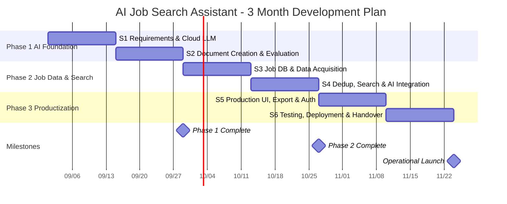

# AI Job Search Assistant — Development & Operations Plan

**Date: 26 August 2026**
**Version: v1.3**

---

## 0. About This Document

This document addresses the following three points regarding the launch of an agentic AI chatbot for job search support.

| # | Topic | Section |
|---|---|---|
| ① | Work required before operational launch | Section 3 |
| ② | Server and infrastructure costs | Section 4 |
| ③ | Questions regarding "AI training" | Sections 5 & 6 |

> ※ The contents of this document represent a plan based on current assumptions. They may change subject to requirement finalization, the results of data source investigation, and AI model performance evaluation results.

---

## 1. Project Overview

### 1.1 Purpose of the System

A system in which job seekers converse with an AI in chat format and receive the following support:

- **Job search** — Searching and presenting jobs matching their criteria (based on current job listings)
- **Application support** — Assistance writing motivation statements and application documents
- **Document creation support** — Assistance creating resumes (履歴書), work history documents (職務経歴書), and portfolios

### 1.2 Overall System Architecture (proposed)

```
                  ┌──────────────────────┐
                  │   Job Data Sources    │
                  │   APIs / Feeds /      │
                  │   Career Pages, etc.  │
                  └──────────┬───────────┘
                             │
                             ▼
                  ┌──────────────────────┐
                  │   Acquisition Layer   │
                  │  (incl. permission    │
                  │   classification)     │
                  └──────────┬───────────┘
                             │
                 Extraction / Normalization / Dedup
                             │
                 ┌───────────┴───────────┐
                 ▼                       ▼
        ┌────────────────┐      ┌────────────────┐
        │ Structured Data│      │ Semantic Data  │
        │  PostgreSQL    │      │ Vector Search  │
        │  company /     │      │ job duties /   │
        │  location /    │      │ required       │
        │  salary /      │      │ skills /       │
        │  type / date / │      │ company        │
        │  URL           │      │ description    │
        └────────┬───────┘      └───────┬────────┘
                 └───────────┬───────────┘
                             ▼
                 ┌───────────────────────┐
                 │     Retrieval (RAG)    │
                 │  filter → semantic rank│
                 └──────────┬────────────┘
                             ▼
                 ┌───────────────────────┐
                 │      AI Agent          │
                 │    (LLM + Tools)       │
                 └──────────┬────────────┘
                             ▼
                           User
```

### 1.3 Core Design Principle

**"The database is the single source of truth."**

The AI is never permitted to infer or generate job information. All answers must be grounded in actual records already acquired into the database. Presenting a job that does not exist would cause serious reputational damage to both the job seeker and the hiring company.

---

## 2. Current Development Status (Existing Assets / Phase 0)

**This project does not start from zero.** The foundational AI agent components are already operational as a prototype.

### 2.1 Already Implemented

| Area | Status | Description |
|---|---|---|
| AI agent foundation | ✅ Complete | Agent orchestration via LangGraph (including the tool-invocation loop) |
| Conversation API | ✅ Complete | Streaming responses via FastAPI (progressive display) |
| CLI | ✅ Complete | Command-line interface for development and verification |
| Conversation persistence | ✅ Complete | All messages stored in PostgreSQL |
| Long-term conversation memory | ✅ Complete | Automatic summarization maintains context in extended conversations |
| Tool invocation | ✅ Complete | Mechanism for the AI to call external processes (currently date/time only) |
| System prompt management | ✅ Complete | AI role and prohibitions defined in external files, switchable |
| Document creation support | ✅ Verified | Interactive interviewing and generation of 履歴書 / 職務経歴書 |
| Frontend | 🔨 Scaffold only | React project structure created; screens not yet implemented |

### 2.2 Current Limitations (scope of upcoming work)

- Job data acquisition, storage, and search are not yet started
- LLM support is limited to local models (no cloud API support yet)
- Authentication and user management are not implemented
- File export (PDF / Word, etc.) is not implemented

> **Key point of this proposal:** Because the foundation already exists, the three months can be spent on **job data integration, search accuracy, UI, testing, and production deployment** rather than rebuilding the AI foundation.

---

## 3. ① Work Required Before Operational Launch

### 3.1 Development Approach

- The project is divided into **three phases (one month each, 12 weeks total)**, delivered as **six two-week sprints**.
- At the end of every sprint, **working software is presented for your review**. Testing is included within each sprint; it is not deferred to the end of the project.
- As a result, if a misunderstanding arises, the rework is contained to at most two weeks.

```
One sprint (two weeks)

   Week 1                      Week 2
 ┌──────────────────┐   ┌──────────────────────┐
 │ Confirm reqs →    │ → │ Implement → test →   │ → next sprint
 │ design → implement│   │ demo (working review)│
 └──────────────────┘   └──────────────────────┘
```

> Note: This plan is a **rough estimate made prior to requirements definition.** The contents of each sprint can be adjusted following the formal requirements confirmation (Sprint 1) and subsequent discussion of priorities. A detailed work plan will be presented at the end of Sprint 1.

### 3.2 Phase 1 (Month 1) — Establishing the AI Foundation

Raising the existing prototype to production quality and building the basis for AI quality evaluation.

| Sprint | Period | Activity | What you can review at the end of the sprint |
|---|---|---|---|
| Sprint 1 | Week 1–2 | Requirements finalization, architecture design, environment setup, cloud LLM support, productionizing conversation management | **A working conversation running on a cloud AI model** (requirements document and architecture diagram attached) |
| Sprint 2 | Week 3–4 | Improving document creation accuracy (履歴書 / 職務経歴書), establishing response quality evaluation | **Document drafts being generated from the conversation**, plus the first accuracy evaluation report |

### 3.3 Phase 2 (Month 2) — Job Data Integration & Search

The core of this project. See **Section 3.6** for details.

| Sprint | Period | Activity | What you can review at the end of the sprint |
|---|---|---|---|
| Sprint 3 | Week 5–6 | Job data design, database construction, source registration, job data acquisition (APIs, feeds, structured data, plus HTML retrieval for a small number of approved sites) | **A database populated with real job data**, plus the source management screen |
| Sprint 4 | Week 7–8 | Deduplication, freshness management, semantic search (RAG), integration of the search tool into the AI agent | **Job search and recommendation working within the chat** |

> **Deduplication in Sprint 4 is the hardest item in this plan to estimate.** Matching the same job posting across multiple sites cannot be assessed definitively until real data is examined. If this item overruns, we will adjust by deferring the file export and authentication work in Sprint 5.

### 3.4 Phase 3 (Month 3) — Productization & Production Launch

| Sprint | Period | Activity | What you can review at the end of the sprint |
|---|---|---|---|
| Sprint 5 | Week 9–10 | Production UI implementation (ChatGPT-style chat interface), file export, user management and authentication | **A screen end users can actually operate**, with document download |
| Sprint 6 | Week 11–12 | Integration testing, AI accuracy evaluation, performance testing, security measures, production build, acceptance | **The system running in production**, test report, operations manual |

> **Sprint 6 is not a development sprint — it is reserved for acceptance and launch.** No new features are built during this period; it is allocated to integration testing, defect correction, production deployment, and acceptance confirmation. Failing to reserve this period is the single most common cause of schedule overrun.

### 3.5 Overall Schedule (Gantt Chart)



> ※ The start date is provisional (1 September 2026) and will be updated once formally agreed.

**Fallback table (for environments where the Gantt chart does not render)**

| Phase | Sprints | Content |
|---|---|---|
| Phase 1 | Sprint 1–2 (W1–W4) | Requirements & cloud LLM support → Document creation & quality evaluation |
| Phase 2 | Sprint 3–4 (W5–W8) | Job database & data acquisition → Deduplication, semantic search & AI integration |
| Phase 3 | Sprint 5–6 (W9–W12) | Production UI, file export & authentication → Testing, production build & acceptance |

### 3.6 Job Data Acquisition Method (Important)

How job data is acquired is **both a technical choice and a matter requiring legal judgement.** We propose the following approach.

#### 3.6.1 Order of Preference for Acquisition Methods

Methods are adopted in order of stability and legal soundness. Each step down the list is more fragile, more expensive, and legally weaker.

```
  ① Official APIs                    ← First choice. Stable, lawful, clearly specified
  ② ATS public job-board endpoints
  ③ XML / JSON job feeds
  ④ Sitemaps + structured data (JSON-LD)
  ⑤ Direct HTML retrieval (scraping)   ← Supplementary. Used only where ①–④ are unavailable
```

**Regarding ④:** Since Google for Jobs (Googleしごと検索) launched in Japan in 2019, many Japanese corporate career pages publish machine-readable structured data (`schema.org/JobPosting`). This is data published *specifically to be read by machines*, making it the safest and lowest-cost acquisition method available.

**Regarding ⑤ (direct HTML retrieval):** We will build this. Some sites you will want to cover publish nothing machine-readable, and a system with no answer for those sites is incomplete. However, it is built as a **supplementary route with a deliberately limited scope**, for the reasons below.

#### 3.6.2 Scope and Handling of Direct HTML Retrieval (⑤)

| | Included in initial release | Not included in initial release |
|---|---|---|
| **Coverage** | Individually configured retrieval for a small number of approved sites (a guideline of 3–5 to begin with) | A general-purpose crawler that works against any site automatically |
| **Trigger** | Scheduled batch execution, plus manual execution by an administrator | On-demand retrieval at the moment a user asks a question |
| **Target sites** | Class A / B sources only (see 3.6.3), registered individually with written approval | Sites where terms of service or robots.txt prohibit it |

**Design principle: the AI does not perform the retrieval itself.**

This is the most important point in this section. Acquisition and search are separated:

```
 [Acquisition]  Scheduled batch  →  verification & deduplication  →  job database
                (①–⑤, administrator-managed)
                                                                        │
 [Search]       User question  →  AI  →  searches the job database ─────┘
                                         (the AI never accesses external sites directly)
```

The AI agent is given a **job database search tool only.** It has no capability to fetch an external site at the moment a user asks something. Therefore:

- Acquisition volume and frequency remain **predictable and controllable**, regardless of how users behave. There is no risk of user activity translating into request load on another company's site.
- If a source later needs to be suspended, it is **stopped by deregistering that source** — no change to the AI is required.
- A record remains of when each piece of data was acquired and from where, so **the basis for any answer can be explained after the fact.**

**Why we limit reliance on ⑤:** direct HTML retrieval sits in a legally grey area, depends on the site's terms of service, and breaks whenever the site's markup changes. It is therefore treated as a supplement to ①–④ rather than a foundation. Where a site later begins offering an API or structured data, we migrate that source to ①–④, and site coverage can be expanded incrementally after launch without changing the system's design.

#### 3.6.3 Legal Classification of Sources (proposed)

Each source is assigned a classification, and **the system refuses to fetch from any source with no classification assigned.** Rather than leaving this judgement to individual programs, it is settled once, in writing, at the time a source is registered.

| Class | Applies to | Handling |
|---|---|---|
| **A (Permitted)** | Official APIs, ATS public endpoints, job feeds, published structured data, data supplied by your own customers | May be acquired |
| **B (Approval required)** | Public HTML where robots.txt does not prohibit access and we hold no account | Acquired only after named written approval |
| **C (Legal review required)** | **Sites where your company holds an account**, paths prohibited by robots.txt, sites where we have previously been blocked | Not acquired until written instruction is received following your legal counsel's judgement |
| **D (Prohibited)** | Circumventing login or paywalls, CAPTCHA bypass, IP rotation to evade blocking, excessive request rates | Not performed even if instructed |

#### 3.6.4 Points We Would Particularly Like to Confirm

- **Does your company hold accounts on any job media sites?**
  Where terms of service were accepted at registration, the legal character of automated acquisition from that site changes substantially (Class C). We would like to confirm this individually for sites such as Rikunabi, Mynavi, doda, en-tenshoku, BIZREACH, Indeed, Wantedly, and Green.
- **Does your business fall under 募集情報等提供事業 (job-information provider business)?**
  If it does under the 2022 amendment to the 職業安定法 (Employment Security Act), maintaining the **accuracy and currency of published job information becomes a statutory obligation.** If applicable, the requirements for the freshness management feature change accordingly.
- **Is the "key points + excerpt + source URL" presentation format acceptable?**
  Compared with storing and publishing full job descriptions on our side, this substantially reduces legal risk while the functional difference is limited. We recommend the former.

> ※ The above is a development design policy, not legal advice. Final determinations will follow the judgement of your legal counsel.

### 3.7 AI Accuracy and Performance Evaluation Plan

"AI performance" cannot be measured by any single metric. We will evaluate it across the following dimensions.

```
                    AI Quality
                        │
        ┌───────────────┼───────────────┐
        ▼               ▼               ▼
    Accuracy        Grounding      Response Quality
        │               │               │
        ▼               ▼               ▼
  Tool selection   Retrieval        Writing quality
    accuracy       accuracy /       & instruction
                   hallucination     adherence
        │               │               │
        └───────────────┼───────────────┘
                        ▼
                   Reliability
                        │
           ┌────────────┼────────────┐
           ▼            ▼            ▼
        Latency     Error rate   Data freshness
```

#### ① Functional Accuracy — Does it do what it is supposed to do?

| Test input | Expected behaviour |
|---|---|
| "I want to write a resume" | Begins interview, generates document |
| "Find backend engineer jobs" | Executes the job search tool |
| "What jobs can I apply to today?" | Presents only currently valid jobs |
| "Which jobs suit my background?" | Combines user profile with job data |
| "Write my motivation statement" | Generates application text (no tool call) |

#### ② Grounding / Hallucination — **Most Important**

Verifying that the system never presents a job that does not exist.

```
  Actual record in DB:   Company A / Backend / ¥350,000 per month

  Question: "Are there any jobs paying ¥600,000 or more per month?"

  ✅ Correct:   "No jobs matching those criteria were found."
  ❌ Incorrect: "Company A is hiring at ¥600,000 per month."
```

**Measurement method:** Build a verification dataset of 30–50 questions and calculate
`grounded answers ÷ total answers containing factual claims × 100`.

**Target: 0% hallucination rate** (with respect to job information)

#### ③ Retrieval Accuracy (RAG Accuracy)

Because structured and semantic data are stored separately, both aspects are verified.

- Filtered search: "Tokyo / full-time / Python" → are the correct jobs returned?
- Semantic search: "jobs where FastAPI experience would be useful" → are relevant jobs returned even without an explicit keyword match?
- Accuracy of presented information: company name, salary, location, URL, and posting date must contain no errors

#### ④ Tool Selection Accuracy (Agent Behaviour)

| User request | Expected tool |
|---|---|
| Search for current jobs | Job search |
| Rewrite my resume | No tool call |
| Write a motivation statement | No tool call |
| General career advice | No tool call |

#### ⑤ Response Quality (Human Evaluation)

Twenty to thirty representative conversations are rated on a five-point scale.

| Rating | Criteria |
|---|---|
| 5 | Excellent — usable as-is |
| 4 | Good — minor corrections only |
| 3 | Acceptable — usable in practice |
| 2 | Needs improvement |
| 1 | Unacceptable |

Evaluation axes: relevance / completeness / naturalness and politeness of Japanese / appropriateness as a professional document / instruction adherence

**Target: average of 4.0 or above, with fewer than 5% rated 2 or below**

#### ⑥ Job Data Freshness — Critical and Specific to Job Search Systems

```
   Job A    Posted: 8/20    Closed: 8/24
   Today:   8/25
   → Must not be presented
```

Test coverage: currently valid jobs / closed jobs / newly acquired jobs / duplicate jobs / updated jobs / removed jobs / jobs with invalid posting dates

#### ⑦ Performance and Response Speed

| Metric | Preliminary target |
|---|---|
| API initial response | under 1 second |
| Time to first displayed character | under 3 seconds |
| Standard response completion | under 10 seconds |
| Database query | under 500 milliseconds |
| Semantic search | under 1 second |
| Tool execution | under 10 seconds |
| API error rate | under 1% |
| Concurrent connections | to be discussed separately |

> ※ These are **preliminary targets.** Because actual values vary with the AI model selected, the AWS configuration, data volume, and network conditions, formal targets will be confirmed based on the Phase 1 evaluation results.

#### Applying the Results — How Poor Scores Are Corrected

Measurement alone improves nothing. Each evaluation category is paired in advance with **the specific corrective action to be taken when the result is poor.**

```
  Evaluate  →  Identify cause  →  Apply correction  →  Re-run the FULL dataset
      ▲                                                          │
      └──────────────────────────────────────────────────────────┘
            (confirms the fix did not break anything else)
```

**An important premise:** the AI does not "learn from being scolded." It retains no memory of past mistakes, so telling it "do not do that again" has no effect on future conversations. Every correction is therefore an **engineering change made by us** — to the instructions, to the retrieval logic, or to the validation code.

| Category | Typical cause when the score is poor | Corrective action |
|---|---|---|
| **① Functional accuracy** | Instructions are ambiguous, or the request pattern was not anticipated | Add the pattern to the instructions with an explicit example; add the case to the test set |
| **② Grounding / hallucination** | The AI wrote beyond the data it was given | **Primary: output validation in code** (see below). Secondary: tighten instructions, lower the creativity setting |
| **③ Retrieval accuracy** | Either the right job was not retrieved, or it was retrieved and not used | Determined by inspecting the retrieval log — the two causes have entirely different fixes (see below) |
| **④ Tool selection** | The tool's description is unclear to the AI | Rewrite the tool description; reduce the number of similar tools; add worked examples |
| **⑤ Response quality** | Wording, level of detail, or tone does not match expectations | Reflect **recurring** patterns in the instructions; register individual cases as test cases |
| **⑥ Data freshness** | Acquisition or expiry handling is at fault | Corrected in the data pipeline. This is not an AI problem and is not addressed by changing instructions |
| **⑦ Performance** | Model, infrastructure, or query efficiency | Change model, add database indexes, tune the configuration |

**On ② (the most important): hallucination is blocked structurally, not by persuasion.**

Instructing the AI is not a guarantee, so we add a verification step in code:

```
  AI generates an answer
        │
        ▼
  Verify every company name, salary figure, and job URL in the answer
  against the records actually retrieved from the database
        │
        ├─ All present  →  return to the user
        └─ Not present  →  do not return it; regenerate or answer "not found"
```

Because this is a mechanical check rather than a request to the AI, its reliability does not depend on the model's mood, the model in use, or the length of the conversation. This is the reason a 0% target is realistic.

**On ③: the retrieval log distinguishes two different failures.**

| What the log shows | Meaning | Fix |
|---|---|---|
| The correct job was **not** in the retrieved set | The search itself failed | Adjust search conditions, revise Japanese word segmentation and synonyms, tune the balance between keyword and meaning-based search, increase the number of candidates retrieved, add a re-ranking step |
| The correct job **was** retrieved but was not used in the answer | The search succeeded; the answer construction failed | Revise instructions, change the ordering of information given to the AI, reduce the volume of simultaneous input |

Without this distinction, the two failures look identical to a user ("it didn't find my job"), and effort is easily spent fixing the wrong half of the system.

**On ⑤: human evaluation is converted into permanent test cases.**

Every conversation rated 2 or below is recorded as a case in the evaluation dataset. Consequently:

- The evaluation dataset **grows over time and becomes a regression test suite.** A problem corrected once is automatically re-checked thereafter.
- A **single** complaint is registered as a test case but does not change the instructions. Only **patterns appearing three or more times** are reflected in the instructions.

This second rule is deliberate. Instructions revised in response to every individual comment become long, mutually contradictory, and degrade overall quality — one fix creating two new problems. This is why every correction is followed by a re-run against the full dataset.

**Operating cadence:** during development, at the end of each sprint. After launch, we propose a monthly review of the evaluation results together with your team.

### 3.8 Completion Criteria for Each Phase

Defining in advance **when the work can be considered complete.**

#### Phase 1 Completion Criteria
- [ ] The chat interface communicates with the backend
- [ ] Conversation history is stored and context is maintained in extended conversations
- [ ] Resume and work history document support is functional
- [ ] The AI adheres to its defined rules, including prohibitions
- [ ] Initial AI response quality evaluation is complete and reported

#### Phase 2 Completion Criteria
- [ ] Job data sources can be registered and managed (including legal classification)
- [ ] Job data is correctly acquired and stored
- [ ] The same job acquired from multiple sites is consolidated into a single record
- [ ] Both filtered search and semantic search are functional
- [ ] The AI correctly invokes the job search tool
- [ ] Closed job listings are not presented
- [ ] **The AI does not present jobs that do not exist (verified against the evaluation dataset)**

#### Phase 3 Completion Criteria
- [ ] The production UI is complete
- [ ] Document file export is functional
- [ ] User authentication and management are functional
- [ ] Integration testing is complete
- [ ] Performance testing is complete and targets are met
- [ ] The AWS production environment is built and operational
- [ ] Acceptance confirmation by your company is complete

---

## 4. ② Server and Infrastructure Costs

### 4.1 Two Proposed Configurations

We propose two configurations depending on budget and requirements. **System functionality is identical in both**; the difference is the balance between operational resilience and cost.

| | Plan A | Plan B |
|---|---|---|
| Configuration | AWS (Amazon Web Services) | Domestic VPS (SAKURA VPS, etc.) |
| Monthly estimate | **approx. ¥11,000–15,500** | **approx. ¥2,000–3,000** |
| Intended use | Production operation, future scale-up | Trial operation, initial release |

### 4.2 Plan A — AWS Configuration

#### Core (required)

| Category | Service | Role |
|---|---|---|
| Application server | Amazon EC2 | Backend processing and interface delivery |
| Database | Amazon RDS (PostgreSQL) | Conversation history and job data. Semantic search included as standard (no dedicated database required) |
| File storage | Amazon S3 | Generated documents and acquired data |
| Network & security | Cloudflare | Domain management, encrypted communication, attack protection, delivery acceleration |
| Operational monitoring | Amazon CloudWatch | Server status monitoring |
| Error detection | Sentry | Automatic notification of application faults |
| Automated deployment | GitLab CI/CD | Automation of update procedures |
| **AI usage** | External AI service | See Section 4.5. Proportional to usage |

**Monthly estimate: approx. ¥11,000–15,500** (calculated using the official AWS pricing calculator)

> ※ Selecting a one-year commitment contract applies a discount of approximately 30–40% to the above.

#### Additional (as required)

| Item | Monthly estimate | When it becomes necessary |
|---|---|---|
| Load balancer + auto scaling | approx. +¥5,000 | Zero-downtime updates, automatic failover on hardware failure |
| Database redundancy | approx. +¥5,000 | If service must continue during a database failure |
| Additional server | approx. +¥5,000 | If concurrent users increase |
| Job data acquisition environment | Separate | Phase 2 onward. Depends on acquisition volume |

### 4.3 Plan B — Domestic VPS Configuration

**SAKURA VPS is used as the reference price.** Domestic alternatives such as ConoHa VPS and Xserver VPS are available at comparable specifications and pricing.

#### Core (required)

| Category | Service | Role |
|---|---|---|
| Server | SAKURA VPS (4–8 GB, domestic data centre) | All processing on a single machine |
| Container platform | Docker / Docker Compose | Standardized configuration; simplifies future migration to AWS |
| Database | PostgreSQL (on the same server) | Same role as RDS in Plan A |
| Web server | Nginx | Interface delivery, encrypted communication termination |
| Network & security | Cloudflare | Same as Plan A |
| **Automated backup** | External storage (Backblaze B2, etc.) | Database automatically encrypted and stored off-server |
| File storage | External storage (Cloudflare R2, etc.) | Generated documents and acquired data |
| Error detection | Sentry | Same as Plan A |
| Automated deployment | GitLab CI/CD | Same as Plan A |
| **AI usage** | External AI service | See Section 4.5 |

**Monthly estimate: approx. ¥2,000–3,000**

#### Additional (as required)

| Item | Monthly estimate | When it becomes necessary |
|---|---|---|
| Server upgrade (higher plan) | approx. +¥1,000 | If processing capacity becomes insufficient |
| Dedicated database server | approx. +¥2,000 | If database load increases |
| Additional server (acquisition processing) | approx. +¥2,000 | Phase 2 onward, to separate acquisition processing |

### 4.4 Plan Comparison

| Criterion | Plan A (AWS) | Plan B (Domestic VPS) |
|---|---|---|
| Monthly cost | approx. ¥11,000–15,500 | approx. ¥2,000–3,000 |
| Annual cost | approx. ¥132,000–186,000 | approx. ¥24,000–36,000 |
| Cost predictability | Varies with usage | Fixed |
| Functionality | Identical | Identical |
| Data location | Tokyo region (domestic) | Domestic data centre |

#### Plan A (AWS) — Advantages

| Item | Description |
|---|---|
| **Backup is a standard feature** | Automated backup and point-in-time recovery are included in the service. Accidental data deletion can be recovered through the management console alone |
| **Resilient to hardware failure** | Physical failures are absorbed by AWS. No equipment replacement or rebuilding is required |
| **Scales without migration** | Capacity can be added to the existing configuration as users increase |
| **Third-party certified** | Holds international certifications such as ISO 27001. Advantageous if your clients conduct infrastructure audits |
| **Widely recognized** | Easily explained in business-to-business contexts |

#### Plan A (AWS) — Disadvantages

| Item | Description |
|---|---|
| **Cost** | Approximately five times Plan B |
| **Cost varies** | Monthly charges fluctuate with data transfer, log volume, and storage, making budgeting somewhat more difficult |
| **Configuration complexity** | Many configuration options; misconfiguration can lead to unexpected charges |

#### Plan B (Domestic VPS) — Advantages

| Item | Description |
|---|---|
| **Cost** | Approximately one fifth of Plan A |
| **Fixed pricing** | A fixed monthly fee makes budgeting straightforward |
| **Simple configuration** | A single-server configuration is easier to understand and to hand over |
| **Portable** | Uses standard container technology, so future migration to AWS requires no redevelopment |
| **Sufficient at current scale** | No performance compromise at the expected user volume |
| **Domestic provider** | Japanese-language support and invoice-based payment. Data is stored within Japan |

#### Plan B (Domestic VPS) — Disadvantages

| Item | Description |
|---|---|
| **Backup requires operation** | Automated backup must be built and restoration periodically tested by us (included in this plan). This work is unnecessary under Plan A |
| **Service stops on hardware failure** | With a single server, service is interrupted until recovery. There is no automatic failover |
| **Migration required to scale** | Exceeding the current server's capacity requires a planned migration |
| **Limited third-party certification** | The scope of international certification is narrower than AWS |

### 4.5 Estimated AI Usage Costs (usage-based billing)

AI usage is **billed in proportion to usage.** For reference, the following estimates assume **one job seeker completing a full interview and generating one set of 履歴書 and 職務経歴書.**

| Model tier | Per person | Per 100 people | Per 1,000 people |
|---|---|---|---|
| Low-cost models | approx. ¥5–15 | approx. ¥1,500 | approx. ¥15,000 |
| Mid-tier models | approx. ¥120 | approx. ¥12,000 | approx. ¥120,000 |
| Top-tier models | approx. ¥210 | approx. ¥21,000 | approx. ¥210,000 |

> ※ Converted at ¥155/USD. Estimates assume a standard conversation volume (interview plus one document generation).
> ※ If conversations run long, costs increase to approximately 1.7 times the above.
> ※ Further reduction is expected via caching mechanisms that discount repeated transmission of the same instruction text.

**Explanation of the cost structure:**
Each time the AI responds, it processes the AI's instructions, the accumulated conversation memory, and the current question together. **Costs therefore increase as conversations grow longer.** This system already implements automatic conversation summarization so that the memory portion does not grow without bound.

**Regarding model selection:**
The cost difference is at most approximately ¥200 per person. **Selection should therefore be based on quality rather than cost.** Specifically, we will measure two criteria during Phase 1 and report the results: whether the model writes Japanese of a standard acceptable for a 職務経歴書, and whether it asks a follow-up question rather than guessing when information is missing.

### 4.6 Proposal: Phased Migration

**For the initial release, Plan B is sufficient and appropriate.** The capabilities that make Plan A more expensive — redundancy and automatic scaling — are not required at the expected user volume.

As the service grows, or once redundancy and third-party certification become requirements of your own clients, migration to Plan A will be carried out as a planned milestone. Because standard container technology is used, **this migration requires no redevelopment.**

| Stage | Configuration | Monthly estimate |
|---|---|---|
| Development & trial (Months 1–3) | Plan B | approx. ¥2,000–3,000 |
| Initial release | Plan B | approx. ¥2,000–3,000 |
| Full operation / scale-up | Plan A | approx. ¥11,000–15,500 |
| Redundant configuration | Plan A + additional | approx. ¥21,000–25,000 |

### 4.7 Cost Assumptions

- The above are estimates for infrastructure and AI usage only and **do not include development or maintenance fees.**
- AWS figures were calculated using the official AWS pricing calculator. Actual costs vary with usage.
- Domestic VPS figures are estimates based on SAKURA VPS. Unit prices vary with contract term.
- Provider rates are subject to revision and will be reconfirmed at the time of contract.
- Yen-converted amounts for foreign-currency services (such as AI usage) vary with exchange rates.
- If job data sources require paid APIs or paid feeds, additional costs will apply.

---

## 5. ③ Regarding "AI Training"

### 5.1 Three Distinct Meanings of "Training the AI"

To ensure we reflect your requirements accurately, we would first like to clarify terminology. There are three technically quite different approaches.

| Approach | Description | Reflection speed | Cost | Required here? |
|---|---|---|---|---|
| **① Instruction design**<br>(Prompt Engineering) | Defining the AI's role, tone, prohibitions, and answering procedure in text | Immediate | Free | **Essential — already implemented** |
| **② Knowledge reference**<br>(RAG) | Having the AI consult job and company data from a database on each request | Immediate | Low | **Essential — Phase 2** |
| **③ Model fine-tuning** | Modifying the AI model itself using training data | Days or more | High | **Not required for now** |

### 5.2 ① Instruction Design (already implemented)

```
   Instructions (role, rules, prohibitions)
                ↓
               AI
                ↓
             Response
```

The following are already defined:

- The AI's role (behaving as a career support representative)
- Interview procedure (gathering information in stages)
- **Prohibitions (never fabricating information the user has not stated)**
- Output format (履歴書 and 職務経歴書 layouts)
- Language rules (match the user's language; documents always in Japanese)

### 5.3 ② Knowledge Reference (RAG) — The Core of This Project

```
   Job data / company data
             ↓
   Database / vector search
             ↓
      Relevant records retrieved
             ↓
   AI answers using only what it was given
```

**Key point:** In this approach the AI model itself does not change. Actual data is supplied to it at the moment of each response.

**Advantages of this approach:**

- Updating job data is reflected in answers **immediately** (no retraining required)
- The **source URL can always be attached** to any job presented
- The AI can be made to answer **"not found" when the data does not contain it**

The design is not "make the AI memorize the jobs" but "make the AI look up the job database." For a job search support system, this is the only appropriate approach.

### 5.4 ③ Model Fine-Tuning (why we consider it unnecessary for now)

Fine-tuning modifies the AI model itself using hundreds to thousands of training examples. We consider it unnecessary for the time being, for the following reasons:

- Job listings change daily, so anything learned becomes outdated immediately
- Accuracy of job information cannot be guaranteed by fine-tuning — only the reference approach (②) can guarantee it
- It requires significant cost and time, and its effects are difficult to verify
- A large portion of the desired behaviour is achievable through instruction design (①)

**Where it may warrant consideration in future:** If you wish to reflect your company's distinctive writing style and editorial standards using a large body of real examples, fine-tuning becomes an option. We would propose this as an additional phase once operational data has accumulated.

### 5.5 A Note on "AI Reproducibility"

> Your concern: "It would be a serious problem if the AI fabricated job listings."

**We agree entirely, and we regard this as the single most important requirement of the system.**

One technical clarification: AI is inherently probabilistic, and it cannot be guaranteed to return word-for-word identical text to the same question every time. **This is not a problem.** What is required is not "the same wording every time" but "**grounded in fact every time**."

```
  ❌ Wrong approach:   Have the AI memorize job listings and recall them
  ✅ Correct approach: Have the AI search the database and describe only the results


      User's question
             ↓
      AI invokes a tool
             ↓
      Database (= single source of truth)
             ↓
      Actual records retrieved
             ↓
      AI describes only the retrieved data in Japanese
             ↓
        Response (with source URL)
```

The phrasing may differ slightly each time, and that is acceptable. **The jobs, company names, salaries, and URLs presented will always match the actual database records exactly.** This is verified on an ongoing basis through the testing described in Section 3.7 ②.

---

## 6. Points for Client Confirmation

### 6.1 Regarding the AI Model

| # | Question |
|---|---|
| Q1 | Do you have any preference or requirement regarding the AI model to be used, including whether overseas cloud services may be used? |
| Q2 | Are there any internal policy restrictions on transmitting job seeker conversation data to AI services located outside Japan? |
| Q3 | Which of the three approaches in Section 5 (①–③) corresponds to what you have in mind by "training the AI"? |

### 6.2 Regarding Information to Be Registered with the AI

| # | Question |
|---|---|
| Q4 | What company-specific information would you like the AI to reference?<br>(Job listings / company information / hiring requirements / career guidance policies / sample documents / sample application texts / FAQs / internal materials, etc.) |
| Q5 | Are there rules the AI must always follow?<br>Examples: never fabricate a job listing / present only currently open positions / always attach the source URL / avoid definitive statements about salary / always ask a follow-up question when information is insufficient |
| Q6 | Should per-user information be retained (skills, experience, desired role, desired salary, desired location, application history)? |

### 6.3 Regarding Job Data Acquisition (Important)

| # | Question |
|---|---|
| Q7 | Could you specify the job sites and media you would like covered? (We will conduct a legal review of acquisition permissibility on a per-site basis.) |
| Q8 | **Among those, does your company hold an account on any of the sites?** |
| Q9 | Has your company previously received any warning or notice from a job medium regarding data acquisition? |
| Q10 | Does your business fall under 募集情報等提供事業 (job-information provider business) under the 2022 amendment to the 職業安定法? |
| Q11 | Is the "key points + excerpt + source URL" presentation format acceptable? |
| Q12 | What is the intended language and geographic scope? (Japan only / including English-language roles, etc.) |
| Q13 | What level of freshness do you expect for job information? (Within one hour / within one day / within one week) |
| Q14 | What scale of job sources do you envisage? (A curated dozen or so / several hundred) |

### 6.4 Regarding Operational Structure

| # | Question |
|---|---|
| Q15 | Who will be responsible for approving and managing job data sources? |
| Q16 | Do you have any requirements regarding maintenance and improvement arrangements after launch? |

---

## 7. Candidate Future Extensions (outside the scope of this plan)

Items that may be considered after launch, subject to your requirements.

| Item | Description |
|---|---|
| Web search integration | Real-time reference to current industry and company information |
| Automated source discovery | Proposing candidate new job sites (subject to human approval) |
| Expanding direct HTML retrieval coverage | Adding sites beyond the small number configured at launch (each requires legal review and approval) |
| Advanced document export | PDF / Excel export conforming to standard Japanese formats |
| Administrator dashboard | Visibility into data acquisition status and usage |
| Interview preparation support | Generating and practising anticipated interview questions |
| Multiple AI models in parallel | Using the optimal model per task to balance cost and quality |

---

## 8. Assumptions and Disclaimers

- The processes and timeframes in this document are current assumptions and may shift due to requirement changes, changes to external service specifications, AI model performance, and evaluation results.
- Costs are estimates and will be confirmed once the configuration is formally settled.
- Statements regarding the permissibility of job data acquisition do not constitute legal advice. Final determinations will follow the judgement of your legal counsel.
- AI performance targets are provisional and will be formally confirmed based on the Phase 1 evaluation results.
- Functionality may be affected by factors outside our control, such as specification changes or discontinuation of job data sources.

---

---

# Appendix A: Internal Notes (delete before submission)

> **⚠ This section must be deleted before the document is provided to the client.**

## A.1 The Most Dangerous Part of This Plan

**Sprint 3 (Week 5–6), "Job data acquisition," is the largest risk.** Building a general-purpose HTML crawler in this timeframe is not possible. To avoid this, the primary scope is **APIs, feeds, and JSON-LD (Tier A)**, and HTML scraping ships as **individually configured retrieval for 3–5 approved sites only** — a fixed, bounded amount of work rather than an open-ended one. Section 3.6.2 states this limit in writing so that "add another 50 sites" is visibly a change request, not an assumption. Expanding coverage sits in Section 7.

If the client says in the meeting "you can pull from all of these sites, right?" — **do not answer yes on the spot.** Redirect to Q7–Q9 and hold the framing that acquisition permissibility is reviewed per site. If that framing collapses, three months will not be enough.

## A.2 The Most Underestimated Task

As noted in Phase 2 of `note_2.txt`, **deduplication (the same job appearing on five sites) is the single most underestimated task in this entire roadmap.** It is currently squeezed into Sprint 4, but realistically it may take one to two weeks on its own. If it is done poorly, the symptom is "the same job keeps appearing," which makes the product look broken at a glance. This overrun risk is stated explicitly in Section 3.3.

If buffer is needed, cutting Sprint 5's file export and authentication (or replacing it with a manual process) does the least damage.

## A.3 Technical Debt to Clear Before This Plan Starts

| Item | Location | Impact |
|---|---|---|
| No authentication on the API | `app/runtime/server.py` | Anyone can consume API credits the moment it is public. Required in Phase 1 |
| CORS hardcoded to localhost | `app/runtime/server.py` | The production UI cannot call the API |
| LLM provider fixed to Ollama | `app/llm/llm_factory.py` | Cloud API support is a prerequisite for Sprint 1 |
| No version pinning in `requirements.txt` | project root | Production builds are not reproducible. Required before deployment |
| Token estimation assumes English (`len//4`) | `app/services/summarization_service.py` | Underestimates Japanese by roughly 2.7x. Summarization fires late and context bloats |
| `prompt_factory.py` / `app/persona/` | `app/llm/`, `app/persona/` | Effectively empty. Cleanup already planned separately |
| Conversation data stored unencrypted | `app/repositories/` | Handling job seekers' personal information requires an encryption and retention policy. APPI compliance |

## A.4 Response to "The System Prompt Gets Us 90% There"

For document creation support, broadly correct. **For job search, entirely incorrect.**

No matter how refined the instructions are, the AI does not know today's job listings. Whether it can answer "show me the latest jobs" is determined solely by **whether the data acquisition pipeline is running**, not by the instructions. Section 5 exists specifically to make the client understand this distinction. If it can be explained successfully in the meeting, there will be no later question of "why is the second month necessary?"

## A.5 Regarding the Cost Figures

The amounts in Section 4.5 were produced by simulating token volume using the current prototype's actual settings (2,271-token instruction text, 12-message history, 1,200 summarization threshold) and multiplying by each provider's published usage rates. **Model names are deliberately omitted** so as not to commit to a specific vendor before contract. If the client asks, the safe answer is "we will measure several models in Phase 1 and present a comparison."

Reconfirm the exchange rate and provider rates the day before the meeting.
