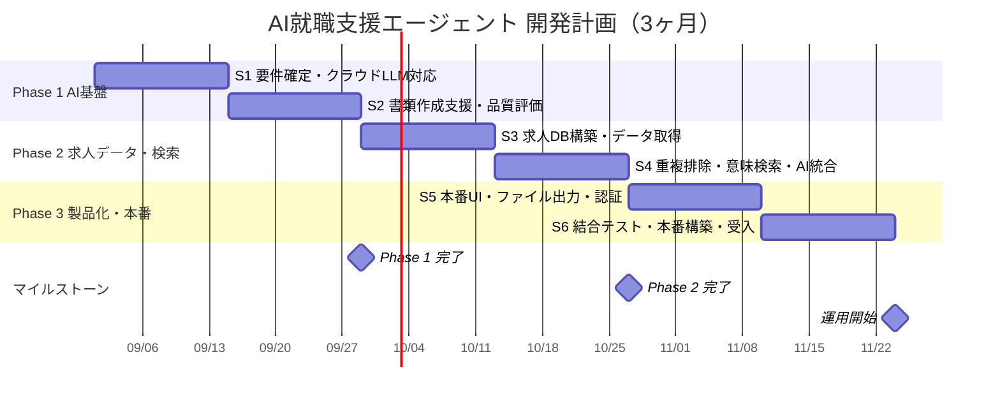

# AI就職支援エージェント 開発・運用計画書

**作成日：2026年8月26日**
**版数：v1.3**

---

## 0. 本書について

本書は、AIエージェント型就職支援チャットボットの運用開始に向けた、以下3点についてご説明するものです。

| # | 項目 | 該当章 |
|---|---|---|
| ① | 運用開始までに必要な工程 | 第3章 |
| ② | サーバ等、かかる費用 | 第4章 |
| ③ | AIの学習についてのご確認事項 | 第5章・第6章 |

> ※ 本書の内容は現時点の想定に基づく計画案であり、要件確定・データ取得元の調査結果・AIモデルの性能検証結果等により変動する可能性があります。

---

## 1. プロジェクト概要

### 1.1 システムの目的

求職者がチャット形式でAIと対話しながら、以下の支援を受けられるシステムを構築します。

- **求人検索** — 条件に合う求人の検索・提示（最新の求人情報に基づく）
- **応募支援** — 志望動機・応募書類の作成支援
- **書類作成支援** — 履歴書・職務経歴書・ポートフォリオの作成支援

### 1.2 システム全体構成（想定）

```
                  ┌──────────────────────┐
                  │  求人情報ソース        │
                  │  API / フィード /      │
                  │  企業採用ページ 等      │
                  └──────────┬───────────┘
                             │
                             ▼
                  ┌──────────────────────┐
                  │  データ取得層          │
                  │  （取得可否判定を含む） │
                  └──────────┬───────────┘
                             │
                       抽出・正規化・重複排除
                             │
                 ┌───────────┴───────────┐
                 ▼                       ▼
        ┌────────────────┐      ┌────────────────┐
        │  構造化データ    │      │  意味検索データ  │
        │  PostgreSQL     │      │  ベクトル検索    │
        │  企業名/勤務地/  │      │  職務内容/       │
        │  給与/雇用形態/  │      │  求めるスキル/   │
        │  掲載日/URL     │      │  企業説明        │
        └────────┬───────┘      └───────┬────────┘
                 └───────────┬───────────┘
                             ▼
                   ┌──────────────────┐
                   │  検索（RAG）      │
                   │  条件絞込 → 意味順位付け │
                   └────────┬─────────┘
                             ▼
                   ┌──────────────────┐
                   │  AIエージェント    │
                   │  （LLM + ツール）  │
                   └────────┬─────────┘
                             ▼
                        ユーザー
```

### 1.3 設計上の基本方針

**「データベースが唯一の正とする（Single Source of Truth）」**

AIが求人情報を推測・生成することは一切許容せず、必ず取得済みデータベースの実データに基づいて回答させます。存在しない求人を提示することは、求職者・求人企業双方に対する重大な信用毀損となるためです。

---

## 2. 現在の開発状況（既存資産 / Phase 0）

**本プロジェクトはゼロからの開始ではありません。** AIエージェントの基盤部分はプロトタイプとして既に稼働しています。

### 2.1 実装済みの機能

| 領域 | 状況 | 内容 |
|---|---|---|
| AIエージェント基盤 | ✅ 完了 | LangGraph によるエージェント制御（ツール呼出ループを含む） |
| 会話API | ✅ 完了 | FastAPI によるストリーミング応答（逐次表示対応） |
| CLI | ✅ 完了 | 開発・検証用のコマンドライン対話 |
| 会話履歴の永続化 | ✅ 完了 | PostgreSQL に全発言を保存 |
| 長期会話メモリ | ✅ 完了 | 会話が長期化した際、自動要約により文脈を維持する仕組み |
| ツール呼出機構 | ✅ 完了 | AIが必要に応じて外部処理を呼び出す仕組み（現在は日時取得のみ） |
| システムプロンプト管理 | ✅ 完了 | AIの役割・禁止事項を外部ファイルで定義・切替可能 |
| 書類作成支援 | ✅ 動作確認済 | 履歴書・職務経歴書の対話ヒアリングと文面生成 |
| フロントエンド | 🔨 雛形のみ | React 構成のみ作成済み。画面は未実装 |

### 2.2 現時点での制約（今後の開発対象）

- 求人データの取得・蓄積・検索機能は未着手
- LLMはローカルモデルのみ対応（クラウドAPI未対応）
- 認証・ユーザー管理は未実装
- ファイル出力（PDF/Word等）は未実装

> **ご提案の要点：** 既存基盤があるため、3ヶ月はAI基盤の再構築ではなく、**求人データ連携・検索精度・UI・テスト・本番構築**に充当できます。

---

## 3. ① 運用開始までに必要な工程

### 3.1 開発方針

- **全体を3フェーズ（各1ヶ月・計12週）** に分割し、その中を **2週間単位の6スプリント**として進めます。
- 各スプリントの終わりには、必ず**その時点で動作するものをご確認いただきます**。テストは各スプリントの中に含まれており、開発の最後にまとめて実施するものではありません。
- これにより、認識の齟齬が生じた場合でも、手戻りの範囲が最大2週間に収まります。

```
1スプリント（2週間）の進め方

  1週目                      2週目
 ┌────────────┐   ┌──────────────────┐
 │ 要件確認 → 設計 │ → │ 実装 → テスト → デモ │ → 次スプリントへ
 │   → 実装     │   │    （動作確認）     │
 └────────────┘   └──────────────────┘
```

> ※ 本計画は**要件定義前の概算**です。各スプリントの内容は、正式な要件確定（Sprint 1）と、その後の優先度のご相談に応じて調整可能です。詳細な作業計画は Sprint 1 完了時にご提示いたします。

### 3.2 Phase 1（第1ヶ月）— AI基盤の確立

既存プロトタイプを製品水準に引き上げ、AIの品質評価の土台を作ります。

| スプリント | 期間 | 実施内容 | スプリント終了時にご確認いただけるもの |
|---|---|---|---|
| Sprint 1 | Week 1–2 | 要件確定・アーキテクチャ設計・開発環境整備、クラウドLLM対応、会話管理の製品化 | **クラウドAIモデルで実際に会話が成立する状態**（要件定義書・システム構成図を添付） |
| Sprint 2 | Week 3–4 | 書類作成支援機能の精度向上（履歴書・職務経歴書）、応答品質の評価の仕組みづくり | **会話内容から書類のドラフトが生成される様子**＋初回の精度評価結果のご報告 |

### 3.3 Phase 2（第2ヶ月）— 求人データ連携・検索

本プロジェクトの中核です。詳細は **3.6節** をご参照ください。

| スプリント | 期間 | 実施内容 | スプリント終了時にご確認いただけるもの |
|---|---|---|---|
| Sprint 3 | Week 5–6 | 求人データ設計、データベース構築、取得元登録機能、求人データ取得（API・フィード・構造化データ、および承認済み少数サイトのHTML取得） | **実際の求人データが蓄積されたデータベース**と、取得元の管理画面 |
| Sprint 4 | Week 7–8 | 重複排除・鮮度管理、意味検索（RAG）構築、AIエージェントへの検索ツール統合 | **チャット上で求人を検索・ご提案できる状態** |

> **Sprint 4 の「重複排除」は、本計画の中で最も見積りが難しい作業です。** 同一の求人が複数サイトに掲載されている場合の名寄せは、実データを見るまで難易度が確定しません。ここが超過した場合は、Sprint 5 のファイル出力・認証を後ろへ送る形で調整させていただきます。

### 3.4 Phase 3（第3ヶ月）— 製品化・本番稼働

| スプリント | 期間 | 実施内容 | スプリント終了時にご確認いただけるもの |
|---|---|---|---|
| Sprint 5 | Week 9–10 | 本番UI実装（ChatGPT型チャット画面）、ファイル出力、ユーザー管理・認証 | **エンドユーザーが実際に操作できる画面**と、書類のダウンロード |
| Sprint 6 | Week 11–12 | 結合テスト・AI精度評価・性能テスト、セキュリティ対応、本番環境構築、受入確認 | **本番環境での稼働**、テスト報告書、運用手順書 |

> **Sprint 6 は開発スプリントではなく、「受入・運用開始」のための期間**として確保しています。ここでは新機能の開発は行わず、結合テスト・不具合修正・本番デプロイ・受入確認に充てます。開発計画において、この期間を確保しないことが遅延の最大の原因となるためです。

### 3.5 全体スケジュール（ガントチャート）



> ※ 開始日は仮置き（2026年9月1日）です。正式な開始日確定後に更新いたします。

**ガントチャートが表示されない環境向け（一覧表）**

| Phase | スプリント | 内容 |
|---|---|---|
| Phase 1 | Sprint 1–2（W1–W4） | 要件確定・クラウドLLM対応 → 書類作成支援・品質評価 |
| Phase 2 | Sprint 3–4（W5–W8） | 求人DB構築・データ取得 → 重複排除・意味検索・AI統合 |
| Phase 3 | Sprint 5–6（W9–W12） | 本番UI・ファイル出力・認証 → 結合テスト・本番構築・受入 |

### 3.6 求人データ取得方式について（重要）

求人データの取得方法は、**技術的な選択であると同時に、法務上の判断を要する事項**です。本プロジェクトでは以下の方針を提案します。

#### 3.6.1 取得手段の優先順位

安定性・法務適合性の高い順に採用します。下に行くほど、壊れやすく・費用が高く・法的リスクが高まります。

```
  ① 公式API                  ← 最優先。安定・合法・仕様が明確
  ② 採用管理システム(ATS)の公開エンドポイント
  ③ XML/JSONの求人フィード
  ④ サイトマップ + 構造化データ(JSON-LD)
  ⑤ HTMLの直接取得（スクレイピング）  ← 補助手段。①〜④が使えない場合のみ
```

**④について：** Googleしごと検索が2019年に日本で開始されて以降、多くの日本企業の採用ページが機械可読な構造化データ（`schema.org/JobPosting`）を公開しています。これは「機械に読ませるために公開されている」データであり、最も安全かつ低コストな取得手段です。

**⑤（HTML直接取得）について：** ⑤も構築いたします。貴社が対象としたいサイトの中には、機械可読なデータを一切公開していないサイトが存在するためであり、そこに対応できない仕組みでは不十分と考えます。ただし、以下の理由から**意図的に範囲を限定した補助手段**として構築します。

#### 3.6.2 HTML直接取得（⑤）の範囲と扱い

| | 初期リリースに含むもの | 初期リリースに含まないもの |
|---|---|---|
| **対応範囲** | 承認済みの少数サイトに対する個別設定型の取得（目安として3〜5サイトから開始） | 任意のサイトに自動対応する汎用クローラー |
| **実行契機** | 定期バッチ実行、および管理者による手動実行 | 利用者が質問した瞬間に、その場でサイトを取得する方式 |
| **対象サイト** | 区分A・B（3.6.3参照）のみ。書面承認の上で個別に登録 | 利用規約・robots.txt が禁止しているサイト |

**設計方針：AI自身は取得を行いません。**

本節で最も重要な点です。取得と検索を分離する設計とします。

```
 【取得】 定期バッチ  →  検証・重複排除  →  求人データベース
          （①〜⑤、管理者が管理）
                                              │
 【検索】 利用者の質問 → AI → 求人データベースを検索 ─┘
                              （AIは外部サイトへ直接アクセスしません）
```

AIエージェントに渡すのは**求人データベースの検索ツールのみ**です。利用者の質問に応じて外部サイトを取得する機能は持ちません。したがって、

- 利用者の行動に関わらず、**取得量・取得頻度は予測・制御可能**な範囲に留まります。利用者の操作が他社サイトへの負荷に直結することがありません。
- 取得元を停止する必要が生じた場合は、**その取得元の登録を解除するだけ**で停止でき、AI側の変更は不要です。
- どのデータをいつ・どこから取得したかの記録が残るため、**回答の根拠を後から説明できます**。

**⑤への依存を抑える理由：** HTML直接取得は法的にグレーな領域であり、サイトの利用規約に左右され、またサイトの表示構造が変わるたびに壊れます。そのため①〜④の**補完**として位置づけ、基盤とはしません。将来、対象サイトがAPIや構造化データの提供を開始した場合は、その取得元を①〜④へ移行します。対応サイトはリリース後、システムの設計を変えることなく段階的に追加可能です。

#### 3.6.3 取得元の法務区分（提案）

取得元ごとに区分を設定し、**区分が未設定のサイトはシステムが取得を拒否する**設計とします。判断を個別のプログラムに委ねず、登録時に一度だけ書面で確定させる仕組みです。

| 区分 | 対象 | 対応 |
|---|---|---|
| **A（可）** | 公式API、ATS公開エンドポイント、求人フィード、公開構造化データ、自社顧客提供データ | 取得可 |
| **B（要承認）** | 公開HTMLで、robots.txt が禁止しておらず、当社がアカウントを保有しないもの | 記名承認の上で取得 |
| **C（要法務判断）** | **貴社がアカウントを保有するサイト**、robots.txt が禁止するパス、過去に遮断された実績のあるサイト | 貴社顧問弁護士のご判断を経て書面指示があるまで取得しない |
| **D（不可）** | ログイン・課金の回避、CAPTCHA回避、遮断回避目的のIP偽装、過大なアクセス頻度 | 指示があっても実施しない |

#### 3.6.4 特にご確認をお願いしたい事項

- **貴社が求人媒体のアカウントを保有されているサイトはありますか。**
  アカウント登録時に利用規約へ同意している場合、当該サイトは自動取得の法的性質が大きく変わります（区分C）。リクナビ・マイナビ・doda・エン転職・ビズリーチ・Indeed・Wantedly・Green 等について個別にご確認いただきたく存じます。
- **貴社の事業は「募集情報等提供事業」に該当しますか。**
  2022年の職業安定法改正により該当する場合、掲載求人情報の**正確性・最新性の維持が法令上の義務**となります。該当する場合、鮮度管理機能の要件が変わります。
- **求人情報は「要点＋抜粋＋元URL」形式でよろしいでしょうか。**
  求人説明文の全文を当社側で保持・公開する形式と比べ、法務リスクが大きく下がる一方、機能面の差は限定的です。前者を推奨いたします。

> ※ 上記は法的助言ではなく、開発上の設計方針です。最終的な可否は貴社顧問弁護士のご判断に従います。

### 3.7 AI精度・性能の評価計画

「AIの性能」は単一の指標では測れません。本プロジェクトでは以下の観点に分解して評価します。

```
                    AI品質
                      │
        ┌─────────────┼─────────────┐
        ▼             ▼             ▼
      正確性        根拠性        応答品質
        │             │             │
        ▼             ▼             ▼
   ツール選択    検索精度・      文章品質・
     精度       ハルシネーション  指示遵守
        │             │             │
        └─────────────┼─────────────┘
                      ▼
                    信頼性
                      │
           ┌──────────┼──────────┐
           ▼          ▼          ▼
         応答速度   エラー率    情報鮮度
```

#### ① 機能正確性 — 意図した動作をするか

| テスト入力 | 期待動作 |
|---|---|
| 「履歴書を書きたい」 | ヒアリング開始、書類生成 |
| 「バックエンドエンジニアの求人を探して」 | 求人検索ツールを実行 |
| 「今日応募できる求人は？」 | 現在有効な求人のみ提示 |
| 「私の経歴に合う求人は？」 | ユーザー情報＋求人情報を組合せて提示 |
| 「志望動機を書いて」 | 応募文面を生成（ツール呼出なし） |

#### ② 根拠性 / ハルシネーション — **最重要**

存在しない求人を提示しないことを検証します。

```
  DB内の実データ：  A社 / バックエンド / 月給35万円

  質問：「月給60万円以上の求人はありますか？」

  ✅ 正しい応答： 「条件に合う求人は見つかりませんでした」
  ❌ 誤った応答： 「A社が月給60万円で募集しています」
```

**測定方法：** 30〜50問の検証用データセットを作成し、
`根拠に基づく回答数 ÷ 事実を含む回答総数 × 100` を算出します。

**目標値：** ハルシネーション発生率 0%（求人情報に関して）

#### ③ 検索精度（RAG精度）

構造化データと意味データを分離して保持する設計のため、両面から検証します。

- 条件検索：「東京都・正社員・Python」→ 該当求人が正しく返るか
- 意味検索：「FastAPIの経験が活かせる求人」→ 明示的な記載がなくても関連求人が返るか
- 提示情報の正確性：企業名・給与・勤務地・URL・掲載日に誤りがないか

#### ④ ツール選択精度（エージェント動作）

| ユーザー発話 | 期待されるツール |
|---|---|
| 現在の求人を探す | 求人検索 |
| 履歴書を書き直す | ツール呼出なし |
| 志望動機を作る | ツール呼出なし |
| 一般的なキャリア相談 | ツール呼出なし |

#### ⑤ 応答品質（人手評価）

代表的な20〜30会話について、5段階評価を実施します。

| 評価 | 基準 |
|---|---|
| 5 | 優秀 — そのまま利用可能 |
| 4 | 良好 — 軽微な修正のみ |
| 3 | 許容 — 実用可能な水準 |
| 2 | 要改善 |
| 1 | 不可 |

評価軸：関連性 / 網羅性 / 日本語の自然さ・敬語 / 専門文書としての適切さ / 指示遵守

**目標値：** 平均4.0以上、評価2以下が5%未満

#### ⑥ 求人情報の鮮度 — 就職支援システム固有の重要項目

```
   求人A   掲載：8/20   募集終了：8/24
   本日：8/25
   → 提示してはならない
```

検証対象：現在有効な求人 / 掲載終了求人 / 新規取得求人 / 重複求人 / 更新された求人 / 削除された求人 / 掲載日が不正な求人

#### ⑦ 性能・応答速度

| 指標 | 暫定目標値 |
|---|---|
| API 初期応答 | 1秒未満 |
| 最初の文字が表示されるまで | 3秒未満 |
| 通常応答の完了 | 10秒未満 |
| データベース検索 | 500ミリ秒未満 |
| 意味検索 | 1秒未満 |
| ツール実行 | 10秒未満 |
| APIエラー率 | 1%未満 |
| 同時接続 | 別途協議 |

> ※ 上記は**暫定目標値**です。採用するAIモデル・AWS構成・データ量・ネットワーク環境により変動するため、Phase 1 の評価結果をもって正式な目標値を確定させていただきます。

#### 評価結果の活用 — 結果が悪かった場合に何を行うか

測定するだけでは品質は向上しません。各評価項目について、**結果が悪かった場合に実施する具体的な改善手段**をあらかじめ対応づけておきます。

```
  評価  →  原因の切り分け  →  改善の実施  →  データセット全体で再評価
    ▲                                              │
    └──────────────────────────────────────────────┘
              （他の項目が悪化していないことを確認）
```

**前提として重要な点：** AIは「叱られて学習する」わけではありません。過去の失敗を記憶しないため、「二度とやらないように」と伝えても次回以降の会話には影響しません。したがって改善は常に、**当社が行う技術的な変更**（指示文の修正・検索処理の修正・検証処理の追加）となります。

| 項目 | 結果が悪い場合の典型的な原因 | 実施する改善 |
|---|---|---|
| **① 機能精度** | 指示が曖昧、または想定していない依頼パターン | 該当パターンを具体例つきで指示文に追加し、テストケースにも追加 |
| **② 根拠性・ハルシネーション** | 与えたデータを超えてAIが記述した | **主：プログラムによる出力検証**（後述）。従：指示文の厳格化、創造性設定の引き下げ |
| **③ 検索精度** | 「正しい求人が取得できていない」か「取得できたが使われていない」のいずれか | 検索ログを確認して切り分け。両者は対処が全く異なる（後述） |
| **④ ツール選択精度** | ツールの説明文がAIにとって不明瞭 | ツール説明文の書き直し、類似ツールの統合、判断例の追加 |
| **⑤ 応答品質** | 言い回し・情報量・トーンが期待と合っていない | **繰り返し現れる**傾向のみ指示文へ反映。個別の事象はテストケースとして登録 |
| **⑥ データ鮮度** | 取得処理・掲載終了判定の不具合 | データ取得処理側で修正。AIの問題ではなく、指示文の変更では解決しません |
| **⑦ 性能** | モデル・インフラ・クエリ効率 | モデル変更、データベースの索引追加、設定調整 |

**②について（最重要）：ハルシネーションは「お願い」ではなく、仕組みで防ぎます。**

AIへの指示だけでは保証にならないため、プログラム側に検証処理を設けます。

```
  AIが回答を生成
      │
      ▼
  回答に含まれる企業名・給与額・求人URLを、
  実際にデータベースから取得したレコードと照合
      │
      ├─ すべて一致  →  利用者へ返す
      └─ 一致しない  →  返さず、再生成または「該当なし」と回答
```

これはAIへの依頼ではなく機械的な照合であるため、AIの機嫌・使用モデル・会話の長さに左右されません。0%という目標が現実的である理由がここにあります。

**③について：検索ログにより、性質の異なる2つの失敗を切り分けます。**

| ログ上の状態 | 意味 | 対処 |
|---|---|---|
| 正しい求人が取得候補に**入っていない** | 検索自体の失敗 | 検索条件の調整、日本語の単語分割・同義語の見直し、キーワード検索と意味検索の比重調整、取得候補数の増加、並べ替え処理の追加 |
| 正しい求人は取得できているが、回答に**使われていない** | 検索は成功、回答の組み立てが失敗 | 指示文の修正、AIへ渡す情報の並び順の変更、同時に渡す情報量の削減 |

この切り分けを行わない場合、利用者からはどちらも「求人が見つからない」という同じ症状に見えるため、誤った側の改修に工数を費やすことになります。

**⑤について：人手評価は、恒久的なテストケースへ変換します。**

評価2以下となった会話は、すべて評価データセットへ事例として登録します。これにより、

- 評価データセットは**運用とともに増え、回帰テスト（過去の問題の再発確認）の役割を持ちます。** 一度直した問題は、以後自動的に確認され続けます。
- **1件のご指摘**はテストケースとして登録しますが、指示文は変更しません。**3件以上繰り返し現れた傾向**のみを指示文へ反映します。

後者は意図的な運用ルールです。個別のご指摘のたびに指示文を書き足すと、指示文が長大化し、記述どうしが矛盾し、かえって全体品質が低下します（1つ直すと2つ壊れる状態）。改善のたびにデータセット全体で再評価するのも同じ理由です。

**実施頻度：** 開発中は各スプリント終了時。運用開始後は、月次で評価結果を貴社とともにご確認いただく形をご提案します。

### 3.8 各フェーズの完了基準

**「いつ完成したと言えるのか」**を事前に定義します。

#### Phase 1 完了基準
- [ ] チャット画面とバックエンドが疎通している
- [ ] 会話履歴が保存され、長期会話でも文脈が維持される
- [ ] 履歴書・職務経歴書の作成支援が動作する
- [ ] AIが定義されたルール（禁止事項を含む）を遵守する
- [ ] AI応答品質の初期評価が完了し、結果を報告済み

#### Phase 2 完了基準
- [ ] 求人取得元を登録・管理できる（法務区分の設定を含む）
- [ ] 求人データが正しく取得・蓄積される
- [ ] 同一求人が複数サイトから取得された場合、1件に統合される
- [ ] 条件検索・意味検索の両方が動作する
- [ ] AIが求人検索ツールを正しく呼び出す
- [ ] 掲載終了求人が提示されない
- [ ] **AIが存在しない求人を提示しない（検証データセットで確認）**

#### Phase 3 完了基準
- [ ] 本番UIが完成している
- [ ] 書類のファイル出力が動作する
- [ ] ユーザー認証・管理が動作する
- [ ] 結合テストが完了している
- [ ] 性能テストが完了し、目標値を満たしている
- [ ] AWS本番環境が構築され、稼働している
- [ ] 貴社による受入確認が完了している

---

## 4. ② サーバ等、かかる費用

### 4.1 2つの構成プランのご提案

ご予算とご要望に応じて、2つの構成をご提案いたします。**いずれの構成でもシステムの機能は同一**であり、違いは「運用の安定性」と「費用」のバランスです。

| | プランA | プランB |
|---|---|---|
| 構成 | AWS（アマゾン ウェブ サービス） | 国内VPS（さくらのVPS 等） |
| 月額目安 | **約 11,000〜15,500円** | **約 2,000〜3,000円** |
| 想定用途 | 本番運用・将来の規模拡大 | 試験運用・初期リリース |

### 4.2 プランA — AWS構成

#### 基本構成（必須）

| 分類 | サービス | 役割 |
|---|---|---|
| アプリケーションサーバ | Amazon EC2 | バックエンド処理と画面配信 |
| データベース | Amazon RDS (PostgreSQL) | 会話履歴・求人データの保管。意味検索機能を標準で内包（専用DB不要） |
| ファイル保管 | Amazon S3 | 生成書類・取得データの保管 |
| 通信・セキュリティ | Cloudflare | ドメイン管理、暗号化通信、不正アクセス防御、配信高速化 |
| 稼働監視 | Amazon CloudWatch | サーバ稼働状況の監視 |
| 障害検知 | Sentry | アプリケーション不具合の自動通知 |
| 自動デプロイ | GitLab CI/CD | 更新作業の自動化 |
| **AI利用料** | 外部AIサービス | 別掲（4.5節）。利用量に比例 |

**月額目安：約 11,000〜15,500円**（AWS公式見積ツールにて算出）

> ※ 1年間の継続利用をお約束いただく契約形態を選択した場合、上記から約30〜40%の割引が適用されます。

#### 追加構成（必要に応じて）

| 項目 | 月額目安 | 追加が必要になる場面 |
|---|---|---|
| 負荷分散装置 + 自動増減 | 約 +5,000円〜 | 無停止での更新、機器故障時の自動切替が必要な場合 |
| データベース冗長化 | 約 +5,000円 | データベース障害時にも停止させたくない場合 |
| サーバ増設 | 約 +5,000円 | 同時利用者数が増加した場合 |
| 求人データ取得用の実行環境 | 別途 | Phase 2 以降。取得量に依存 |

### 4.3 プランB — 国内VPS構成

**さくらのVPS を基準価格として記載しております。** ConoHa VPS・Xserver VPS 等の国内サービスも同等の構成・価格帯で選択可能です。

#### 基本構成（必須）

| 分類 | サービス | 役割 |
|---|---|---|
| サーバ | さくらのVPS（4GB〜8GB / 国内データセンター） | すべての処理を1台で実行 |
| コンテナ基盤 | Docker / Docker Compose | 構成の標準化。将来のAWS移行を容易にする |
| データベース | PostgreSQL（サーバ内に設置） | プランAのRDSと同一の役割 |
| Webサーバ | Nginx | 画面配信、暗号化通信の終端 |
| 通信・セキュリティ | Cloudflare | プランAと同一 |
| **自動バックアップ** | 外部保管（Backblaze B2 等） | データベースを暗号化して外部に自動保管 |
| ファイル保管 | 外部保管（Cloudflare R2 等） | 生成書類・取得データの保管 |
| 障害検知 | Sentry | プランAと同一 |
| 自動デプロイ | GitLab CI/CD | プランAと同一 |
| **AI利用料** | 外部AIサービス | 別掲（4.5節） |

**月額目安：約 2,000〜3,000円**

#### 追加構成（必要に応じて）

| 項目 | 月額目安 | 追加が必要になる場面 |
|---|---|---|
| サーバ増設（上位プラン） | 約 +1,000円〜 | 処理能力が不足した場合 |
| データベース専用サーバ | 約 +2,000円〜 | データベース負荷が高まった場合 |
| サーバ追加（求人取得処理用） | 約 +2,000円〜 | Phase 2 以降、取得処理を分離する場合 |

### 4.4 プラン比較

| 比較項目 | プランA（AWS） | プランB（国内VPS） |
|---|---|---|
| 月額費用 | 約 11,000〜15,500円 | 約 2,000〜3,000円 |
| 年額費用 | 約 132,000〜186,000円 | 約 24,000〜36,000円 |
| 費用の予測しやすさ | 利用量により変動 | 定額 |
| 機能 | 同一 | 同一 |
| データ保管場所 | 東京リージョン（国内） | 国内データセンター |

#### プランA（AWS）のメリット

| 項目 | 内容 |
|---|---|
| **バックアップが標準機能** | 自動バックアップと任意時点への復元がサービスに含まれます。誤ってデータを削除した場合も、管理画面の操作のみで復旧できます |
| **機器故障の影響を受けにくい** | 物理的な故障はAWS側で吸収されます。機器の交換・再構築作業が発生しません |
| **移行なしで規模拡大が可能** | 利用者増加に対し、現構成のまま処理能力を追加できます |
| **第三者認証を取得済み** | ISO 27001 等の国際認証を取得しています。貴社のお客様から監査を受ける際に有利です |
| **広く認知されている** | 企業間取引において説明が容易です |

#### プランA（AWS）のデメリット

| 項目 | 内容 |
|---|---|
| **費用** | プランBの約5倍です |
| **費用が変動する** | 通信量・ログ量・保存量に応じて月額が変動するため、予算計上がやや難しくなります |
| **構成が複雑** | 設定項目が多く、設定誤りが想定外の課金につながる可能性があります |

#### プランB（国内VPS）のメリット

| 項目 | 内容 |
|---|---|
| **費用** | プランAの約5分の1です |
| **定額制** | 月額が固定のため、予算計上が容易です |
| **構成が単純** | 1台構成のため、把握・引継ぎが容易です |
| **他社への移行が容易** | 標準的なコンテナ技術を使用するため、将来AWSへ移行する際も再開発は不要です |
| **現在の規模には十分** | 想定利用者数において、性能面での妥協はありません |
| **国内事業者** | 日本語サポート、請求書払いに対応。データも国内に保管されます |

#### プランB（国内VPS）のデメリット

| 項目 | 内容 |
|---|---|
| **バックアップの運用が必要** | 自動バックアップの構築と定期的な復元試験を当社にて実施します（本計画に含まれます）。プランAでは不要な作業です |
| **機器故障時に停止する** | 1台構成のため、故障時は復旧までサービスが停止します。自動切替の仕組みはありません |
| **規模拡大時に移行作業が必要** | 現サーバの能力を超える場合、計画的な移行作業が発生します |
| **第三者認証が限定的** | 国際認証の取得範囲がAWSより限定的です |

### 4.5 AI利用料（従量課金）の試算

AI利用料は**利用量に比例する従量課金**です。参考として、**「1名の求職者が対話を通じて履歴書・職務経歴書を1式作成する場合」**の試算を以下に示します。

| 採用モデル区分 | 1名あたり | 100名あたり | 1,000名あたり |
|---|---|---|---|
| 低コストモデル | 約 ¥5〜15 | 約 ¥1,500 | 約 ¥15,000 |
| 中位モデル | 約 ¥120 | 約 ¥12,000 | 約 ¥120,000 |
| 最上位モデル | 約 ¥210 | 約 ¥21,000 | 約 ¥210,000 |

> ※ 為替 ¥155/USD 換算。標準的な対話量（ヒアリング＋書類生成1回）を前提とした概算です。
> ※ 対話が長期化した場合、上記の約1.7倍程度まで増加します。
> ※ 同一指示文の再送分を割り引く仕組み（キャッシュ）により、さらに削減可能な見込みです。

**費用構造のご説明：**
AIは会話のたびに「AIへの指示文＋これまでの会話の記憶＋今回の質問」をまとめて処理するため、**対話が長くなるほど費用が増加します**。本システムでは会話の自動要約により、記憶量が際限なく増えない仕組みを既に実装済みです。

**モデル選定について：**
費用差は1名あたり最大でも約¥200程度です。したがって**選定は費用ではなく品質で判断すべき**と考えます。具体的には「職務経歴書として通用する日本語を書けるか」「情報が無い場合に推測せず質問し返せるか」の2点を Phase 1 で実測し、ご報告いたします。

### 4.6 ご提案：段階的な構成移行

**初期リリースにおいては、プランBで十分かつ適切であると考えております。** 想定される利用者数において、プランAを高額にしている機能（冗長化・自動拡張）は必要となりません。

サービスの成長に伴い、または冗長性・第三者認証が貴社のお客様から求められる段階で、プランAへの移行を計画的な節目として実施いたします。標準的なコンテナ技術を使用するため、**この移行に再開発は不要です。**

| 段階 | 構成 | 月額目安 |
|---|---|---|
| 開発・試験運用（1〜3ヶ月目） | プランB | 約 2,000〜3,000円 |
| 初期リリース | プランB | 約 2,000〜3,000円 |
| 本格運用・規模拡大時 | プランA | 約 11,000〜15,500円 |
| 冗長化構成 | プランA + 追加構成 | 約 21,000〜25,000円 |

### 4.7 費用に関する前提

- 上記はインフラおよびAI利用料の概算であり、**開発費・保守費は含みません**。
- AWS費用はAWS公式見積ツールによる算出値です。実際の利用量により変動します。
- 国内VPS費用は、さくらのVPS を基準とした概算です。契約期間により単価が変動します。
- 各社の料金は改定される可能性があるため、契約時点で再確認いたします。
- 為替変動により、外貨建てサービス（AI利用料等）の円換算額は変動します。
- 求人データ取得元が有料API・有料フィードの場合、別途費用が発生します。

---

## 5. ③ AIの学習について

### 5.1 「AIに学習させる」の3つの意味

ご要望を正確に反映するため、まず用語を整理させてください。技術的に全く異なる3つの方式があります。

| 方式 | 内容 | 反映速度 | 費用 | 本件での要否 |
|---|---|---|---|---|
| **① 指示文の設計**<br>(Prompt Engineering) | AIの役割・口調・禁止事項・回答手順を文章で定義 | 即時 | 無償 | **必須・実装済** |
| **② 知識の参照**<br>(RAG) | 求人情報・企業情報等をデータベースから都度参照させる | 即時 | 低 | **必須・Phase 2** |
| **③ モデルの追加学習**<br>(Fine-tuning) | AIモデル自体を学習データで改変する | 数日〜 | 高 | **当面不要** |

### 5.2 ① 指示文の設計（実装済）

```
   指示文（役割・ルール・禁止事項）
            ↓
           AI
            ↓
          応答
```

現時点で以下を定義済みです：

- AIの役割（就職支援担当者としての振る舞い）
- ヒアリング手順（段階的な情報収集）
- **禁止事項（ユーザーが述べていない情報を創作しない）**
- 出力形式（履歴書・職務経歴書の書式）
- 使用言語の規則（ユーザーの言語に合わせる／書類は日本語）

### 5.3 ② 知識の参照（RAG）— 本件の中核

```
   求人情報・企業情報
          ↓
   データベース／ベクトル検索
          ↓
      関連情報を抽出
          ↓
   AIが「与えられた情報だけ」で回答
```

**重要な点：** この方式ではAIモデル自体は変化しません。回答の都度、実データを渡して参照させます。

**この方式の利点：**

- 求人情報を更新すれば**即座に**回答へ反映される（再学習不要）
- 提示した求人の**出典URLを必ず添付できる**
- **データに無い情報は「見つかりません」と回答させられる**

「AIに求人を覚えさせる」のではなく「AIに求人データベースを調べさせる」設計です。就職支援システムにおいては、こちらが唯一適切な方式です。

### 5.4 ③ モデルの追加学習（当面不要と考える理由）

追加学習は、AIモデル自体を数百〜数千件の学習データで改変する手法です。本件では以下の理由から、当面は不要と考えます。

- 求人情報は日々変動するため、学習させても即座に陳腐化する
- 求人の正確性は追加学習では保証できない（②の参照方式でのみ保証可能）
- 費用と期間を要し、効果の検証も困難
- 指示文の設計（①）で対応可能な範囲が大きい

**将来的に検討の余地がある場合：** 貴社独自の文章表現・添削方針を大量の実例で反映させたい場合には、選択肢となり得ます。その際は、運用実績データが蓄積された後の追加フェーズとしてご提案いたします。

### 5.5 「AIの再現性」についての補足

> ご懸念：「AIが求人を捏造すると困る」

**全くその通りであり、本システムの最重要要件と認識しております。**

一点、技術的な補足をさせてください。AIは本質的に確率的な仕組みであり、同じ質問に毎回一字一句同じ回答を返すことは保証できません。**しかしこれは問題ではありません。** 必要なのは「毎回同じ文章」ではなく「**毎回、事実に基づいていること**」だからです。

```
  ❌ 誤ったアプローチ： AIに求人情報を記憶させ、思い出させる
  ✅ 正しいアプローチ： AIにデータベースを検索させ、結果のみを説明させる


      ユーザーの質問
           ↓
      AIがツールを呼出
           ↓
      データベース（＝唯一の正）
           ↓
      実データを取得
           ↓
      AIは取得したデータのみを日本語で説明
           ↓
        回答（出典URL付き）
```

文章表現は毎回多少異なっても構いません。**提示される求人・企業名・給与・URLは、常にデータベースの実データと完全に一致します。** これを 3.7節②の検証で継続的に確認いたします。

---

## 6. クライアント様へのご確認事項

### 6.1 AIモデルについて

| # | ご確認事項 |
|---|---|
| Q1 | 使用するAIモデルについて、ご指定・ご希望はございますか。（海外クラウドサービスの利用可否を含む） |
| Q2 | 求職者との会話データを国外のAIサービスに送信することについて、社内規程上の制約はございますか。 |
| Q3 | 「AIに学習させたい」とお考えの内容は、第5章の①〜③のいずれに該当しますでしょうか。 |

### 6.2 AIに登録する情報について

| # | ご確認事項 |
|---|---|
| Q4 | AIに参照させたい貴社固有の情報は何でしょうか。<br>（求人情報 / 企業情報 / 募集要件 / キャリア相談の指針 / 書類の見本 / 応募文の見本 / よくある質問 / 社内資料 等） |
| Q5 | AIに「必ず守らせたいルール」はございますか。<br>例：求人を創作しない / 現在募集中の求人のみ提示する / 必ず出典URLを添える / 給与に関して断定的な表現をしない / 情報不足時は必ず質問し返す |
| Q6 | ユーザーごとの情報（スキル・経歴・希望職種・希望給与・希望勤務地・応募履歴）を記憶させる必要はございますか。 |

### 6.3 求人データの取得について（重要）

| # | ご確認事項 |
|---|---|
| Q7 | 対象としたい求人サイト・媒体を具体的にお示しいただけますでしょうか。（サイト単位で取得可否を法務確認いたします） |
| Q8 | **上記のうち、貴社がアカウントを保有されているサイトはございますか。** |
| Q9 | 過去に求人媒体等から、データ取得に関する警告・通知を受けられたことはございますか。 |
| Q10 | 貴社の事業は「募集情報等提供事業」（2022年 職業安定法改正）に該当しますか。 |
| Q11 | 求人情報の提示形式は「要点＋抜粋＋元URL」でよろしいでしょうか。 |
| Q12 | 対象言語・地域の範囲をお教えください。（日本国内のみ / 英語求人を含む 等） |
| Q13 | 求人情報の更新頻度について、どの程度の鮮度をご期待でしょうか。（1時間以内 / 1日以内 / 1週間以内） |
| Q14 | 対象とする求人取得元の規模感をお教えください。（厳選した十数件 / 数百件） |

### 6.4 運用体制について

| # | ご確認事項 |
|---|---|
| Q15 | 求人取得元の承認・管理はどなたが担当されますか。 |
| Q16 | 運用開始後の保守・改善体制について、ご希望はございますか。 |

---

## 7. 今後の拡張候補（本計画スコープ外）

運用開始後、ご要望に応じて追加検討可能な項目です。

| 項目 | 内容 |
|---|---|
| Web検索連携 | 最新の業界情報・企業情報のリアルタイム参照 |
| 取得元の自動探索 | 新規求人サイトの候補提示（人手承認を前提） |
| HTML直接取得の対応サイト拡大 | リリース時に設定した少数サイトを超える追加対応（1サイトごとに法務判断・承認を要す） |
| 書類の高度な出力 | 日本の標準様式に準拠したPDF/Excel出力 |
| 管理者ダッシュボード | 求人取得状況・利用状況の可視化 |
| 面接対策支援 | 想定問答の生成・練習機能 |
| 複数AIモデルの併用 | 用途別に最適なモデルを使い分け、費用と品質を最適化 |

---

## 8. 前提条件・免責事項

- 本書の工程・期間は現時点における想定であり、要件変更・外部サービスの仕様変更・AIモデルの性能・検証結果等により前後する可能性があります。
- 費用は概算であり、正式な構成確定後に確定いたします。
- 求人データの取得可否に関する記述は法的助言ではありません。最終的な可否判断は貴社顧問弁護士のご判断に従います。
- AI応答の性能目標値は暫定値であり、Phase 1 の評価結果をもって正式に確定いたします。
- 求人取得元の仕様変更・提供停止等、当社の管理外の要因により機能が影響を受ける場合があります。