# AI Job Navigator — システム用語集・アーキテクチャ解説

**対象読者:** 本プロジェクトの技術的な議論において、共通の用語基盤を必要とするメンバー。

**目的:** 何を構築しているのか、各構成要素が何を担当するのか、そしてそれらの境界がどこにあるのかを正確に定めること。

---

## 0. 最も重要な区別

本書において最も重要な点は次の一文に尽きます。

> **私たちは大規模言語モデルを開発しているのではありません。大規模言語モデルを「利用する」アプリケーションを開発しています。**

言語モデルは構成要素の一つであり、交換可能です。外部プロバイダから提供される（あるいはローカルで実行される）ものであり、ネットワーク経由で呼び出され、アプリケーション本体を書き換えることなく別のモデルに差し替えられます。

AI Job Navigator を製品たらしめている部分 — ユーザーアカウント、会話履歴、求人データ、書類生成、決済、そして「いつ検索するか」「その結果をどう扱うか」という判断 — は、すべて私たち自身のソフトウェアです。モデルが提供するのは言語の理解と生成のみであり、それ以外は何も提供しません。

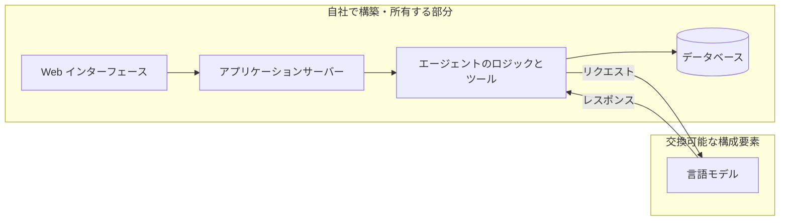

分かりやすい比較として、会計システムを構築する企業はデータベースエンジンを利用しますが、データベース事業を営んでいるわけではありません。私たちも言語モデルを利用しますが、言語モデル事業を営んでいるわけではありません。

---

## 1. 用語

### 1.1 モデルそのものに関する用語

**LLM（大規模言語モデル）**
膨大な量のテキストで学習された統計モデルであり、与えられた入力に続くべきテキストを予測します。呼び出し間の記憶を持たず、インターネットにアクセスできず、自ら行動を起こす能力もありません。呼び出しは毎回独立しています。GPT、Claude、Gemma、Qwen はいずれも LLM です。

**トークン**
LLM が読み書きする単位であり、おおよそ単語の断片に相当します。英語では平均して 1 トークンあたり約 4 文字ですが、日本語ははるかに密度が高く、1 トークンあたり約 1〜1.5 文字です。API の料金はすべてトークン単位で計算されるため、トークン数がそのままコストの単位となります。

**コンテキストウィンドウ**
モデルが 1 回の呼び出しで考慮できるトークン数の上限です。システム指示、会話履歴、新しい質問のすべてを合算した値です。会話がこの上限を超えた場合、古い内容を削除するか要約する必要があります。本システムではローリング要約により自動的に処理しています。

**推論（インファレンス）**
モデルを実行して出力を得る行為です。「推論コスト」「推論速度」とは、モデルの実行に関する指標であり、学習に関するものではありません。**本プロジェクトでモデルの学習は行いません。**

**プロンプト / システムプロンプト**
モデルに与えるテキストです。「システムプロンプト」とは、アシスタントの役割・口調・出力形式を定義する恒久的な指示ブロックを指します。本システムではキャリアアドバイザーの人格を定義するファイルがこれにあたります。

**ファインチューニング**
既存モデルを専用データで追加学習させ、既定の振る舞いを変更することです。高コストかつ時間を要し、さらに自社で保守すべきモデルが増えてしまいます。**本プロジェクトでは行いません。** 代わりにプロンプトとツールによって振る舞いを制御します。こちらは数日ではなく数分で調整できます。

**ハルシネーション（幻覚）**
モデルが自信を持って事実と異なる出力を生成する現象です。これは LLM の仕組みに内在するものであり、プロンプトの工夫だけで根絶することはできません。対策はアーキテクチャで行います。すなわち、モデルに事実を思い出させるのではなく、実データを与えた上で処理させます。求人検索を自社データベースに対して実行し、「どんな求人があるか」をモデルに尋ねない理由はまさにこれです。

### 1.2 アーキテクチャに関する用語

**エージェント / エージェンティック**
LLM が単に返答するのではなく、呼び出し可能な「ツール」群を与えられ、ループの中で動作する仕組みを指します。すなわち、考える → ツールを呼ぶ → 結果を読む → また考える、をタスクが完了するまで繰り返します。決定的な特徴は、**手順の数と順序が事前にプログラムで固定されておらず、実行時にモデルによって決定される**点にあります。

**ツール（関数呼び出し / Function Calling）**
モデルに対して公開する機能であり、モデルが「要求できる」関数です。モデル自身は何も実行しません。`search_jobs(location=福岡, salary_min=250000)` のような構造化されたリクエストを返すだけです。**それを実行するのは私たちのコード**であり、引数を検証した上で結果を返します。モデルは依頼できるのみで、判断と実行はアプリケーション側が行います。セキュリティおよび業務ルールはすべてこの境界に置かれます。

**アグノスティック（非依存）**
特定の実装に依存しないことを指します。本システムは「プロバイダ非依存」です。汎用インターフェースに対して実装されているため、OpenAI、OpenRouter、ローカル実行の Ollama はいずれも設定一つで交換可能です。これは偶然ではなく意図的な設計特性であり、**同一のコードのまま、開発ではローカルモデル、本番では商用モデルを使える**理由でもあります。

**オーケストレーション**
タスクの複数手順を統括することです。次にどの手順を実行するか、失敗時にどうするか、いつ停止するか、といった制御を指します。本システムではこれを LangGraph が担います。

**RAG（検索拡張生成）**
先に関連する実データを取得し、質問と一緒にモデルへ渡すことで、モデルの学習データではなく自社が管理する事実に基づいた回答を得る手法です。求人検索はこのパターンに従います。

**チェックポイント**
エージェントの状態を各手順ごとに保存し、サーバー再起動をまたいでも会話を中断地点から正確に再開できるようにする仕組みです。本システムでは PostgreSQL に会話単位で保存しています。

**SSE（Server-Sent Events）**
サーバーからブラウザへの一方向ストリーミング通信です。返答が長い沈黙の後にまとめて表示されるのではなく、順次表示されるのはこの仕組みによります。

**冪等性（べきとうせい / Idempotency）**
同じリクエストを繰り返しても処理が重複せず、同一の結果になる性質です。ユーザーが送信ボタンを二度押しても、二重課金や二重返信が発生しないことを保証します。

---

## 2. 本システムの正体と、ChatGPT 型アプリとの違い

### 2.1 ChatGPT 型アプリケーション

モデルの上に載った薄い層に過ぎません。ユーザーが入力し、履歴を添えてモデルへ転送し、返答を表示します。アプリケーション自体は業務知識を持たず、行動も起こしません。その価値はモデルへの便利なアクセス手段であること、それだけです。

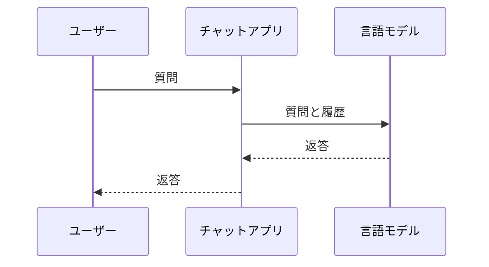

福岡の求人について尋ねれば、学習データからそれらしい内容を生成します。しかし本日実際に掲載されている求人を知ることはできません。求人データへのアクセス手段を一切持たないからです。

### 2.2 エージェンティックなアプリケーション

モデルは、実データを保持し行動を起こせる、より大きなシステムの「推論部品」となります。

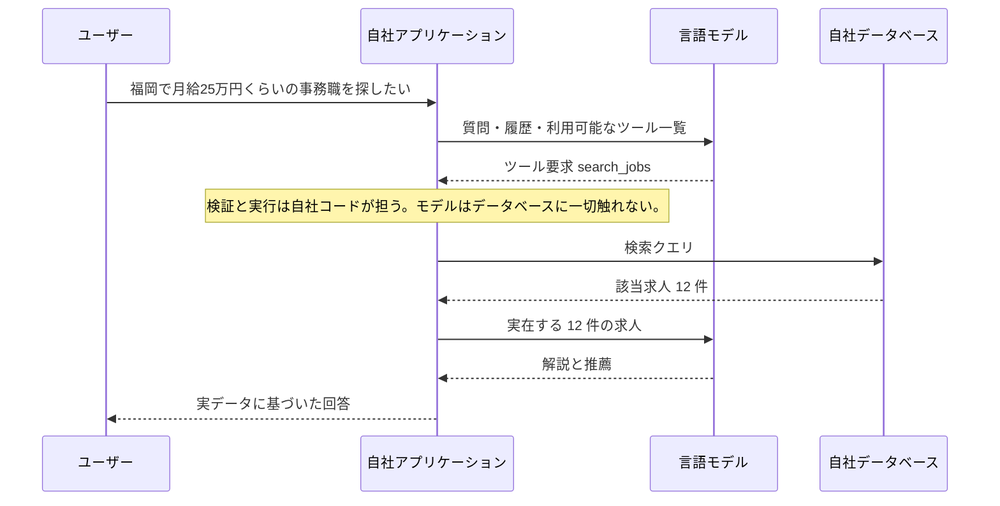

一文で言えば、**チャットアプリは求人について「語る」だけですが、エージェンティックなアプリは求人を「調べ」、その結果をもとに「考え」、そこから「書類を生成する」**という違いです。

### 2.3 表による整理

| | ChatGPT 型アプリ | AI Job Navigator |
|---|---|---|
| 事実の出所 | モデルの学習データ | 自社で収集・保守する求人データベース |
| 行動の実行 | 不可 | 可能（検索・書類生成・記録の保存） |
| 業務知識 | なし | 日本の履歴書・職務経歴書の慣習、雇用用語 |
| 永続化 | チャットログのみ | ユーザー、書類、応募、求人履歴 |
| 正確性 | もっともらしいだけ | 実レコードと照合可能 |
| 優れたモデルが出たら置き換わるか | それ自体がモデルである | 置き換わらない。モデルはその一部品 |

最後の行が最も重要です。明日より優れたモデルが登場した場合、ChatGPT 型アプリは陳腐化します。本システムは設定を 1 行変更するだけで、より優れた製品になります。

---

## 3. Ollama と パブリック API の違い

ここは誤解が生じやすいため、丁寧に整理します。両者は**同じ種類の構成要素を入手する 2 通りの手段**であり、運用上の特性が大きく異なります。

### 3.1 それぞれの正体

**Ollama** は、自分が管理するマシン上で言語モデルを実行するソフトウェアです。モデルファイルをそのマシンにダウンロードし、GPU のメモリ上に読み込み、ローカルのネットワークポートで提供します。外部通信は発生せず、リクエスト単位の課金もありません。その代わり、ハードウェアと電力という形で費用を負担します。

**パブリック API**（OpenAI、OpenRouter、Anthropic など）はホスティングされたサービスです。HTTPS でリクエストを送り、返答を受け取ります。ハードウェア — 通常はデータセンターに並ぶ大量の GPU — はプロバイダが運用し、消費トークン量に応じて課金されます。

重要なのは、**この 2 つはアプリケーションから見て同一のインターフェースを持つ**という点です。Ollama は OpenAI 互換プロトコルを話すため、私たちのコードは環境変数 1 つで両者を切り替えられます。

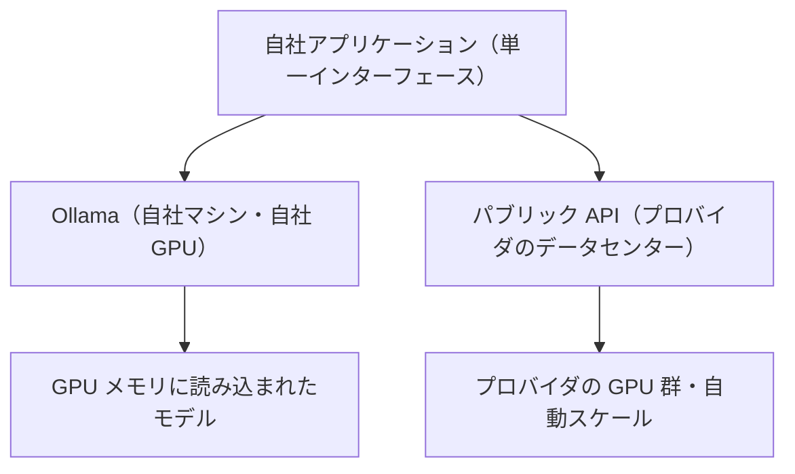

### 3.2 同時接続数 — 決定的な違い

ここが最も見落とされやすい点です。

GPU は一度に 1 つのバッチしか処理できません。Ollama を実行する 1 台のマシンは、GPU メモリ上にモデルを 1 つ保持し、リクエストを実質的に順番に処理します。2 人のユーザーが同時に質問しても、同時には返答されません。2 人目は 1 人目の処理完了を待ちます。同時利用者が 10 人なら、10 人目は他の 9 人を待つことになります。

一方、パブリック API のプロバイダはロードバランサの背後で数千台規模の GPU を運用しています。同時リクエストはその群全体に分散されます。10 人が同時に利用しても、それぞれに割り当てる余剰ハードウェアが存在するため、並列に処理されます。

自社ハードウェアで同時 10 ユーザーを支えようとすれば、およそ 10 倍の設備を購入・運用する必要があり、しかもアクセスが少ない時間帯はそれが遊休資産となります。

### 3.3 比較

| | Ollama（自社運用） | パブリック API |
|---|---|---|
| 実行場所 | 自社所有のマシン | プロバイダのデータセンター |
| 費用構造 | 固定費（ハードウェア＋電力） | 変動費（トークン従量課金） |
| 同時利用者数 | 実質的に 1 台あたり 1 人 | 数百人規模を透過的に処理 |
| 応答速度 | 自社 GPU の性能に完全依存 | 安定・専門的にチューニング済み |
| 利用できるモデル品質 | GPU メモリ容量による制約 | 最大級のモデルが利用可能 |
| データの外部送信 | なし | あり（プロバイダへ送信される） |
| 利用者増への対応 | マシンを買い増す | 対応不要 |
| 可用性 | 自社が責任を負う | プロバイダの SLA で担保 |
| 深夜の障害対応 | 自社の問題 | プロバイダの問題 |

### 3.4 本プロジェクトの方針

**開発では Ollama を、本番ではパブリック API を使用します。** これは二者択一ではなく、同一の構成要素を状況に応じて使い分けるものです。

開発中の利用者は開発者 1 名のみです。同時接続数は問題になりません。さらにローカルモデルはリクエスト単位の費用がゼロであるため、プロンプト調整に伴う大量の試行錯誤を無償で行えます。

本番環境では、予測できないタイミングで多数の利用者が同時にアクセスします。従量課金はまさにこの状況に適した費用構造であり、使用した分だけを支払い、処理能力の確保はプロバイダ側の責任となります。

アプリケーションがプロバイダ非依存であるため、両者の移行は設定変更のみで完了し、書き換えは発生しません。**この柔軟性こそが抽象化を設けた理由**であり、今後の設計判断においても維持すべき性質です。

---

## 4. 技術スタック

### 4.1 レイヤー構成

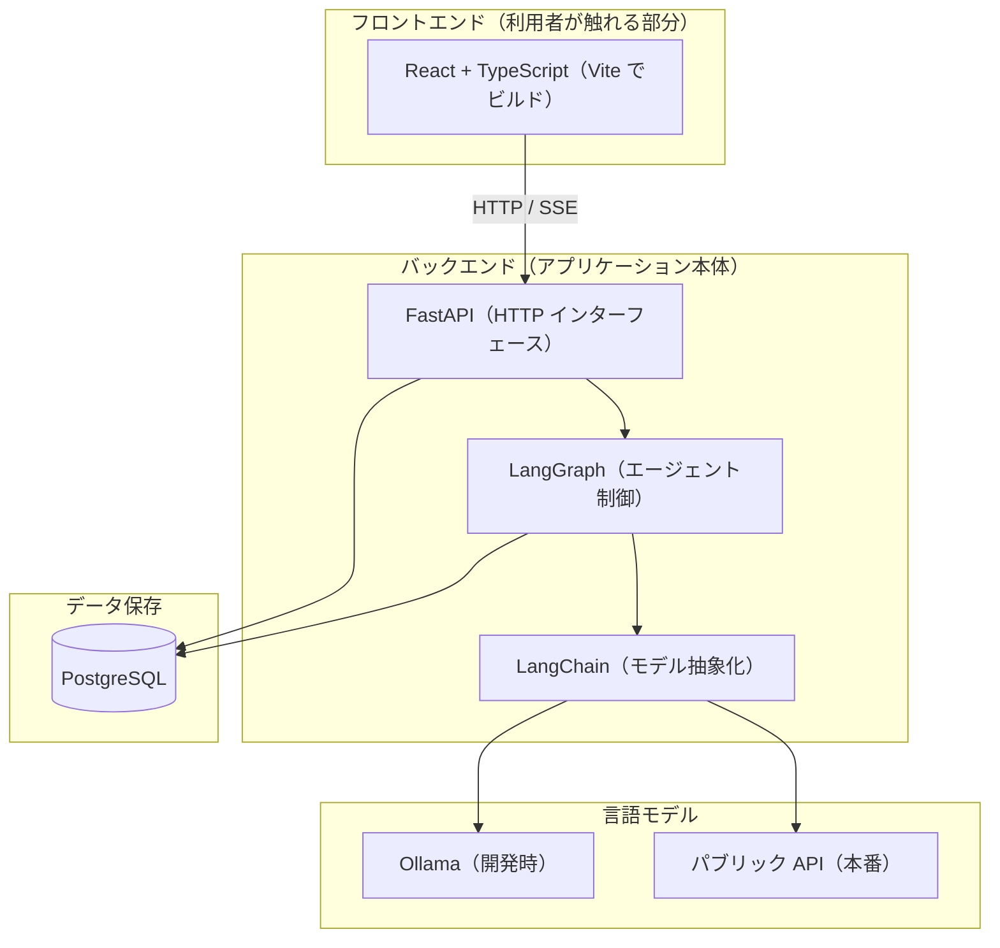

### 4.2 構成要素の説明

**React + TypeScript（Vite）** — ブラウザ側のインターフェースです。React が画面をコンポーネント単位で構造化し、TypeScript が型検査によって誤りを実行前に検出し、Vite がビルドと開発サーバーを担当します。

**FastAPI** — HTTP インターフェースを提供する Python の Web フレームワークです。ブラウザからのリクエストを受け付け、認証を行い、SSE で返答をストリーミングします。外部と自社ロジックの境界にあたります。

**LangChain** — 各言語モデルプロバイダに対するアダプタ群のライブラリです。本プロジェクトにおける役割は意図的に限定しており、「どのモデルでも同一の方法で呼び出せる」ことのみを担わせています。OpenAI、OpenRouter、Ollama の差異が設定だけに収まるのはこのためです。**プロバイダ非依存性を実現している中核部品**です。

**LangGraph** — LangChain の上に構築されたエージェント制御層です。エージェントをグラフとして定義し、ノードが処理手順、エッジがその間の遷移を表します。「モデルを呼ぶ → 要求されたツールを実行する → 結果を添えて再度モデルを呼ぶ」というループをタスク完了まで回し、各手順で状態を保存するため、再起動をまたいでも会話が継続します。

現在のグラフ構成は次のとおりです。

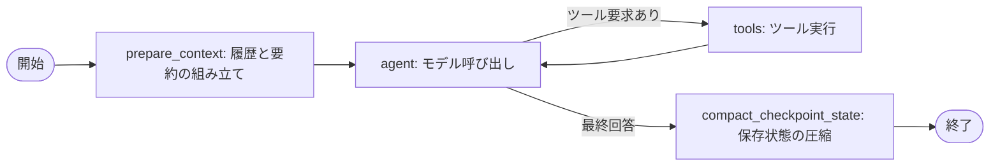

**PostgreSQL** — リレーショナルデータベースです。ユーザー、会話、メッセージ、ローリング要約、実行時設定、および LangGraph のチェックポイントを保持します。今後は求人データと生成書類もここに格納されます。**システムの記憶そのもの**であり、モデル自身は記憶を持ちません。

**Ollama** — 開発時に使用するローカルモデル実行環境です。詳細は第 3 章のとおりです。

**LangChain / LangGraph についての補足。** これらは私たちが「呼び出すライブラリ」であって、プログラム全体を支配する「フレームワーク」ではありません。制御の流れを決めるのは自社のコードであり、ライブラリ側がアプリケーションを所有することはありません。この区別は意図的なものであり、将来これらを差し替える必要が生じた場合のコストを限定的に保つためのものです。

---

## 5. データフロー

### 5.1 1 回の会話ターンの全体像

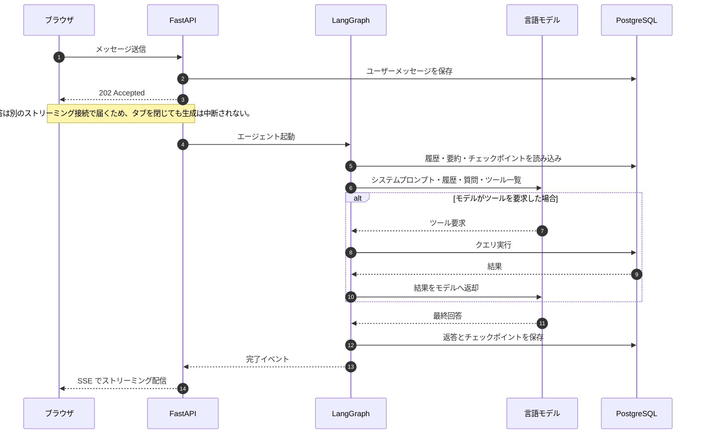

### 5.2 求人検索の目標アーキテクチャ

求人データは、ユーザーの会話とは完全に独立して、定期実行により自社側で収集・保存します。ユーザーが質問した時点では、検索は自社に蓄積済みのデータに対して行われます。外部サイトへ都度アクセスすることも、モデルの記憶に頼ることもありません。

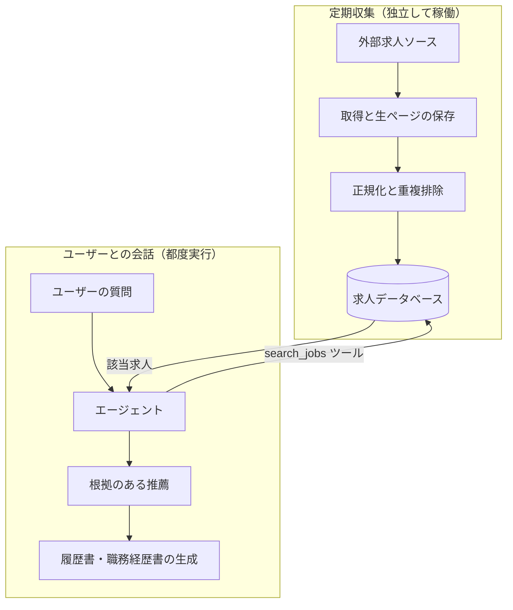

この分離は意図的であり、設計上の要です。収集処理は時間を要し、かつ取得元サイトへの負荷に配慮する必要があります。一方、会話処理は高速でなければなりません。両者を分離することで、ユーザーが外部サイトの応答を待たされることがなくなり、また取得元サイトが利用者数に比例したアクセスを受けることもありません。

---

## 6. これが今後の基盤となる理由

ここまで説明した内容のうち、求人検索に固有の部分はごくわずかです。

ユーザーインターフェース、ストリーミング、アカウントとセッション、会話の永続化、長い履歴の要約、プロバイダ抽象化、そしてツール境界を持つエージェントループ — これらはいずれも「求人情報とは何か」を知りません。本システムを *求人* ナビゲーターたらしめているのは、その上に載る薄い層、すなわちシステムプロンプト、与えられたツール、そしてデータベースの中身だけです。

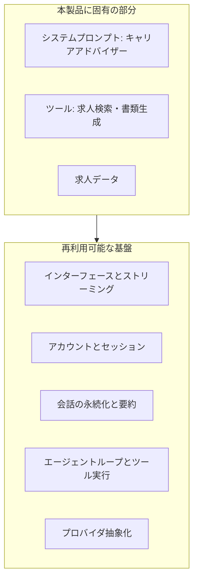

将来まったく別の領域でエージェンティックな製品を構築する場合、この基盤をそのまま再利用し、上層のみを差し替えれば済みます。今この基盤に投じている工数が本製品だけのための工数ではない理由であり、またプロバイダ非依存の設計が、そのわずかな構造上のコストに見合う理由でもあります。

---

## 7. まとめ

| 論点 | 結論 |
|---|---|
| 構築対象 | 言語モデルではなく、言語モデルを利用するアプリケーション |
| モデルの役割 | 言語の理解と生成のみ。交換可能な一構成要素 |
| 事実の根拠 | 自社データベース。モデルの記憶は根拠としない |
| 実行主体 | 自社コード。モデルは要求できるのみで、実行はしない |
| Ollama | ローカル・固定費・実質単一利用者向け → 開発用 |
| パブリック API | ホスト型・従量課金・真の同時処理 → 本番用 |
| 両立できる理由 | アプリケーションが設計上プロバイダ非依存であるため |
| LangChain | 任意のモデルプロバイダへの統一的アクセス |
| LangGraph | エージェントループの実行と状態の永続化 |
| 長期的価値 | 基盤は再利用可能。求人固有なのは最上層のみ |

---

# 付録 A: 開発ツールについて — Claude Code と AI 支援開発

本付録が扱うのは、ソフトウェアを「どう書くか」という話であり、ソフトウェアが「何であるか」とは別の論点です。第 0 章から第 7 章までは製品そのものの説明でした。本章では、それを構築するために使用しているツールを説明します。

この区別が重要なのは、両者が混同されやすいためです。どちらも LLM を利用し、どちらも「エージェンティック」です。しかし両者は別物であり、対象とする利用者も、ライセンスも、費用構造も異なります。

## A.1 Claude Code とは何か

Claude Code は Anthropic 社が提供するコーディング支援ツールです。開発者自身のマシン上で動作し（コマンドラインツール、デスクトップアプリ、あるいはエディタの拡張機能として）、プロジェクトのソースコードを直接操作します。

アーキテクチャ的には、本書 2.2 節で説明したものとまったく同じ構造です。すなわち、ツール群を与えられた LLM がループの中で動作する仕組みです。違いは「与えられているツールが何か」という一点のみにあります。当社の製品がモデルに与えるのは求人検索や書類生成のツールですが、Claude Code がモデルに与えるのは、ファイルの読み取り、ファイルの編集、シェルコマンドの実行、コードベースの検索、バージョン管理の操作といったツールです。

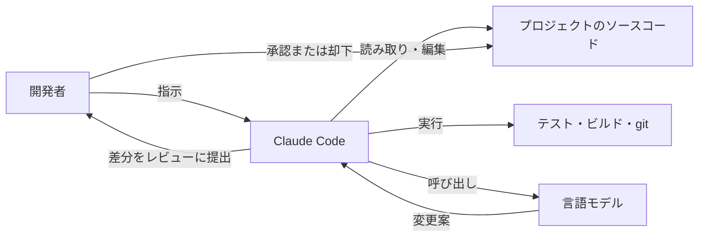

重要なのは最後の 2 ステップです。Claude Code は変更を「提案」し、開発者がそれをレビューして受け入れます。**開発者が操作するツールであり、開発者を自律的に代替するものではありません。**

## A.2 費用

Claude Code はリクエスト単位の課金ではなく、Claude のサブスクリプションに含まれる形で提供されます。

| プラン | 月額の目安 | 想定利用者 |
|---|---|---|
| Pro | 約 20 米ドル（税込 約 21 米ドル） | 個人開発者。本プロジェクトで使用しているプラン |
| Max | 約 100〜200 米ドル | 毎日の重度利用、大規模コードベース、より高い利用上限 |

これは定額のサブスクリプションであり、一定期間ごとにリセットされる利用上限が設けられています。トークン従量課金ではありません。したがってこれは**開発側の固定的な運営費**であり、スケジュール資料の第 2 章で説明した本番環境の AI 費用とは完全に別枠です。両者は予算上の別の行に計上され、性質も異なります。サブスクリプション費用は開発量にかかわらず一定ですが、本番の AI 費用は利用者数に比例して増加します。

## A.3 何ができて、何ができないのか

ここでは期待を煽るよりも、現実的な線引きを示すことが重要です。

**得意なこと:**

- 不慣れなコードベースを読み解き、既存コードの動作を説明すること
- 仕様が明確な定型的コードの記述（データアクセス層、API エンドポイント、フォーム処理、テスト）
- 多数のファイルにまたがる機械的なリファクタリング
- ソースコードからのドキュメント生成
- デバッグ（ただし、そのエラーが実際に再現・観測できる場合に限る）
- 明確に言語化された意図を、動作する初稿へ変換すること

**苦手なこと・できないこと:**

- 「何を作るべきか」の決定。クライアントにも要件にも商談の文脈にもアクセスできません
- 数か月後に影響が現れる種類のアーキテクチャ上の判断
- 検証できない事柄全般。記憶違いの API に対しても、もっともらしいコードを平然と書きます
- 自分の出力が誤っていると気づくこと。不確実性を確実に申告してはくれません
- 責任を負うこと。受け入れられた時点で、すべての行の責任は開発者に帰属します

実務上の効果は、**すでに理解している作業の速度が大幅に上がる**一方、**まだ理解していない作業にはまったく寄与しない**という形で現れます。短縮されるのはタイピングであって、思考ではありません。

## A.4 なぜ本製品を Claude Code だけで作れないのか

ここまで読めば「これほど有能なツールがあるなら、プロジェクト自体が不要ではないか」という疑問は当然です。答えは、Claude Code が**開発者向けのツールであって、製品の実行基盤ではない**という点にあります。

| 製品に必要なもの | Claude Code が提供するもの |
|---|---|
| 相互に隔離された多数のエンドユーザー | 1 台のマシン上の単一の操作者 |
| 日本人求職者が使える Web インターフェース | ターミナルまたはエディタ |
| データベース上のユーザーデータ、アカウント、セッション | 作業ディレクトリ内のファイル |
| 決済、利用量計測、ユーザー単位の費用管理 | 開発者 1 名のサブスクリプションへの課金 |
| 商用バックエンドとしての利用を許諾するライセンス | 開発ツールとしてのライセンス |

さらにセキュリティ上の論点があります。Claude Code は設計上、ファイルシステムとシェルへの完全なアクセス権を持ちます。これは信頼された開発者が自身のマシンで操作することを前提としているためです。開発ツールとしては妥当な設計ですが、不特定多数に公開されるサービスとしては到底許容できません。

## A.5 バイブコーディングと「ツール支援開発」の違い

「バイブコーディング（vibe coding）」という語は 2025 年に一般化しました。自然言語のプロンプトからコードを生成し、**その内容を読まず、理解しないまま受け入れる**開発手法を指します。判断基準が「正しいかどうか」ではなく「動いているように見えるかどうか」になっている状態です。

該当するツールには、Claude Code やエディタ統合型の各種アシスタントのほか、説明文から アプリケーション一式を生成する Base44、Lovable、Bolt といったプロンプト駆動型ビルダーが含まれます。

**決定的に重要なのは、ツールが手法を決めるわけではない**という点です。同じツールがどちらの使い方にもなり得ます。両者を分けるのはツールを取り巻くプロセス、とりわけ**出荷前に能力のある人間が出力を読み、理解しているかどうか**です。

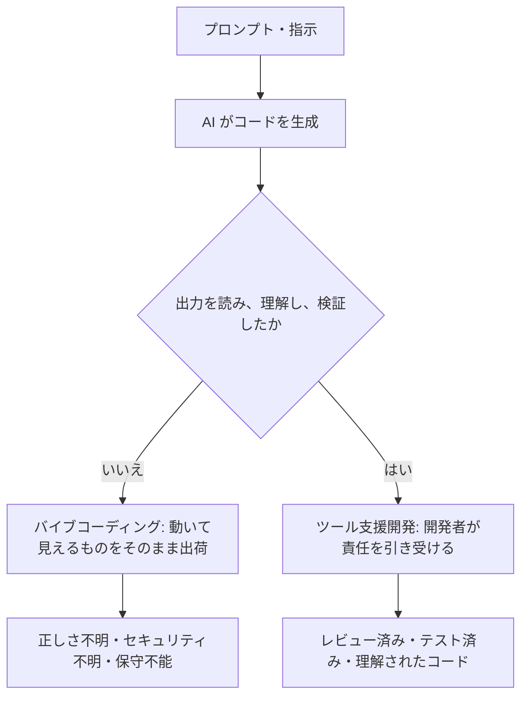

### A.5.1 比較

| | バイブコーディング | ツール支援開発 |
|---|---|---|
| 受け入れ前にコードを読むか | 読まない | 全変更を読む |
| システムを理解している人 | 誰もいない | 開発者 |
| アーキテクチャ | ツールが出力したものがそのまま | 開発者が決定 |
| バグへの対応 | 症状が消えるまでプロンプトを打ち直す | 原因を特定して修正 |
| セキュリティ | 未評価 | 要所をレビュー済み |
| 例外的な入力時の挙動 | 不明 | 検討・テスト済み |
| 半年後の保守性 | 極めて低い（誰も説明できない） | 通常どおり |
| 適した用途 | 試作、デモ、使い捨ての社内ツール | 実ユーザーのデータを扱う本番システム |

### A.5.2 信頼性について

率直に述べると、次のとおりです。

**バイブコーディングによるソフトウェアは本番運用に耐えません。** ただしその理由はしばしば誤って説明されます。生成されたコードは、個々に見れば正しいことも多いのです。問題は、**どの部分が正しいのかを誰も把握していない**という点にあります。2 人のユーザーが同時に操作したら何が起きるのか、決済が二重に発生し得ないか、あるユーザーが他人のデータを読めてしまわないか、コードが暗黙に依存している前提は何か — これらに誰も答えられません。そして必ずいつか何かが壊れたとき、それを修復できるだけシステムを理解している人間が存在しません。

**ツール支援開発の信頼性は、レビューを行う開発者の水準と等しくなります。** ツールが品質の上限を上げることも下げることもありません。変わるのは、その上限に到達するまでの速度だけです。厳密な開発者は厳密なソフトウェアをより速く作り、雑な開発者は雑なソフトウェアをより速く作ります。

したがってこの区別は、技術の問題ではまったくありません。**結果に対して誰が責任を負うのか**という問題です。ツール支援開発においてその答えは明確に開発者であり、ツールを使わない場合とまったく変わりません。

## A.6 本プロジェクトにおける開発方針

本プロジェクトでは、Claude Code をツール支援開発の補助として使用しています。具体的な分担は次のとおりです。

| ツールに任せる領域 | 開発者が保持する領域 |
|---|---|
| 仕様が明確な定型的実装 | システムアーキテクチャとデータモデル |
| テストの骨組みと定型コード | セキュリティ上重要なコード（認証・決済） |
| ドキュメントの下書き | 何を、どの順序で作るかの決定 |
| コードベースの調査と説明 | 全変更のレビューと受け入れ判断 |
| 機械的なリファクタリング | 実運用条件下での正しさの担保 |

すべての変更はコミット前に読まれます。開発者が説明できないコードがリポジトリに入ることはありません。

これが、プロジェクト計画のスケジュールが開発者 1 名でも達成可能である理由であり、同時に、それ以上には短縮できない理由でもあります。ツールが加速するのは実装作業です。何を作っているのかを理解すること、それをレビューすること、そしてその結果に責任を負うことの必要性を取り除くものではありません。そしてプロジェクトの速度を決めているのは、タイピングの速さではなく、まさにこれらの工程です。
