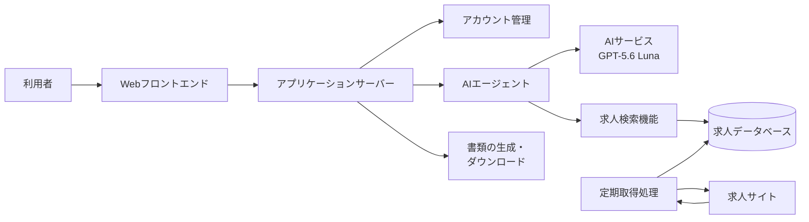
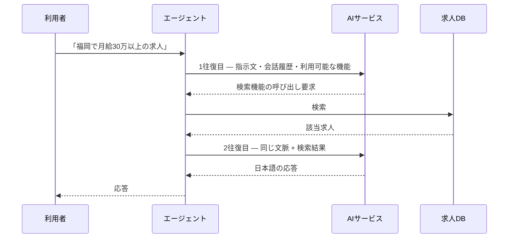
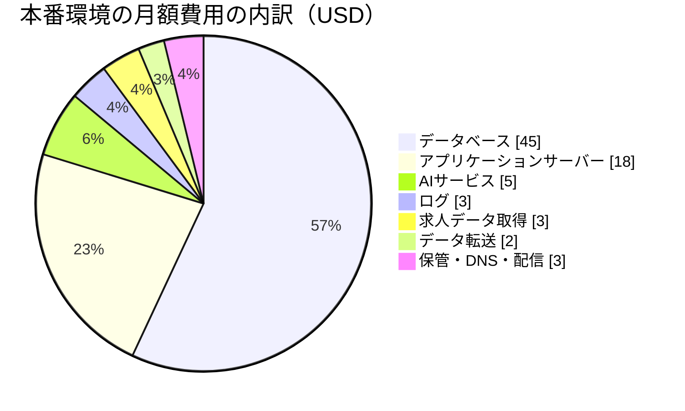
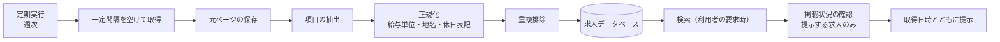
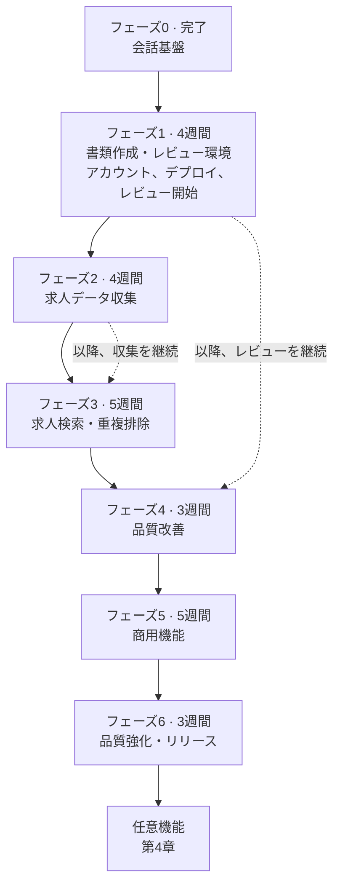
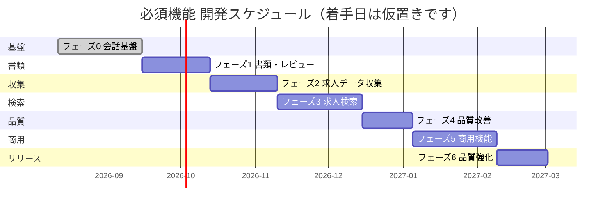
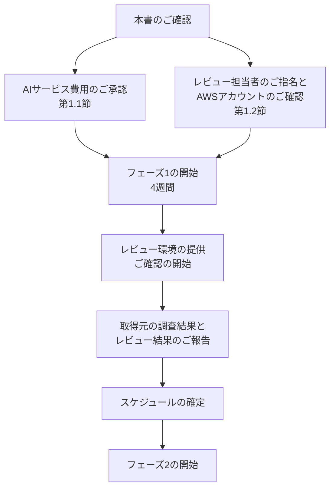

# AI Job Navigator プロジェクトスケジュール・ご依頼事項

**対象文書:** AI_Job_Navigator_Client_Requirements_Engineering_Specification_EN_Updated.docx
**作成日:** 2026年9月6日
**版数:** v6.0

---

## 0. 本書の目的

本書は以下の4点をまとめたものです。

1. 貴社よりご提供いただきたい事項と、それぞれが必要となる時期
2. 開発期間中および運用時の想定費用
3. **必須機能**の開発スケジュールのご提案
4. **任意機能**の一覧。必須機能の完成後に、別途ご計画いただくもの

### 必須機能と任意機能

本書で扱う機能は2つに区分しております。

**必須機能**は、要件仕様書の各MVPフェーズに定義された機能です。これらが製品を構成するものであり、第3章のスケジュールに含まれるのはこの範囲のみです。

**任意機能**は、必須機能がすべて完成した後に追加を検討する機能です。第4章に見積とともに記載しておりますが、第3章のスケジュールからは意図的に除外しております。製品が動作するために必要な範囲のみをスケジュールに反映するためです。

### 開発体制

開発は開発者1名で実施いたします。第3章の期間はこれを前提に算出しております。

### システム全体像

### 求人データの取得方針

スクレイピングによるデータ取得にあたっては、相手方サーバーに負荷をかけないよう配慮すべきとのご指示を承っております。この点は設計に反映しております。

取得は一定以上の間隔を空けた定期実行とし、利用者の操作を契機とすることはございません。したがって各取得元へのアクセス量は当方のスケジュールによって決まり、利用者数の増加によって変動いたしません。取得元が構造化されたデータの提供口を用意している場合は、ページの解析よりもそちらを優先いたします。相手方サーバーへの負荷が軽く、運用上も安定するためです。

### 現時点の実装状況

| 領域 | 状況 |
|---|---|
| 会話基盤 — 応答のストリーミング配信、同時アクセスの安全性、データ永続化、会話履歴の要約 | **完了。** 実運用水準です |
| AIエージェント基盤 — 機能呼び出しの制御、文脈の構築、AIサービスの抽象化 | **完了。** 現在は簡易な機能ではなく、書類生成機能を実際に呼び出しております |
| Web画面 — チャット画面、会話一覧、テーマ切替、ログイン画面 | **チャットとログインは完了。** 他の画面は存在しません |
| アカウント管理 — ログイン、セッション管理、権限区分、管理者権限 | **概ね完了。** セッション方式のログイン、権限の区分、権限による管理機能の保護まで実装済みです。利用者ご自身による登録、パスワード再設定、メールアドレスの確認は未実装です |
| 書類作成 — 雛形・生成・ファイル出力 | **前倒しで大部分が完了。** ご提供いただいた様式をもとに、履歴書はJIS準拠の書式に記入するExcelファイル、職務経歴書はWordファイルとして生成いたします。AIによる聞き取りののち、完成した書類をチャット画面からダウンロードできます。書類のアップロードと文字抽出は未着手です |
| 運用設定 — サービスを再起動せずAIの挙動を調整する機能 | **完了。** バックエンドのみで、画面は未作成です |
| 求人データ — 収集・保存・検索・重複排除 | **未着手** |
| 決済・有人対応・管理画面 | **未着手** |

全体の30〜35%程度が完了しております。第3章のフェーズ0、すなわちAIとの会話を安定して成立させる基盤部分は完成しており、フェーズ1の中心である履歴書・職務経歴書の作成機能も、ご提供いただいた実際の様式をもとに大部分を前倒しで構築済みです。

**本版ではフェーズの順序を見直しております。** 書類作成を計画の先頭に移し、求人データの収集をその後ろに配置いたしました。動作する機能を、5か月目ではなく最初のフェーズで貴社のレビュー担当者にご確認いただくためです。理由は第3.3節に記載しております。

---

## 1. 貴社よりご提供いただきたい事項

### 1.1 AIサービス — 直ちに必要となる唯一の項目

**本書のご依頼のうち、後続フェーズではなく現時点で必要となるのは本項のみです。**

本システムには商用のAIサービスが必要となります。**GPT-5.6 Luna** をご提案いたします。料金は**入力100万トークンあたり 0.20米ドル**、**出力100万トークンあたり 1.20米ドル**です。

**現在の開発環境では不十分である理由。** 現在は2つの暫定的な手段で開発を進めておりますが、いずれも本プロジェクトを継続できるものではございません。

| 現在の手段 | 問題点 |
|---|---|
| ローカル環境で動作するモデル | 動作が遅く反復的な開発に適さず、また応答品質が機能の成否を判断できる水準に達しておりません |
| 無償枠で提供されるモデル | 利用制限により断続的に応答が停止いたします。自動テストの完了を前提にできません |

**本サービスに依存する範囲:**

| フェーズ | AIサービスを必要とする機能 | 未導入の場合 |
|---|---|---|
| フェーズ1 | AIによる聞き取り、書類内容の文章生成、およびレビュー担当者によるご確認 | 当該フェーズの中心的機能です。開発できず、ご確認いただくこともできません |
| フェーズ1 | 応答品質の評価環境 | 品質の基準値を設定できません |
| フェーズ3 | 自然文からの条件抽出 | 開発・確認ともに実施できません |
| フェーズ4 | 日本語の応答品質の改善 | 当該フェーズの目的そのものです |
| フェーズ5 | 有人対応への引き継ぎ判断 | 動作確認を実施できません |

フェーズ1は本サービスなしでは実質的に着手できず、以降も継続して必要となります。唯一依存しないのはフェーズ2で、データ収集ではAI処理を行わないためです。

#### 処理1回あたりの費用

現行のシステム構成にて実測した値をもとに算出しております。

| 処理 | 費用 |
|---|---|
| 会話の初回メッセージ | \$0.0010 |
| 通常の会話1往復 | \$0.0016 |
| 求人検索をともなう会話1往復 | \$0.0033 |
| 会話履歴の要約処理1回 | \$0.0009 |
| **30往復の相談1件あたり** | **約 \$0.08** |

求人検索の費用が通常の約2倍となるのは、AIサービスとのやり取りが2往復必要となるためです。

**図1 — 利用者が求人を尋ねた場合の処理の流れ**

#### 開発期間中の月額費用

費用は一定ではございません。AIの挙動を構築・調整するフェーズに集中いたします。

| フェーズ | 期間 | AIサービス月額 |
|---|---|---|
| **フェーズ1 — 書類作成・レビュー環境** | 4週間 | **\$50** |
| フェーズ2 — 求人データ収集 | 4週間 | \$15 |
| **フェーズ3 — 求人検索** | 5週間 | **\$45** |
| **フェーズ4 — 品質改善** | 3週間 | **\$40** |
| フェーズ5 — 商用機能 | 5週間 | \$10 |
| フェーズ6 — 品質強化・リリース | 3週間 | \$20 |
| **残作業全体の合計** | 24週間 | **約 165米ドル** |

**上限額を月50米ドルとし、これに達するのはフェーズ1およびフェーズ3〜4のみとなる想定です。**

参考までに、月100米ドルに到達するには最大長のAIリクエストを1日約4,400回実行する必要がございます。開発者1名の手動確認でこの量に達することはなく、上記の上限額は想定費用ではなく安全装置としての位置づけです。

**主たるリスクは利用量ではなく不具合です。** AIが同一の処理を繰り返し呼び出す不具合が発生した場合、放置すると1時間あたり5米ドル程度を消費いたします。サービスアカウントの作成時、開発で使用を開始する前に2つの対策を講じます。サービス側での上限額設定と、AI処理内部での繰り返し回数の上限設定です。

### 1.2 後続フェーズで必要となる事項

急なご依頼とならないよう、必要となるフェーズを明記しております。**うち2件はフェーズ1に該当いたします。** フェーズ1は本書のご確認後ただちに開始いたしますので、これらは先の話ではなく間近のご依頼となります。

| 必要となる時期 | 項目 | 用途 |
|---|---|---|
| ~~フェーズ2~~ **受領済み** | 実際の履歴書・職務経歴書（個人情報を伏せたもの） | 3つの目的がございます。下記をご参照ください。ご提供いただいた書類は雛形の作成に使用し、現在の実装に反映済みです |
| ~~フェーズ2~~ **受領済み** | ベースとする履歴書・職務経歴書の様式 | 書類雛形の開発。完了しております |
| **フェーズ1** | AWSアカウント、または当方にて開設し費用をご負担いただくことのご承認 | 第3.3節のレビュー環境を構築いたします。費用は第2.2節に記載しております |
| **フェーズ1以降** | **日本語レビュー担当者のご指名** | AIの日本語および生成書類の継続的なご確認。第1.3節をご参照ください |
| **フェーズ5** | 決済システムの接続情報および仕様 | 第1.4節をご参照ください |
| **フェーズ6** | 本番ドメインおよびDNSの管理権限 | TLS証明書の取得、本番環境の構築 |

**実物の書類をお願いする理由について。** 以下の3つの目的がございます。いずれも架空の例では代替できません。

1. **雛形を作成するため。** ご使用の様式について、どの項目がどの順序で、どのような見出しと余白で配置されているかを実物で確認する必要がございます。記入用の雛形を想像で作成することはできません。
2. **AIに「良い出力」の見本を示すため。** 承認済みの実例をAIに提示することが、生成される日本語を自然なものにするうえで最も効果の高い方法です。第1.3節に記載の文体の課題に対する直接的な対策となります。
3. **品質を測定するため。** AIの出力が許容水準にあるかを判断するには、比較対象が必要です。実例がなければ、十分な品質かという問いに答える基準がございません。

また実物の書類には、離職期間、転職、非常勤期間といった、架空の例には現れない多様性がございます。本システムが正しく扱うべきなのは、まさにそうした実際の記載です。

個人情報は不要ですので、削除のうえご提供ください。必要なのは構成と文章表現です。

### 1.3 AI応答品質のレビュー体制 — フェーズ1より開始

一度限りの成果物ではなく継続的なご協力のご依頼となります。今回のフェーズ順序の見直しにより最初のフェーズから開始するものであり、順序を入れ替える意義そのものが本項に懸かっております。

AIモデルが生成する日本語は、文法的には正確です。懸念されるのは正確性ではなく**文体・語調**、すなわち生成された職務経歴書が、日本企業の採用担当者や経営層の目から見て適切なものと映るかという点にございます。この点は自動的な指標では測定できません。

つきましては、フェーズ1以降、貴社にて日本語のレビュー担当者をご指名いただきたく存じます。第3.3節のレビュー環境が整い次第、実際の利用者と同じように操作していただき、以下の3点についてご指摘を頂戴したく存じます。

1. AIの日本語が自然で、敬語の水準が適切であるか
2. 会話の中でお伝えいただいた情報が、正確かつ漏れなく取り込まれているか
3. 生成された履歴書・職務経歴書のファイルが、記載位置・文言を含めて日本語の読み手から見て適切であるか

所要時間は1回あたり2時間程度を想定しております。

**ご指摘の反映方法。** ご指摘はまずテスト項目として記録し、以降の変更のたびに自動で再確認できるようにいたします。1件のご指摘はテスト項目の追加にとどめ、同種のご指摘が繰り返された場合に限りAIへの指示文を変更する、という運用といたします。この区別は実務上重要でございます。個別のご指摘のたびに指示文を書き換えると、指示文が長大かつ相互に矛盾したものとなり、品質はかえって低下するためです。

そのうえで、レビュー結果は段階的に反映いたします。まずAIへの指示文の調整、次に承認済みの実例をAIに提示する方法、さらに必要であれば案件ごとに関連する実例を自動的に選び出して提示する仕組みの構築です。これらの手段を尽くしてなお品質が許容水準に達しない場合に限り、より上位のAIモデルへの変更をご提案いたします。設定変更のみで対応でき、アプリケーションの改修は不要ですが、運用費用は概ね10〜15倍、相談1件あたり約0.08米ドルから約0.80〜1.20米ドル程度となります。ユーザー数10名の段階では大きな金額ではございませんが、ユーザー数を大きく増やす前に改めて検討をご提案いたします。

### 1.4 決済システム — フェーズ5で必要

ご提示いただいた参考URLより、決済システムはGMOペイメントゲートウェイの環境であり、海外の汎用決済サービスではないものと理解しております。

本作業の見積および実装のため、フェーズ5までに以下をご確認いただきたく存じます。

| 項目 | 補足 |
|---|---|
| 接続方式のご指定 | リンクタイプ・モジュールタイプ・プロトコルタイプがございます。方式により作業量が大きく異なります |
| テスト環境の接続情報（ショップID・ショップパスワード） | 貴社のGMO契約に基づき発行されるものです。これがない状態では決済処理のコードを記述・検証することができません |
| 対応する決済手段の範囲 | クレジットカードのみか、コンビニ決済・銀行振込・キャリア決済等を含むか。手段ごとに個別の実装が必要であり、カード以外は即時完了ではなく非同期の処理となります |
| 3Dセキュアの要否 | 決済の流れに銀行での本人確認の手順が追加されます |
| 料金プラン・無料範囲・解約規定 | 仕様書上、未確定と記載されております |

**接続方式が確定するまで、フェーズ5の見積は暫定となります。** リンクタイプであれば2週間程度、プロトコルタイプであれば4週間程度を要します。第3章のスケジュールはその中間の数字を採用しております。

---

## 2. 費用

金額はいずれも米ドル建てで、AWSの東京リージョンを前提としております。概算であり、確定にあたってはAWS料金計算ツールでの確認を推奨いたします。

### 2.1 開発の進め方 — ローカル環境を基本とする

開発はローカル環境で実施し、クラウド環境は機能上必要となった時点で構築いたします。初週から本格的な本番環境を用意することは、必要となる数か月前から費用を負担することを意味いたします。

クラウド環境が必要となる時点は以下のとおりです。

| 要件 | フェーズ | 理由 |
|---|---|---|
| レビュー担当者がアクセスできる開発環境 | フェーズ1 | レビュー担当者ご自身に操作していただく必要がございます。当方の手元の開発機には貴社から到達できません |
| 無人での定期取得 | フェーズ2 | 開発機は常時稼働ではございません。求人データは中断なく蓄積される必要がございます |
| 決済ゲートウェイからの通知受信 | フェーズ5 | 決済事業者からアプリケーションサーバーへ直接到達できる必要があり、ローカル環境では受信できません |
| TLS・本番ドメイン・セッションの安全性 | フェーズ6 | 一般公開の前提となります |
| 同時接続10名での負荷試験 | フェーズ6 | ローカル環境では確度をもって測定できません |

**1点目は本版で新たに加わったものであり、費用構成が変わった理由でもございます。** 従来の計画では最初のクラウド環境はフェーズ5に登場しておりました。レビュー環境をフェーズ1へ前倒しすることで、月額約25米ドルの負担がその分早く発生いたしますが、引き換えにレビュー担当者のご指摘を5か月目ではなく1か月目に頂戴できます。また最初のフェーズでデプロイを行うことにより、デプロイに関する問題を、対処が最も高くつくプロジェクト終盤ではなく開始時点で把握できます。

### 2.2 開発期間中の費用

| フェーズ | 期間 | 環境 | AWS | AIサービス | **月額換算** |
|---|---|---|---|---|---|
| フェーズ0 — 会話基盤 | 完了 | ローカルのみ | \$0 | — | **発生済み** |
| フェーズ1 — 書類作成・レビュー環境 | 4週間 | ローカル + レビュー環境 | \$25 | \$50 | **\$75** |
| フェーズ2 — 求人データ収集 | 4週間 | + 収集用インスタンス | \$30 | \$15 | **\$45** |
| フェーズ3 — 求人検索 | 5週間 | 同上 | \$32 | \$45 | **\$77** |
| フェーズ4 — 品質改善 | 3週間 | 同上 | \$32 | \$40 | **\$72** |
| フェーズ5 — 商用機能 | 5週間 | + 検証環境 | \$55 | \$10 | **\$65** |
| フェーズ6 — 品質強化・リリース | 3週間 | 本番環境 + 検証環境 | \$85 | \$20 | **\$105** |

**残作業全体を通じた開発費用は約400米ドルとなります。** 内訳はAWSが約235米ドル、AIサービスが約165米ドルです。

前版でお示しした330米ドルより増加しておりますが、その差額はレビュー環境によるものです。フェーズ5ではなくフェーズ1から稼働するため、小規模なAWS環境の費用を約4か月分多く負担することになります。これは妥当な交換と考えております。AIの日本語と生成書類を、対処が容易なプロジェクト初期の段階で日本語の読み手にご判断いただけるようになるためです。

開発用サーバーは業務時間中のみ稼働させ、夜間および週末は停止する前提としております。常時稼働と比較して約70%の削減となります。ただしレビュー環境は例外で、当方だけでなく貴社レビュー担当者の業務時間中も利用可能とする前提で上記に織り込んでおります。仮にすべてを常時稼働とした場合、AWS分は全体で約600米ドル程度まで増加いたしますが、AIサービス分はほとんど変動いたしません。AIの費用は経過時間ではなく、実施する確認作業の量によって決まるためです。

### 2.3 リリース時の本番環境

ご指定のとおり、同時接続ユーザー数10名を前提としております。

| 項目 | 構成 | 月額 |
|---|---|---|
| アプリケーションサーバー | EC2 t4g.small（2 vCPU / 2 GB） | \$18 |
| データベース | RDS PostgreSQL db.t4g.small、50 GB、シングルAZ | \$45 |
| 求人データ取得処理 | Fargate定期実行、月24時間程度 | \$3 |
| 書類保管 | S3 | \$1 |
| フロントエンド配信 | CloudFront + S3 | \$1 |
| DNS | Route 53 | \$0.50 |
| ログ | CloudWatch | \$3 |
| データ転送 | | \$2 |
| **インフラ小計** | | **\$74** |
| AIサービス | 同時接続10名 | \$5 |
| **合計** | | **月額 約79米ドル** |

冗長化のためロードバランサーを追加する場合、月額約20米ドルの増加となります。同時接続10名の段階では推奨いたしませんが、利用が増加した際に最初に検討すべき拡張です。

### 2.4 割引プランについて

AWSには、1年間の利用量を確約することで30〜40%程度の割引を受けられる制度がございます。

**現段階での契約は推奨いたしません。** 同時接続ユーザー10名の想定ではインフラ費用は月額約74米ドルであり、割引額は25米ドル程度にとどまります。これを得るためには、実際の利用状況を把握する前に、かつユーザー数の変動が見込まれる時期に、サーバー構成を1年間固定することになります。

リリース後3〜6か月間は通常料金で運用し、実際の利用状況を測定したうえで、確認できた水準に対して1年契約を購入する進め方をご提案いたします。

### 2.5 費用に関する留意点

**NAT Gatewayについて。** AWSのネットワーク構成要素の一つで、利用量にかかわらず月額32米ドル程度が発生いたします。一般的な構成例には既定で含まれていることが多い一方、本件の規模では不要です。本書の構成では使用しない設計としております。仮に含めた場合、第2.3節の中で最大の費目となります。

**データベース容量の増加について。** ユーザー数10名ではサーバー性能は問題となりません。処理の大部分をAIサービスが担うためです。増加するのは保存容量で、求人データ10万件と検索用インデックスで、インデックスのみで約600 MBを要します。1年以内に50〜100 GBを見込んでおくことを推奨いたします。なお現在のご方針どおりアップロード書類・生成書類を無期限に保持する場合、保存容量は経年で増加いたしますので、年1回程度の見直しをお勧めいたします。

---

## 3. 開発スケジュール — 必須機能

### 3.1 開発方式

開発は7つのフェーズに分けて進行いたします。うち**フェーズ0はすでに完了しております**。**各フェーズの完了時に、動作するものをご確認いただくデモンストレーションと、書面による進捗報告を実施いたします。**

フェーズ1以降のご確認は、当方が画面をお見せする形ではなく、貴社レビュー担当者ご自身がアクセスできるレビュー環境上で実施いたします。

フェーズの期間は固定せず、作業内容に応じて設定しております。フェーズごとに規模が大きく異なるためです。自動テストの作成は最終段階にまとめるのではなく、各フェーズ内で実施いたします。

### 3.2 初期リリースの範囲

以下の項目は、リリース時点では定めた形で提供し、残りをその後に対応いたします。スケジュールの前提となる範囲を明確にするため、また、ご希望があればいずれの項目も前倒しできるよう、明記しております。

| 項目 | リリース時点 | その後の対応 |
|---|---|---|
| 求人取得元 | 2社 | 残り2社を追加 |
| 重複排除 | 企業名・職種名・勤務地の完全一致 | 実データの蓄積後、取得元をまたぐ照合へ |
| 書類様式 | 履歴書・職務経歴書 各1様式。ご承認いただいた見本に合わせ、履歴書はExcel、職務経歴書はWordで出力 | 様式の追加およびPDF出力 |
| 管理画面 | 運用に必要な機能 | 運用上の必要に応じて残りの機能を追加 |

適用している考え方は、深さではなく広さを絞るというものです。取得元や様式の追加は、動作しているシステムに対して比較的容易に行えます。一方で重複排除は、後回しにするほど対応が困難になる唯一の項目であり、それゆえ削除ではなく縮小にとどめ、データ収集はフェーズ2から開始して以降継続いたします。

### 3.3 本計画における2つの方針

**フェーズ1では、1つの機能を完成させたうえで、貴社が実際に操作できる環境へ配置いたします。** 完了時点で、利用者が登録し、ログインし、AIの聞き取りを受け、完成した履歴書・職務経歴書をダウンロードするまでが、開発機ではなくAWS上で動作いたします。貴社の日本語レビュー担当者に直接ご確認いただくためです。

これが前版との最大の相違点であり、その理由は、以下の3つの問いが日本語の読み手による実物の確認以外では答えられないことにございます。

1. AIの日本語が自然に読めるか
2. 会話の中で利用者が伝えた内容が正しく取り込まれているか
3. 出力されたファイルが書類として正しいか

いずれも当方だけでは判断できず、自動テストでも、当方が操作するデモンストレーションでも確認できません。これらを5か月目ではなく1か月目に確認することが、本計画において最も大きくリスクを下げる手段です。同じご指摘が後半で出てきた場合、後続機能がすでに依存している書類処理をまとめて作り直すことになります。またデプロイの手順も、終盤ではなく開始時点で確認できます。

**求人データの収集はフェーズ2で開始し、以降継続いたします。** 重複排除は相当量の実データを前提とし、そのデータは作業量ではなく日数の経過によって蓄積されます。フェーズ3で重複排除を構築し、フェーズ4で精度を高める時点では、約1〜3か月分の収集データが利用可能となる見込みです。また項目の抽出前に元ページを保存いたします。抽出処理を改善した際に、取得元へ再度アクセスすることなく、保有済みのデータに対して再実行できるようにするためです。

求人データに関する作業のうち、検索よりも収集を先に実施するのはこのためです。またこの部分は、AIサービスを一切必要としない唯一の工程でもございます。

### 3.4 求人データ処理の流れ

**図2 — 求人データの取得から提示までの流れ**

### 3.5 スケジュール

| フェーズ | 内容 | 期間 |
|---|---|---|
| **フェーズ0** | 会話基盤 | **完了** |
| | 会話基盤: 応答のストリーミング配信、データ永続化、会話履歴の要約 | |
| | AIエージェント基盤、AIへの指示文、AIサービスの抽象化 | |
| | チャット画面および会話一覧 | |
| | ログイン、セッション管理、権限による管理機能の保護 | |
| **フェーズ1** | 書類作成・レビュー環境 | **4週間** |
| | 履歴書・職務経歴書のためのAI聞き取り — **構築済み** | |
| | Excel・Word出力とダウンロード — **構築済み** | |
| | 長い会話の中でも、いただいた情報を確実に保持する仕組み | |
| | アカウント機能: 登録・パスワード再設定・メール認証 | |
| | **AWS上のレビュー環境: デプロイ、TLS、セッションの安全性** | |
| | 破棄できないデータを持つ環境に必要となる、データベース変更の管理手順 | |
| | **レビュー担当者によるご確認と、その結果に基づく品質評価環境の整備** | |
| | 求人取得元の調査（レビュー期間と並行して実施） | |
| **フェーズ2** | 求人データ収集 | **4週間** |
| | 求人データ構造およびデータベース設計 | |
| | 取得間隔の制御を含む収集基盤 | |
| | 元ページの保存および項目の抽出 | |
| | 1社目・2社目からの継続的な収集 | |
| **フェーズ3** | 求人検索 | **5週間** |
| | 給与単位・地名・休日表記の正規化 | |
| | 重複排除 | |
| | 自然文からの条件抽出 | |
| | 検索機能とAIの連携 | |
| | AIが提示する求人が実在することの検証 | |
| | 書類のアップロードおよび記載内容の抽出 | |
| **フェーズ4** | 品質改善 | **3週間** |
| | 蓄積したレビュー結果に基づく日本語応答品質の改善 | |
| | 掲載状況の確認、取得日時の表示 | |
| | 利用者による確認画面、検索結果の表示 | |
| | 重複排除の精度調整 | |
| **フェーズ5** | 商用機能 | **5週間** |
| | 決済連携、料金プラン、解約処理 | |
| | アプリ内有人対応および引き継ぎ | |
| | 管理画面 | |
| **フェーズ6** | 品質強化・リリース | **3週間** |
| | 性能・セキュリティ・同時接続10名での負荷試験 | |
| | 本番環境構築、検収のご支援 | |
| **残作業の合計** | | **24週間** |

**フェーズ1の開始から約5か月半となります。**

前版では7フェーズで25週間としておりました。フェーズ0と書類作成の大部分がすでに完了しておりますが、そこで生じた余力を、レビュー環境とアカウント機能をフェーズ1へ前倒しすることに充てております。残りが24週間と大きく減っていないのはそのためです。変わったのは作業量ではなく順序であり、日本語の読み手にしか判断できない部分を最初に作り、最初にご確認いただく構成といたしました。

フェーズ1は、書類生成が構築済みであっても4週間を据え置いております。当該フェーズに残る作業は、レビューを開始する前に確度をもって見積もることができないためです。短縮できた分は、通例どおりフェーズの区切りにてご報告いたします。

**図3 — フェーズの流れ。各フェーズの完了時にデモンストレーションを実施いたします。**

### 3.6 当初の3か月という見積について

当初の3か月という数字は、要件仕様書が存在する前に作成したもので、対象範囲がより狭いものでした。現在の仕様書に記載された内容は、その約2倍の作業量に相当いたします。

増加分は、当初の想定に含まれていなかった作業によるものです。具体的には、アカウント管理、決済処理、管理画面、有人対応、セキュリティ強化、検収対応、および複数サイトにまたがって掲載される求人の重複排除です。

### 3.7 スケジュールの確定について

実データを確認するまで十分な確度をもって見積れない項目が2点ございます。取得元からの収集の安定性と、重複排除で達成可能な精度です。加えて決済連携が、第1.4節の接続方式に依存いたします。さらに本版では4点目として、AIの日本語にどの程度の調整が必要かが、レビュー担当者にご確認いただくまで判明いたしません。

**つきましては、上記スケジュールは暫定のものとしてお取り扱いいただき、確定日程はフェーズ1の完了時に取り決めさせていただきたく存じます。** フェーズ1には求人取得元の調査と最初のレビューが含まれており、その完了時点、すなわち着手から4週間後には、主要な不確定要素を確認したうえで確定したスケジュールをご提示できる見込みです。

フェーズの所要期間が見積を超過する場合は、プロジェクト終盤ではなく各フェーズの区切りごとにご報告いたします。また第3.2節の範囲に関する項目は、いずれの方向にも調整可能な余地として引き続きご利用いただけます。

より短い期間をご希望の場合、最も効果の大きい変更はフェーズ5（決済・有人対応・管理画面）を後回しとすることで、完成度のある製品を5週間前倒しできます。

---

## 4. 任意機能

以下は**第3章のスケジュールには含まれておらず**、製品の動作に必要な機能でもございません。必須機能がすべて完成した後、別途の作業として計画的にご検討いただけるよう、見積とともに記載しております。

| 機能 | 期間 | 前提 |
|---|---|---|
| **通知機能** — 検索条件の保存、新着求人との日次照合、メール送信基盤、通知設定 | 3週間 | フェーズ3 |
| **求人取得元の残り2社** | 2週間 | フェーズ2の収集基盤 |
| **重複排除の精度向上** — 完全一致から取得元をまたぐ照合へ | 3週間 | 相当量の実データ |
| **Career Advancement Assessment** — 完成した職務経歴書の評価および管理者による確認 | 3週間 | フェーズ1および管理画面 |
| **LINE連携** — 公式アカウント、Messaging API、LINEアカウントとサービスアカウントの紐付け | 2.5週間 | 通知機能 |
| **OCR** — スキャンされた画像・写真からの読み取り | 2週間 | フェーズ3 |
| **管理画面の全機能** — 残りの機能 | 2週間 | フェーズ5 |
| **書類様式の追加およびPDF出力** | 1週間 | フェーズ1 |
| **書類のメール送付** | 3日 | 通知機能 |
| **SNSからの求人取得** | 3週間 | 事前調査が必要。実現不可の可能性もございます |
| **すべて実施した場合の合計** | **約22週間** | |

上記は当方が推奨する構築順に並べております。いずれも現時点でのご決定は不要です。

### 4.1 個別の補足

**通知機能は、最初にご要望をいただく可能性が最も高い機能です。** 仕様書において検索条件の保存が存在する理由がこの機能にございます。本機能がない状態では、利用者は新着のご案内を受け取るのではなく、ご自身で再度検索を実行することになります。製品としては動作いたしますが、利便性は下がります。

**メール送信はそれ以外の用途では必要となりません。** 通知機能を必須範囲から外したため、生成書類はブラウザからのダウンロードでお渡しいたします。なお、パスワード再設定とメールアドレス確認のための最小限のメール送信機能は、フェーズ1で構築いたします。これらがないアカウント機能は実用に耐えないためです。これはアカウント機能を支える基盤であり、通知機能とは別のものです。

**SNSからの取得については、費用の問題ではなく実現自体が困難な可能性がございます。** 一部のプラットフォームでは、第三者が公開投稿を横断的に検索する手段が提供されておりません。上記の見積は取得手段が存在することを前提としており、着手のご判断の前に調査を行うべきと考えます。

**Career Advancement Assessmentは、優先順位にかかわらず先行して構築することができません。** 完成した職務経歴書を対象とし、管理者による確認フローを前提といたします。書類作成機能は構築済みのため、残る前提はフェーズ5の管理画面のみとなります。

---

## 5. 前提条件

以下のいずれかが異なる場合、該当する数値は変動いたします。

- 開発者は1名（プロジェクト全期間を通じて）
- リリース時の同時接続ユーザー数は10名
- リリース時の求人取得元は2社とし、残り2社は後日追加
- リリース時の重複排除は完全一致による判定とし、実データの蓄積後に精度を向上
- リリース時の書類様式は1種類とし、ご承認いただいた見本に合わせてExcel・Wordで出力。様式の追加とPDF出力は後日
- リリース時の管理画面は運用に必要な機能に限定
- 第4章に記載の機能はすべて第3章のスケジュールから除外
- 有人対応はアプリ内チャットのみ
- 生成書類はダウンロードでお渡しし、メールはアカウント機能のみに使用
- アップロード書類・生成書類は現在のご方針どおり無期限に保持
- 開発はローカル環境を基本とし、クラウド環境は第2.1節に従って構築
- フェーズ1よりAWS上にレビュー環境を構築し、ご指名いただくレビュー担当者がアクセス可能とする
- フェーズ1以降、日本語レビュー担当者に1回あたり2時間程度のご確認をいただける
- フェーズの期間は作業内容に応じて設定
- 画面設計・UIは当方にて決定し、貴社にご確認いただく
- 利用規約およびプライバシーポリシーは貴社にて作成

---

## 6. 次のステップ

着手にあたり必要となるのは第1.1節のAIサービスのご承認のみです。加えてAWSアカウントとレビュー担当者のご指名の2点がフェーズ1の期間中に必要となりますので、あわせてご検討いただけますと幸いです。第1章のその他の項目はいずれも後続フェーズで必要となるものであり、事前にご準備いただけるよう記載しております。

ご確認のほど、よろしくお願いいたします。
