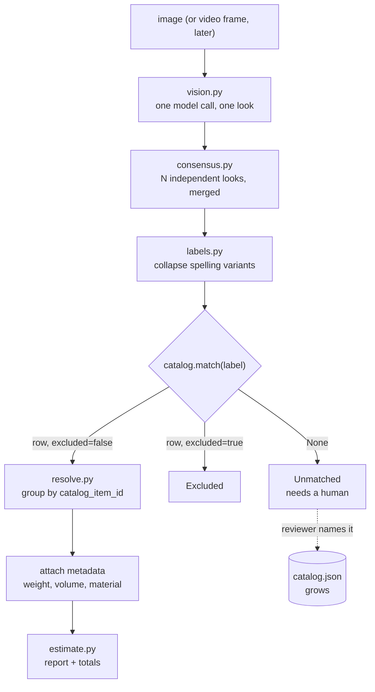

# Recycling Estimator — Project Context & TODO

> **Purpose of this file.** A self-contained context restore document. If the
> chat session is cleared, reading this alone should be enough to resume with
> the same understanding and direction. It depends on no conversation history.
>
> **Status (2026-09-14):** the image pipeline is built and runs end to end —
> detection, consensus, catalog match, resolve, metadata, totals. A catalog was
> built once from the 8 photos in `images/catalog/` and **is stale**: 41 rows,
> produced before `--min-observations` defaulted to 1, so real items seen in a
> single photo (office chair, monitor, cushion, computer tower) are missing. It
> must be rebuilt with `--from-harvest` and reviewed by hand before anything is
> built on top of it. Review UI, multi-image rooms, detector and video: not
> started.
>
> **Relationship to this repository: decided, and it has changed.** This is no
> longer a separate product prototyped alongside the app. It becomes a plugin
> inside it — `app/plugins/recycling/` — reached through slash commands in the
> same chat interface. There is **one deployment**, not two; the plugin is left
> out of `ENABLED_TOOL_PLUGINS` on the deploy branch, so the production job-
> application service never loads it. See §12.
>
> **Revision note:** the requirement changed after the first draft. Price is no
> longer the primary output — see §1.

---

## 1. The product

A customer records a room full of recyclable goods. The system identifies which
items are collectable, counts them, and attaches **approximate physical metadata
to each** — weight, dimensions, volume, material, and optionally price. A
trained employee reviews the result and finalises it.

Sold as **SaaS**. The camera operator is an untrained customer; the reviewer is
a trained employee.

### What changed from the original requirement

| Originally | Now |
|---|---|
| Primary output was an estimated **price** per item | Primary output is **approximate metadata** per item — weight, size, volume, material. Price is one optional field among several. |
| Catalog was a price list | Catalog is a **physical properties table**. Price is a column, not the purpose. |

Truck load planning (fitting items into 4-tonne trucks, splitting across
multiple vehicles) was discussed and is **explicitly out of scope for now**. The
metadata model is deliberately shaped so it could be added later without
rework — but do not build it until asked.

### Why the change makes the project easier

An LLM genuinely knows physical facts about kinds of object, and does not know
prices.

| Property | Can an LLM estimate it? | Why |
|---|---|---|
| Weight | Yes, reasonably | A stable physical fact, widely documented |
| Dimensions | Yes, reasonably | Standard product sizes |
| Nestable / stackable | Yes | Follows from what the object is |
| Material | Usually | |
| **Price** | **No** | Market, region, condition and date dependent |

So the catalog's whole physical block can be populated automatically and
spot-checked, rather than authored. Price stays `null` until a human or the
client supplies it.

### Client-stated constraints

| Constraint | Meaning |
|---|---|
| Do not tag the same item twice | No double counting across frames or runs |
| Same type, different colour or several units | Counted as one row with a quantity |
| No brand or model identification | A 2K TV and a 4K TV are both "tv" |
| No damage assessment | Condition is out of scope |
| Input may be live footage or an uploaded file | File first, video later |
| Exclusion list exists | A room door is technically recyclable but must not be listed |

### Answers already given by the developer — do not re-ask

| # | Question | Answer |
|---|---|---|
| 1 | Who operates the camera? | An untrained **customer**. A trained employee reconfirms afterwards. Sold as SaaS. |
| 2 | Is human review allowed? | **Yes — mandatory.** The client requires it. |
| 3 | Catalog size? | Unknown; assume 100–1,000+ rows. |
| 4 | What is the estimate for? | A reference figure the employee finalises. |
| 5 | Quantity handling? | Group by item **type**: six identical chairs is `chair x 6`. Different types stay separate. Colour never splits a row. |
| 6 | Real-time required? | **No.** Recorded video is fine; a live overlay is cosmetic. |
| 7 | Reference photos from the client? | **No.** Deliberately building without them — see §6. |

Answer #5 is architecturally load-bearing: see §3.

---

## 2. The three approaches considered, and the verdict

| Approach | Verdict | Reason |
|---|---|---|
| **A. AI decides, with instructions supplied behind the scenes** | **Chosen**, in refined form | A vision LLM plus, later, open-vocabulary detection. No training data, ships in weeks. |
| **B. Feed the video and analyse frame by frame** | Not a distinct approach | This is A done naively — 600 calls producing 600 duplicate detections to reconcile. |
| **C. Hardcoded / classical CV (OpenCV)** | Dead on arrival | OpenCV is image *processing* — resize, blur, edges, contours. It has no concept of "this is a television". The only non-LLM route is training a detector on a hand-labelled dataset, which is the expensive path, not the cheap one. |

**Framing correction that matters:** OpenCV is not a competitor to the AI
approach. It is the plumbing inside it — decoding video, sampling frames,
cropping regions. Both get used.

---

## 3. Why answer #5 simplified the project

Grouping by type rather than by physical instance changes the question:

| | If instances mattered | With type-level counts |
|---|---|---|
| Question | "Is this the same TV I saw 40 frames ago?" | "How many TVs are in this room?" |
| Requires | Re-identification across occlusion and backtracking | A robust count estimate |
| Difficulty | Research-grade | Engineering-grade |

Residual risk for video: a camera panning back over the same object assigns it a
new track id and double counts it. Mitigations, cheapest first — guided capture
(app instructs a single slow sweep), census cross-check, ReID embeddings, and
the human review UI, which is the only one that always works.

---

## 4. Locked design decisions

| Decision | Choice | Rationale |
|---|---|---|
| Recognition | Retrieval-constrained labelling with a vision LLM | No training data needed |
| **Catalog role** | The **canonical item table**: identity, aliases, exclusion, physical metadata | See §5 |
| Filter position | **At the front, never post-hoc** | See §5 |
| Exclusions | A catalog row with `excluded: true`, not a separate file | Keeps aliases attached; one place to look; a reviewer flips a boolean |
| Grouping key | `catalog_item_id`. Colour is a display attribute only. | Client answer #5 |
| Metadata | Weight, dimensions, volume, material, nesting; **price optional** | The new requirement |
| Missing metadata | `None`, never `0` | Zero silently produces a wrong total; `None` forces the caller to decide |
| Every value | Carries a `source`: `llm_estimate` / `measured` / `client_supplied` | A reviewer must know which numbers to distrust |
| Human review | Mandatory, so optimise for **recall** and review throughput | Deleting a wrong row is one click; a missing row means re-watching the video |
| Input format | **Stills first.** Video decodes *into* stills later. | One pipeline: `list[Image]` in. Never convert images into a video. |
| Reference photos | Skipped | See §6 |
| Multi-tenancy | Catalog is per-tenant | SaaS; retrofitting tenancy is painful |

---

## 5. Why the catalog filter goes at the FRONT

The intuitive design is: scan everything, get free-form labels, then filter
against the catalog. **This is wrong and must not be built that way.**

| | Post-filter (wrong) | Retrieval-first (correct) |
|---|---|---|
| Flow | scan, free labels, fuzzy match, drop non-matches | catalog first, model picks a known row **or abstains** |
| A door is excluded because | it matched nothing | it is a row marked excluded |
| Failure mode | **"correctly excluded" and "match failed" look identical** | abstentions are explicit and reviewable |

Concrete failure: a real ceiling fan labelled `"industrial air circulator"`
matches nothing and is dropped exactly like the door. The employee never sees
it. Silent revenue and material loss with no signal.

### Collapse the catalog into visual classes

A 1,000-row catalog is not 1,000 visually distinct objects — more likely ~80
visual classes with variants:

```
TV - LCD under 32"   |
TV - LCD 32-50"      +---> visual_class "television"
TV - LCD over 50"    |
```

Vision only needs the class; the variant is a coarse attribute or a reviewer
decision. This matters practically: **open-vocabulary detectors degrade badly
past roughly a hundred classes**, so this collapse is a hard requirement for
the detector stage, not tidiness.

---

## 6. Reference photos — decision and reasoning

Proceeding **without** client-supplied reference images. Whether text-only
matching works depends on how the client names things, not on catalog size:

| Naming style | Outcome |
|---|---|
| Plain nouns — "ceiling fan", "microwave oven" | Works well; these are in every model's training data |
| Fine-grained variants — "radiator, copper" vs "aluminium" | Unreliable; material is hard to see |
| Client jargon — "Unit Type B4" | Fails outright |

**So the ask to the client is not "send 1,000 photos" — it is "send 50 sample
rows of your real catalog".** That reveals which row above applies.

Two free substitutes are already built in: the catalog is enriched with visual
descriptions and aliases by an LLM at build time, and the review UI will
eventually harvest confirmed crops into a reference library nobody had to
request.

---

## 7. Architecture as built



Text form:

```
image
  -> vision.py       one call: what objects are visible, and how many
  -> consensus.py    repeat N times, merge, keep the spread and agreement
  -> labels.py       "mouse pad" == "mousepad"
  -> catalog.match   "desk" -> the "table" row      (this merges SYNONYMS)
  -> resolve.py      regroup by catalog id, attach metadata, three buckets:
                       matched / excluded / unmatched
  -> estimate.py     table + totals, unmatched always shown
```

Two grouping passes on two different axes, and both are needed:
`consensus` merges spelling variants, the catalog merges synonyms.

---

## 8. Files

**Revised 2026-09-14 — the pipeline moved, then the prototype was deleted.**
`labels.py`, `vision.py`, `consensus.py`, `catalog.py`, `resolve.py`, and
the harvest/cluster/enrich/assemble logic that used to live inline in
`build_catalog.py` moved unchanged into `app/plugins/recycling/pipeline/`
(`vision.py` gained bytes-based entry points alongside its original
`Path`-based ones; nothing else changed). The standalone `playground/`
folder this all started in — its CLIs (`detect.py`, `estimate.py`,
`build_catalog.py`, `run.py`) and the phase-0.3 dedup probe
(`probe_multiview.py`) — has since been **deleted entirely**, on purpose:
the point of building this as a plugin was always to reach the agentic
loop (§12), not to keep a standalone tool usable, and once the logic had a
home inside the app the CLI-only path stopped earning its keep. There is
now no way to exercise any part of the pipeline without running the full
app and going through `/recycle` in a real conversation — see §9.

```
llm-system/
├── requirements.txt              # + openai, pydantic, pillow (no new deps for the plugin)
├── images/                       # test photographs
└── app/plugins/recycling/        # the plugin — see README.md's "Tool plugins" section, and its own README.md
    ├── __init__.py               # PLUGIN — builds one openai client, registers /recycle
    ├── commands.py               # scan_image / scan_video (stub) / build_catalog / show_catalog
    ├── runner.py                 # async concurrent runs (asyncio.to_thread) — the event loop that serves SSE must never block on this
    ├── catalog.json              # the catalog. REVIEW BY HAND after any build_catalog run — the model gets granularity and exclusions wrong often enough that this is not optional
    └── pipeline/
        ├── vision.py             ├── consensus.py            ├── labels.py
        ├── catalog.py            ├── resolve.py               └── build.py
```

**The one rule every file follows: nothing detected is ever dropped without the
reviewer seeing it.** Low-agreement items, unmatched labels, labels the
clustering model forgot, unanswered enrichment and contested aliases are all
reported. Five early bugs were violations of this rule; check it first when
reviewing any change. `/recycle scan_image` and `build_catalog` also attach
the full structured result as a file on the assistant message —
`read_attachment` reads it back later — so a follow-up question still has
everything even after the conversation is summarized past what the Markdown
reply itself preserves.

**Synonyms are merged per run, inside consensus.** `grouping_key(catalog)`
is passed into the merge, so "table" in two runs and "desk" in the third is
one table. Merging later, after runs are combined, cannot tell one object
named twice from two objects, and double counts. `runner.scan`/
`runner.harvest` follow the same rule, just concurrently, and
`/recycle scan_image` additionally deduplicates *across several attached
photos of one room* in a single call (`detect_items_bytes`) when more than
one image is attached.

---

## 9. How to run it

There is no CLI anymore. Start the app and use `/recycle` in a real
conversation:

```bash
python -m app.main --api
```

```
/recycle build_catalog          # attach photos to this message first (the slow, paid step)
/recycle show_catalog           # review what got built — REVIEW BY HAND, not optional
/recycle scan_image             # attach photos to this message; the product path
```

---

## 10. Findings from the first real runs

Three runs of the same photograph produced 24, 22 and 22 kinds; grape counts of
25, 32 and 20; `table` once and `desk` twice.

**The important discovery:** almost everything that appeared in only one run was
a *synonym of something already found*, not a missed object.

| Kept | Seen once | Same object? |
|---|---|---|
| `headset` | `headphone` | Yes |
| `table` | `desk` | Yes |
| `usb drive` | `usb flash drive` | Yes |
| `backpack` | `bag` | Yes |

So the model's **perception is stable; its naming is not.** The problem was
never recognition. This is why the catalog's alias list is the highest-value
component, and why an open-vocabulary detector was moved down the plan.

Other findings:

- `gpt-5.6-luna` **rejects the `temperature` parameter** outright: *"Only the
  default (1) value is supported."* Sampling control is unavailable, so
  stabilisation must come from consensus across runs.
- Counting past roughly eight identical objects is unreliable — grapes ranged
  20–32. `count_is_unstable` flags this.
- The model's self-reported `confidence` is not calibrated: it reported 0.99 for
  items it failed to mention at all on the next run. **Agreement across runs is
  the real confidence signal.**
- The model has no notion of relevance — it reports a coin and a floor with
  equal seriousness. Only the catalog fixes that.

---

## 11. Where YOLO-World fits, and why it is not next

YOLO-World is an **open-vocabulary detector**: you supply class names as text at
inference time and it returns bounding boxes, with no training. It cannot
enumerate objects on its own — given no class list it detects nothing, so it
cannot bootstrap its own vocabulary. The catalog produces that vocabulary
(`Catalog.vocabulary()` already returns it).

| | Vision LLM | YOLO-World |
|---|---|---|
| Naming things you did not anticipate | Yes | **Cannot** |
| Deterministic | No | Yes |
| Bounding boxes | No | Yes |
| Counting | Weak | **Strong** |
| Video at frame rate | No | Yes |

**Its justification was latency and boxes, not accuracy.** Both have since been
re-examined, and neither survives — see §11a. A detector is no longer planned.
The comparison above is kept because it is still true, and because the escape
hatch below depends on understanding it.

Integration is already seamed: `consensus.py` calls one function. Inject an
alternative detector with the same output shape and nothing else changes.

**Licensing — settle this before any detector work starts.** Ultralytics ships
YOLO under AGPL-3.0. AGPL is GPL plus a network clause: with ordinary GPL you
owe source only when you distribute a binary, and a SaaS never distributes one,
which is the loophole AGPL was written to close. Anyone *using the service over
a network* can demand the complete corresponding source of the combined work,
under the same licence. A closed-source SaaS therefore has three honest options:
buy Ultralytics' commercial licence, open-source the product, or use a detector
under a permissive licence (OWLv2 and similar Apache-2.0 open-vocabulary models
are the usual substitute — verify the licence of both the code *and* the weights
for whichever is chosen, since they are often licensed separately).

**Evaluating it locally is fine.** AGPL obligations are triggered by conveying
the software or by letting *other people* use it over a network. Running it on
your own machine to measure whether it is any good triggers nothing. The line is
crossed when it is deployed somewhere the client can reach — a demo on
`career-lamp.com` counts. So: benchmark it locally, keep it behind the detector
interface, and decide the licence question before it goes anywhere public.

Raise it with Katsu-san before starting. Wrap whatever is chosen behind
`Detector.detect(image) -> list[Box]` so it is imported in exactly one file —
that seam is also what makes a licence-driven swap cheap.

**Environment risk:** the project runs Python 3.14.2. PyTorch and Ultralytics
wheels lag new Python releases. Check `pip index versions torch` before
committing time; the CV stage may need its own 3.12 environment.

---

## 11a. Video without a detector — the current decision

**Decided 2026-09-14. This reverses "YOLO-World is phase 4".**

### Why latency stopped mattering

The product scans a room and an employee reviews the result afterwards
(answer #6: real-time is not required). There is no frame-rate budget. The only
number that counts is how long **one video** takes to process in the background,
and minutes are acceptable. That was YOLO's whole justification.

| YOLO gives | Needed? |
|---|---|
| Milliseconds per frame | No. This is a background job |
| Boxes for a live overlay | No. Cosmetic, last phase |
| Boxes for evidence thumbnails in review | Nice; the whole frame works as evidence |
| Boxes for tracking across frames | This is the only real one — answered below |

### The actual hard problem: per-frame counts are not additive

`consensus.py` merges N looks at **one image** by taking the median. Frames from
a camera sweep are not that — they are different views of different parts of one
room, and neither obvious rule works:

| Rule | Frame A: 1 TV, frame B: 1 TV | Fails when |
|---|---|---|
| Median across frames | 1 TV | The camera panned to a *second* TV — undercount |
| Sum across frames | 2 TVs | One TV appears in 40 frames — 40 TVs |

This is exactly the client's "do not tag the same item twice" constraint, and it
is a spatial-reasoning problem, not a detection problem. Tracking with boxes is
the classical answer. It is no longer the chosen one.

### Chosen approach: let the model see the frames together

```
video
  -> OpenCV: decode, sample keyframes, drop near-duplicates by visual difference
  -> batch 8-16 frames into ONE vision call:
     "these are views of one room; list distinct items and counts,
      do not count the same object twice"
  -> repeat N times -> merge_runs() unchanged
  -> catalog match -> resolve -> review
```

`gpt-5.6-luna` holds 1,050,000 tokens of context; a dozen images is roughly
20,000. The model can hold the whole room at once and deduplicate as reasoning —
the job tracking was going to do — with no boxes, no track ids, no ReID, and no
AGPL dependency. A two-minute sweep is perhaps 30 keyframes and three consensus
runs: pennies in tokens, a couple of minutes wall-clock with calls issued
concurrently. `merge_runs` is untouched; only the per-run detection call changes
from one image to several.

OpenCV (Apache-2.0) decodes and samples. That is the only new dependency.

### What is unproven, and the experiment that settles it

Whether the model reliably recognises "that is the same sofa from another
angle". Nothing else in this plan is in doubt. **Test before building:** take
4–6 photos of one room from different positions, send them in a single call, and
see whether it answers "1 sofa" or "3 sofas". `images/room/` currently holds one
photo; five more is ten minutes of work and settles the biggest open question in
the video phase.

**Preliminary result (2026-09-14), via `playground/probe_multiview.py`
(phase 0.3):** 2 photos of one desk setup from different angles, 3 runs.
Every object visible in both photos — laptop, monitor, keyboard, headset,
router, glass mug, toilet paper roll — was reported with its true physical
count (1 each), not doubled from appearing in two images. The two office
chairs also stayed at 2 across all three runs. This is the failure mode the
experiment exists to catch, and it did not happen.

Noise that did show up (`curtain`: 4/4/1, `power adapter` appearing/
disappearing between runs) is a labelling-granularity problem — what counts
as "one curtain" — not a duplication-across-views problem, and is the kind
of thing `consensus.py`'s cross-run merge already exists to smooth over.

**A separate risk `cable: 8/8/8` exposes: agreement is not correctness.**
`count_is_unstable` is a variance check across runs — it has nothing to say
about three independent runs converging on the same wrong number. Nobody
counted eight cables; the model settled on a plausible-sounding figure for
something it cannot actually delineate, and did so consistently enough that
the one metric built to flag disagreement stays silent. This isn't specific
to cables — it applies to any cluttered, hard-to-delineate category. The
practical fix already exists and doesn't require touching the metric:
catalog-exclude clutter categories (cables, curtains) so the question never
reaches a human, rather than trying to make consensus detect its own blind
spot.

**Not yet settled — undercounting.** Only 2 angles were tested, both heavily
overlapping, so this proved "doesn't double-count" and nothing about the
opposite failure: two *different* similar-looking objects in non-overlapping
views getting merged into one. The next probe to run: two photos of
different corners of a room, each containing a similar item (two matching
chairs on opposite sides, say), and check the result says 2, not 1.

**Two readings of that probe worth keeping.** First, the naming chaos it shows
(`desk`/`table`, `mouse pad`/`mousepad`/`gaming mat`, `bucket`/`storage bin`/
`plastic container`) is an artefact of the probe, not of the approach: the probe
prints raw labels, while the product path passes `grouping_key(catalog)` into
`detect_stable` and merges those per run. Judge naming on `estimate.py`'s output,
never on the probe's. Second, the same three labels for one group of objects
(2 buckets + 1 basin = 3 containers = 3 "plastic containers") is the §10 finding
again at room scale — perception stable, naming unstable — which is more evidence
for the alias list being the highest-value component, not against it.

**Improvement to make when this becomes real code:** have the multi-image call
return, per item, which views it was seen in (`seen_in: [1, 3]`). It costs a
schema field and it buys two things — the model is forced to commit to an
identity claim per object rather than emitting one merged number, and the review
UI gets a citation ("this chair came from frames 1 and 3") without any bounding
boxes.

### Fallbacks, cheapest first, if deduplication proves weak

1. Guided capture — instruct the customer to sweep once, slowly, stopping at
   each wall (client question #6 asks whether the app may do this).
2. Segment the sweep and sum across non-overlapping segments, accepting
   boundary overlap as a review item.
3. Only then boxes and tracking — by which point the accuracy gap being bought
   is known, and the licence question in §11 has to be answered.

---

## 12. How this becomes part of the app

Decided 2026-09-14, after the host application gained file uploads.

| Question | Decision | Why |
|---|---|---|
| Separate repo or plugin? | **Plugin**, `app/plugins/recycling/` | The agent loop, auth, storage, SSE streaming and the React UI already exist. Rebuilding them for one feature is the expensive path. |
| One deployment or two? | **One.** The plugin is omitted from `ENABLED_TOOL_PLUGINS` on the deploy branch | The production service is the job-application product; it must never load recycling. `ENABLED_TOOL_PLUGINS` is an allowlist that already exists, so this costs no code. **Caveat: it is an allowlist, so it must name every plugin that should load** — `clock,documents,attachments`. Forgetting `attachments` silently disables file reading. |
| Entry point: agent tool or slash command? | **Slash command**, `/recycle scan`, `/recycle train`, `/recycle catalog` | A command never enters the tool schemas, so the recycling feature cannot confuse the `anna` persona even when both are loaded. It also costs no LLM call to start, and cannot be invoked by mistake. |
| How does the result reach the screen? | The command **writes the assistant message itself**, as Markdown the frontend already renders | Deterministic. A model asked to reproduce a 40-row table can drop a row or alter a number, and this project's one rule is that nothing detected disappears without the reviewer seeing it. |
| Where does the catalog live? | Postgres, per tenant | `catalog.json` inside a container is destroyed on every deploy, and SaaS tenancy was a locked decision (§4). |
| Which model does the scan call? | **The app's own model by default** — deployment already runs `MODEL_NAME=gpt-5.6-luna` with `LLM_SUPPORTS_VISION=true`, the same model `vision.py` was originally written against. An optional `RECYCLING_VISION_MODEL` overrides it | No second key, no second configuration to keep in sync. The override exists only for the day the chat model is downgraded for cost and the scan still needs vision. |
| Which SDK does it call through? | The raw `openai` SDK `vision.py` was originally written against, given the app's credentials (`ToolContext.llm`) | Its Pydantic structured-output call is the part most likely to break in a LangChain rewrite, and it moved across unchanged. The cost is two LLM paths in one process — acceptable while the plugin is young, worth revisiting if it outlives the prototype. |

### Plan

| Phase | Work | Status |
|---|---|---|
| 0 | Detection, consensus, exclusions | **Done** |
| 1 | Catalog build + resolve + metadata | **Built; catalog stale, rebuild + review outstanding** |
| 1.5 | Host app: file uploads, image and document reading | **Done** — shipped and tested in the main app |
| 2 | Slash-command registry: a plugin declares a namespace, `ChatService` routes a leading `/` before the LLM runs | **Done** — generalized to every plugin (`app/plugins/contracts.py`'s `PluginCommand`/`command_factory`), not recycling-specific; proven live with `/clock time` |
| 3 | `/recycle scan_image` over attached images: pipeline moved into the plugin, run concurrently (`runner.py`, `asyncio.to_thread`), Markdown table + attached JSON written back | **Done** — also folds in phase 6 (see below); `/recycle scan_video` registered as a stub, `/recycle build_catalog` and `/recycle show_catalog` also built (not originally scoped this early, brought forward) |
| 4 | Catalog into Postgres; `/recycle train`, `/recycle catalog` | `/recycle build_catalog`/`show_catalog` exist against the plugin's own `catalog.json`; the Postgres move itself has not started |
| 5 | Review UI — table, thumbnails, edit count, add missing, name unmatched. Needs a plugin manifest endpoint so the frontend knows the plugin is loaded | Next planned: a `.tsx` settings/review page for `/recycle`, replacing chat-driven catalog editing before it was ever built (an `edit_catalog` command was scoped and deliberately dropped in favour of this) |
| 6 | Multi-image estimate (a whole room, not one photo) | **Folded into phase 3** — `/recycle scan_image` accepts several attached photos and deduplicates across views in one call (`detect_items_bytes`), since the §11a preliminary result already validated the approach |
| 7 | Video: OpenCV keyframe sampling -> multi-frame vision call -> existing consensus (§11a). No detector | Not started. `/recycle scan_video` is registered and answers "not implemented yet" — OpenCV is still the one dependency phases 0-2's "no new dependencies" rule was deferring |
| 8 | Guided capture, if deduplication needs help | |
| 9 | Open-vocabulary detector — **only** if 7 and 8 prove insufficient (§11, §11a) | Dropped from the plan |
| 10 | Live overlay (cosmetic) | |

Phase 5 is the demo, and it is also the mandatory human review, so it is not
optional polish. Phase 6 matters more than it sounds: a room is several
photographs, and deduplicating across them is the first real instance of the
double-counting problem — solve it there, on stills, where it is cheap to test,
and phase 7 becomes "decode the video into those stills".

---

## 13. Open questions for the client

| # | Question | Why |
|---|---|---|
| 1 | **Send 50 sample rows of the real catalog** | Still open, still the highest-value ask. It decides whether text matching works at all: our whole recognition path is "the model names a thing, the name resolves to a catalog row". If their rows are plain nouns that works; if they are product codes or in-house jargon, nothing a vision model says will ever match one, and the project needs a mapping layer we have not planned. 50 rows is a spreadsheet export, not a photo shoot. |
| 2 | Excel or relational database? How often does it change? | One-off import or a sync job |
| 3 | Which metadata fields do they actually need? | Weight and volume are assumed; material and price may not matter |
| 4 | Are dimensions needed per unit, or only totals? | Affects how much precision to chase |
| 5 | Confirm in writing that the estimate is a reference an employee overrides | Lowers the accuracy bar; protects against a later dispute |
| 6 | Can the capture app instruct the customer, or must arbitrary video be accepted? | Guided capture is the highest-leverage risk reduction available |

---

## 14. Glossary

| Term | Meaning |
|---|---|
| **Vision-capable LLM** | A model whose encoder accepts images, so pixels enter the same context as the prompt. A text-only model cannot see an image however it is described. |
| **CLIP** | Maps images *and* text into one shared vector space, so a photo and its description land near each other. |
| **Text embedding** | A vector for text only. Cannot compare an image to anything. |
| **Open-vocabulary detection** | Detection where the class list is supplied as text at inference time rather than fixed at training time. |
| **YOLO-World / YOLOE** | Open-vocabulary detectors. Given `["ceiling fan"]` they return boxes, untrained. |
| **ByteTrack** | Multi-object tracker; links detections across frames into persistent `track_id`s. |
| **ReID** | Re-identification: matching an object to one seen earlier by appearance, after tracking lost it. |
| **Abstention** | The model answering "none of these" rather than forcing a wrong pick. Must always be surfaced. |
| **Consensus / census** | Merging several independent observations of one scene into one measurement, keeping the spread. |
| **Collapse key** | A normalised, punctuation-stripped label used only for matching. Never displayed. |

---

## 15. Model note

`gpt-5.6-luna` supports image input: modalities text + image in, text out;
1,050,000 token context; 128,000 max output; knowledge cutoff 2026-02-16;
structured outputs and function calling both supported; $0.2 / 1M input and
$1.2 / 1M output, with 2x input and 1.5x output above 272K input tokens.

**It rejects `temperature`.** Verified empirically. Confirm current figures on
the model page before relying on them commercially.
