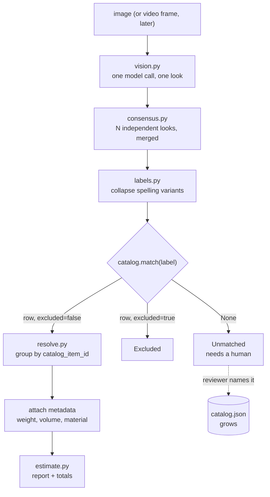

# Recycling Estimator — Project Context & TODO

> **Purpose of this file.** A self-contained context restore document. If the
> chat session is cleared, reading this alone should be enough to resume with
> the same understanding and direction. It depends on no conversation history.
>
> **Status:** image pipeline built and running. Catalog stage written, not yet
> run. Video and detector work not started.
>
> **Relationship to this repository:** none structurally. This is a separate
> product that happens to be prototyped in `playground/`. Long term it becomes
> either its own system or a tool the existing agent can call.
>
> **Revision note:** the requirement changed after the first draft. Price is no
> longer the primary output — see §1.

---

## 1. The product

A customer records a room full of recyclable goods. The system identifies which
items are collectable, counts them, and attaches **approximate physical metadata
to each** — weight, dimensions, volume, material, and optionally price. A
trained employee reviews the result and finalises it.

Sold as **SaaS**. The camera operator is an untrained customer; the reviewer is
a trained employee.

### What changed from the original requirement

| Originally | Now |
|---|---|
| Primary output was an estimated **price** per item | Primary output is **approximate metadata** per item — weight, size, volume, material. Price is one optional field among several. |
| Catalog was a price list | Catalog is a **physical properties table**. Price is a column, not the purpose. |

Truck load planning (fitting items into 4-tonne trucks, splitting across
multiple vehicles) was discussed and is **explicitly out of scope for now**. The
metadata model is deliberately shaped so it could be added later without
rework — but do not build it until asked.

### Why the change makes the project easier

An LLM genuinely knows physical facts about kinds of object, and does not know
prices.

| Property | Can an LLM estimate it? | Why |
|---|---|---|
| Weight | Yes, reasonably | A stable physical fact, widely documented |
| Dimensions | Yes, reasonably | Standard product sizes |
| Nestable / stackable | Yes | Follows from what the object is |
| Material | Usually | |
| **Price** | **No** | Market, region, condition and date dependent |

So the catalog's whole physical block can be populated automatically and
spot-checked, rather than authored. Price stays `null` until a human or the
client supplies it.

### Client-stated constraints

| Constraint | Meaning |
|---|---|
| Do not tag the same item twice | No double counting across frames or runs |
| Same type, different colour or several units | Counted as one row with a quantity |
| No brand or model identification | A 2K TV and a 4K TV are both "tv" |
| No damage assessment | Condition is out of scope |
| Input may be live footage or an uploaded file | File first, video later |
| Exclusion list exists | A room door is technically recyclable but must not be listed |

### Answers already given by the developer — do not re-ask

| # | Question | Answer |
|---|---|---|
| 1 | Who operates the camera? | An untrained **customer**. A trained employee reconfirms afterwards. Sold as SaaS. |
| 2 | Is human review allowed? | **Yes — mandatory.** The client requires it. |
| 3 | Catalog size? | Unknown; assume 100–1,000+ rows. |
| 4 | What is the estimate for? | A reference figure the employee finalises. |
| 5 | Quantity handling? | Group by item **type**: six identical chairs is `chair x 6`. Different types stay separate. Colour never splits a row. |
| 6 | Real-time required? | **No.** Recorded video is fine; a live overlay is cosmetic. |
| 7 | Reference photos from the client? | **No.** Deliberately building without them — see §6. |

Answer #5 is architecturally load-bearing: see §3.

---

## 2. The three approaches considered, and the verdict

| Approach | Verdict | Reason |
|---|---|---|
| **A. AI decides, with instructions supplied behind the scenes** | **Chosen**, in refined form | A vision LLM plus, later, open-vocabulary detection. No training data, ships in weeks. |
| **B. Feed the video and analyse frame by frame** | Not a distinct approach | This is A done naively — 600 calls producing 600 duplicate detections to reconcile. |
| **C. Hardcoded / classical CV (OpenCV)** | Dead on arrival | OpenCV is image *processing* — resize, blur, edges, contours. It has no concept of "this is a television". The only non-LLM route is training a detector on a hand-labelled dataset, which is the expensive path, not the cheap one. |

**Framing correction that matters:** OpenCV is not a competitor to the AI
approach. It is the plumbing inside it — decoding video, sampling frames,
cropping regions. Both get used.

---

## 3. Why answer #5 simplified the project

Grouping by type rather than by physical instance changes the question:

| | If instances mattered | With type-level counts |
|---|---|---|
| Question | "Is this the same TV I saw 40 frames ago?" | "How many TVs are in this room?" |
| Requires | Re-identification across occlusion and backtracking | A robust count estimate |
| Difficulty | Research-grade | Engineering-grade |

Residual risk for video: a camera panning back over the same object assigns it a
new track id and double counts it. Mitigations, cheapest first — guided capture
(app instructs a single slow sweep), census cross-check, ReID embeddings, and
the human review UI, which is the only one that always works.

---

## 4. Locked design decisions

| Decision | Choice | Rationale |
|---|---|---|
| Recognition | Retrieval-constrained labelling with a vision LLM | No training data needed |
| **Catalog role** | The **canonical item table**: identity, aliases, exclusion, physical metadata | See §5 |
| Filter position | **At the front, never post-hoc** | See §5 |
| Exclusions | A catalog row with `excluded: true`, not a separate file | Keeps aliases attached; one place to look; a reviewer flips a boolean |
| Grouping key | `catalog_item_id`. Colour is a display attribute only. | Client answer #5 |
| Metadata | Weight, dimensions, volume, material, nesting; **price optional** | The new requirement |
| Missing metadata | `None`, never `0` | Zero silently produces a wrong total; `None` forces the caller to decide |
| Every value | Carries a `source`: `llm_estimate` / `measured` / `client_supplied` | A reviewer must know which numbers to distrust |
| Human review | Mandatory, so optimise for **recall** and review throughput | Deleting a wrong row is one click; a missing row means re-watching the video |
| Input format | **Stills first.** Video decodes *into* stills later. | One pipeline: `list[Image]` in. Never convert images into a video. |
| Reference photos | Skipped | See §6 |
| Multi-tenancy | Catalog is per-tenant | SaaS; retrofitting tenancy is painful |

---

## 5. Why the catalog filter goes at the FRONT

The intuitive design is: scan everything, get free-form labels, then filter
against the catalog. **This is wrong and must not be built that way.**

| | Post-filter (wrong) | Retrieval-first (correct) |
|---|---|---|
| Flow | scan, free labels, fuzzy match, drop non-matches | catalog first, model picks a known row **or abstains** |
| A door is excluded because | it matched nothing | it is a row marked excluded |
| Failure mode | **"correctly excluded" and "match failed" look identical** | abstentions are explicit and reviewable |

Concrete failure: a real ceiling fan labelled `"industrial air circulator"`
matches nothing and is dropped exactly like the door. The employee never sees
it. Silent revenue and material loss with no signal.

### Collapse the catalog into visual classes

A 1,000-row catalog is not 1,000 visually distinct objects — more likely ~80
visual classes with variants:

```
TV - LCD under 32"   |
TV - LCD 32-50"      +---> visual_class "television"
TV - LCD over 50"    |
```

Vision only needs the class; the variant is a coarse attribute or a reviewer
decision. This matters practically: **open-vocabulary detectors degrade badly
past roughly a hundred classes**, so this collapse is a hard requirement for
the detector stage, not tidiness.

---

## 6. Reference photos — decision and reasoning

Proceeding **without** client-supplied reference images. Whether text-only
matching works depends on how the client names things, not on catalog size:

| Naming style | Outcome |
|---|---|
| Plain nouns — "ceiling fan", "microwave oven" | Works well; these are in every model's training data |
| Fine-grained variants — "radiator, copper" vs "aluminium" | Unreliable; material is hard to see |
| Client jargon — "Unit Type B4" | Fails outright |

**So the ask to the client is not "send 1,000 photos" — it is "send 50 sample
rows of your real catalog".** That reveals which row above applies.

Two free substitutes are already built in: the catalog is enriched with visual
descriptions and aliases by an LLM at build time, and the review UI will
eventually harvest confirmed crops into a reference library nobody had to
request.

---

## 7. Architecture as built



Text form:

```
image
  -> vision.py       one call: what objects are visible, and how many
  -> consensus.py    repeat N times, merge, keep the spread and agreement
  -> labels.py       "mouse pad" == "mousepad"
  -> catalog.match   "desk" -> the "table" row      (this merges SYNONYMS)
  -> resolve.py      regroup by catalog id, attach metadata, three buckets:
                       matched / excluded / unmatched
  -> estimate.py     table + totals, unmatched always shown
```

Two grouping passes on two different axes, and both are needed:
`consensus` merges spelling variants, the catalog merges synonyms.

---

## 8. Files

```
llm-system/
├── requirements.txt              # + openai, pydantic, pillow
├── images/                       # test photographs
└── playground/
    ├── labels.py                 # normalize() display / collapse_key() matching
    ├── vision.py                 # one image -> one LLM call -> DetectedItem[]
    ├── consensus.py              # N runs -> StableItem[] with agreement + spread
    ├── exclusions.py             # text-file exclusion list (detect.py only)
    ├── exclusions.txt            # seeded from real output; feeds catalog build
    ├── detect.py                 # CLI: raw detection. Harvesting and debugging.
    ├── catalog.py                # CatalogItem / ItemMetadata / Catalog + match()
    ├── build_catalog.py          # CLI: photos -> harvest -> cluster -> enrich -> catalog.json
    ├── resolve.py                # StableItem[] + Catalog -> matched/excluded/unmatched
    ├── estimate.py               # CLI: the product. image -> items + metadata + totals
    ├── run.py                    # earliest ad-hoc runner; superseded by detect.py
    ├── harvest.json              # generated: raw label frequencies (cache)
    └── catalog.json              # generated: the catalog. REVIEW BY HAND.
```

Two CLIs on purpose. `detect.py` reports whatever the model said and is the
harvesting and debugging tool. `estimate.py` is the product path and requires a
catalog.

---

## 9. How to run it

```bash
# 1. raw detection, no catalog needed
cd playground
python detect.py ..\images\table.jpg --runs 3

# 2. build a catalog from a folder of photos  (the slow, paid step)
python build_catalog.py ..\images --runs 2

# 3. re-cluster or re-enrich for free while tuning prompts
python build_catalog.py --from-harvest

# 4. REVIEW catalog.json BY HAND  <- not optional

# 5. the product
python estimate.py ..\images\table.jpg
python estimate.py ..\images\table.jpg --json
```

---

## 10. Findings from the first real runs

Three runs of the same photograph produced 24, 22 and 22 kinds; grape counts of
25, 32 and 20; `table` once and `desk` twice.

**The important discovery:** almost everything that appeared in only one run was
a *synonym of something already found*, not a missed object.

| Kept | Seen once | Same object? |
|---|---|---|
| `headset` | `headphone` | Yes |
| `table` | `desk` | Yes |
| `usb drive` | `usb flash drive` | Yes |
| `backpack` | `bag` | Yes |

So the model's **perception is stable; its naming is not.** The problem was
never recognition. This is why the catalog's alias list is the highest-value
component, and why an open-vocabulary detector was moved down the plan.

Other findings:

- `gpt-5.6-luna` **rejects the `temperature` parameter** outright: *"Only the
  default (1) value is supported."* Sampling control is unavailable, so
  stabilisation must come from consensus across runs.
- Counting past roughly eight identical objects is unreliable — grapes ranged
  20–32. `count_is_unstable` flags this.
- The model's self-reported `confidence` is not calibrated: it reported 0.99 for
  items it failed to mention at all on the next run. **Agreement across runs is
  the real confidence signal.**
- The model has no notion of relevance — it reports a coin and a floor with
  equal seriousness. Only the catalog fixes that.

---

## 11. Where YOLO-World fits, and why it is not next

YOLO-World is an **open-vocabulary detector**: you supply class names as text at
inference time and it returns bounding boxes, with no training. It cannot
enumerate objects on its own — given no class list it detects nothing, so it
cannot bootstrap its own vocabulary. The catalog produces that vocabulary
(`Catalog.vocabulary()` already returns it).

| | Vision LLM | YOLO-World |
|---|---|---|
| Naming things you did not anticipate | Yes | **Cannot** |
| Deterministic | No | Yes |
| Bounding boxes | No | Yes |
| Counting | Weak | **Strong** |
| Video at frame rate | No | Yes |

**Its justification is latency and boxes, not accuracy.** 300 frames at ~15s per
LLM call is over an hour serially; YOLO does it in seconds. Boxes are needed for
tracking, evidence thumbnails and the live overlay. It is *worse* at naming.

Integration is already seamed: `consensus.py` calls one function. Inject an
alternative detector with the same output shape and nothing else changes.

Note also that `consensus.py` is the video module in disguise — its job is
merging repeated observations of one scene. Swap "runs" for "frames" and it
works unmodified.

**Licensing:** Ultralytics is AGPL-3.0. Fine for prototyping; a closed-source
SaaS product needs a commercial licence. Raise with Katsu-san before starting
detector work. Wrap it behind `Detector.detect(image) -> list[Box]` so it is
imported in exactly one file.

**Environment risk:** the project runs Python 3.14.2. PyTorch and Ultralytics
wheels lag new Python releases. Check `pip index versions torch` before
committing time; the CV stage may need its own 3.12 environment.

---

## 12. Plan

| Phase | Work | Status |
|---|---|---|
| 0 | Detection, consensus, exclusions | **Done** |
| 1 | Catalog build + resolve + metadata | **Written, not yet run** |
| 2 | Review UI — table, thumbnails, edit count, add missing, name unmatched | Next |
| 3 | Multi-image estimate (a whole room, not one photo) | |
| 4 | YOLO-World detector behind the same interface | |
| 5 | Video: frames -> consensus, guided capture | |
| 6 | Live overlay (cosmetic) | |

Phase 2 is the demo. Phase 3 matters more than it sounds: a room is several
photographs, and deduplicating across them is the first real instance of the
double-counting problem.

---

## 13. Open questions for the client

| # | Question | Why |
|---|---|---|
| 1 | **Send 50 sample rows of the real catalog** | Decides whether text matching works at all. Highest-value ask. |
| 2 | Excel or relational database? How often does it change? | One-off import or a sync job |
| 3 | Which metadata fields do they actually need? | Weight and volume are assumed; material and price may not matter |
| 4 | Are dimensions needed per unit, or only totals? | Affects how much precision to chase |
| 5 | Confirm in writing that the estimate is a reference an employee overrides | Lowers the accuracy bar; protects against a later dispute |
| 6 | Can the capture app instruct the customer, or must arbitrary video be accepted? | Guided capture is the highest-leverage risk reduction available |

---

## 14. Glossary

| Term | Meaning |
|---|---|
| **Vision-capable LLM** | A model whose encoder accepts images, so pixels enter the same context as the prompt. A text-only model cannot see an image however it is described. |
| **CLIP** | Maps images *and* text into one shared vector space, so a photo and its description land near each other. |
| **Text embedding** | A vector for text only. Cannot compare an image to anything. |
| **Open-vocabulary detection** | Detection where the class list is supplied as text at inference time rather than fixed at training time. |
| **YOLO-World / YOLOE** | Open-vocabulary detectors. Given `["ceiling fan"]` they return boxes, untrained. |
| **ByteTrack** | Multi-object tracker; links detections across frames into persistent `track_id`s. |
| **ReID** | Re-identification: matching an object to one seen earlier by appearance, after tracking lost it. |
| **Abstention** | The model answering "none of these" rather than forcing a wrong pick. Must always be surfaced. |
| **Consensus / census** | Merging several independent observations of one scene into one measurement, keeping the spread. |
| **Collapse key** | A normalised, punctuation-stripped label used only for matching. Never displayed. |

---

## 15. Model note

`gpt-5.6-luna` supports image input: modalities text + image in, text out;
1,050,000 token context; 128,000 max output; knowledge cutoff 2026-02-16;
structured outputs and function calling both supported; $0.2 / 1M input and
$1.2 / 1M output, with 2x input and 1.5x output above 272K input tokens.

**It rejects `temperature`.** Verified empirically. Confirm current figures on
the model page before relying on them commercially.
