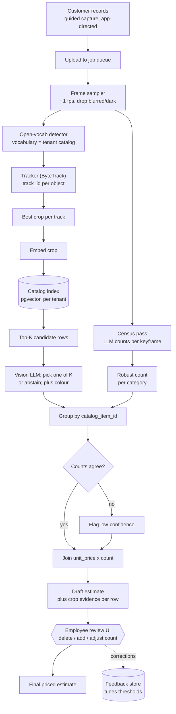

# Recycling Estimator — Project Context & TODO

> **Purpose of this file.** This is a self-contained context restore document.
> If the chat session is cleared, reading this file alone should be enough to
> resume work with the same understanding and direction. It does not depend on
> conversation history, memory, or compaction.
>
> **Status:** design settled, nothing built yet.
> **Relationship to this repository:** none, structurally. This is a *separate*
> codebase and product. It is recorded here only because the design discussion
> happened in this repo's session. Long term it may become a tool call invoked
> by the existing agent system (e.g. user uploads a video, the agent calls it).

---

## 1. The product

A client wants a system that:

1. Takes a recording of a room full of recyclable goods (warehouse / garage /
   storage room) — either an uploaded video file or live camera footage.
2. Identifies which items in that room are recyclable **according to the
   client's own catalog**, and ignores everything else.
3. Produces a priced estimate: each identified item type, its count, its unit
   price from the client's catalog, and a total.

Sold as **SaaS**. The person recording is a *customer* (untrained). A trained
employee then reviews the AI's draft and issues the final price.

### Client-stated constraints

| Constraint | Meaning |
|---|---|
| Do not tag the same item twice | No double-billing an object seen in many frames |
| Same type, different colour or multiple units still counted | Quantity must be captured |
| No brand or model identification | A 2K TV and a 4K TV are both just "TV". Accepted inaccuracy. |
| No damage assessment | Condition is out of scope |
| Input may be live footage or an uploaded file | Both eventually; file first |
| Exclusion list exists | A room door is technically recyclable but must **not** be listed |
| Price source | Client supplies a relational DB or Excel spreadsheet of items + prices |

### Answers already given by the developer (do not re-ask)

| # | Question | Answer |
|---|---|---|
| 1 | Who operates the camera? | A **customer**, untrained. A trained employee then reconfirms the AI result and sets the exact price. Sold as SaaS. |
| 2 | Is human review allowed before pricing? | **Yes — mandatory.** The client requires it. |
| 3 | Catalog size? | Unknown, but assume **100–1,000+ rows**. Large but not enormous. |
| 4 | What does "approximate price" mean commercially? | Literally a reference figure from the catalog. The employee sets the real price afterwards. |
| 5 | Quantity handling? | Group by **item type**: 6 identical plastic chairs become `chair x 6`. Different *types* (plastic chair vs sofa) stay separate rows. Colour does **not** split rows. |
| 6 | Real-time required? | **No.** Recorded video is fine. A live bounding-box overlay while recording is a nice-to-have, not needed for the prototype. |

Answer #5 is architecturally important — see §3.

---

## 2. The three approaches originally considered, and the verdict

| Approach | Verdict | Reason |
|---|---|---|
| **A. Let the AI decide, with instructions supplied behind the scenes** | **Chosen** (in refined form) | Open-vocabulary detection + a vision LLM. Flexible, needs no training data, ships in weeks. |
| **B. Feed the whole video and analyse frame by frame** | Not a distinct approach | This is A done naively. A 5-minute video at 2 fps is 600 model calls producing 600 duplicate detections to reconcile. Expensive, and it makes the dedup problem worse rather than better. |
| **C. Hardcoded / algorithmic extraction with classical CV (OpenCV)** | Dead on arrival | OpenCV is image *processing* — resize, blur, edges, contours, thresholds. It has no concept of "this object is a television." The only non-LLM route is training a detector like YOLO on a hand-labelled dataset: thousands of manually drawn boxes per class. That is the *expensive* path, not the cheap one. |

**Important framing correction:** OpenCV is not a competitor to the AI approach.
It is the plumbing *inside* it — decoding video, sampling frames, cropping
regions, drawing overlays. Both get used.

---

## 3. Why answer #5 simplified the whole project

Grouping by item type rather than by physical instance changes the question the
system must answer:

| | If instances mattered | With type-level counts (actual requirement) |
|---|---|---|
| Question | "Is this TV the same physical TV I saw 40 frames ago?" | "How many TVs are in this room?" |
| Requires | Re-identification across occlusion and camera backtracking | A robust count estimate |
| Difficulty | Research-grade | Engineering-grade |

Per-object identity is no longer needed. This is the single biggest reduction in
project risk, and it is why the plan below is achievable.

### The residual risk: re-entry double counting

A tracker assigns one ID per object *while it stays visible*. The failure mode:

> The customer pans right across the garage, then pans back left. The same
> ceiling fan becomes `track_id=3`, then later `track_id=47`. It gets billed twice.

Mitigations, cheapest first:

| Mitigation | Cost | Reliability |
|---|---|---|
| **Guided capture** — app instructs a single slow sweep, rejects backtracking | Free (UX work) | Depends on operator compliance, but very high leverage |
| **Census cross-check** — independent whole-room count, flag disagreements | Low | Good confidence signal |
| ReID appearance embeddings | Low | Good for distinct objects; fails on six identical chairs |
| **Human review UI** | Medium | **Highest — ship this regardless** |
| 3D reconstruction (SLAM / COLMAP) | Very high | Correct, but a research project. Do not attempt. |

---

## 4. Locked design decisions

| Decision | Choice | Rationale |
|---|---|---|
| Recognition strategy | Retrieval-constrained labelling with a vision LLM | Flexible, no training data |
| **Catalog role** | The catalog is the **input vocabulary and the closed answer set** | See §5 — the most important decision in this document |
| Filter position | **At the front, never post-hoc** | See §5 |
| Exclusions (doors, walls, fixtures) | Simply absent from the catalog, so never a candidate | Deterministic, auditable, client-editable in Excel. No prompt engineering. |
| Grouping key | `catalog_item_id`. Colour is a display attribute only. | Per client answer #5 |
| **Price** | Always a database join on a catalog row. **The model never emits a number.** | An LLM asked for prices will produce confident, plausible, wrong figures. Discovered on the invoice. |
| Human review | Mandatory, so optimise for **recall** and **review throughput**, not autonomous accuracy | Deleting a wrong row is 1 click. A missing row means the employee re-watches the video. Asymmetric cost, so deliberately over-detect. |
| Evidence | Every line item stores its cropped image | Without a thumbnail the employee must re-watch the video, and the product is worse than useless |
| Input format | **Stills first.** Video decodes *into* stills later. | One pipeline: `list[Image]` to results. A video is just a slower way to produce that list. **Never convert images into a video** — that only adds a decode step that throws information away. |
| Reference photos from client | **Skipped deliberately.** | See §6 |
| Multi-tenancy | Catalog, vocabulary and vector index are all per-tenant | SaaS. Retrofitting tenancy is painful; design it in from day one. |

---

## 5. Why the catalog filter goes at the FRONT

The intuitive design is: scan everything, get free-form JSON, then filter the
results against the catalog. **This is wrong and it must not be built that way.**

| | Post-filter (wrong) | Retrieval-first (correct) |
|---|---|---|
| Flow | scan, free-form labels, fuzzy-match against catalog, drop non-matches | catalog, retrieve top-K candidates, model picks one **or abstains** |
| A door is excluded because | it failed to match any catalog row | it was never a candidate |
| Failure mode | **"correctly excluded" and "match failed" are indistinguishable** | abstentions are explicit, counted, and reviewable |

Concrete failure: a real ceiling fan is labelled
`"industrial air circulator, ceiling-mounted"`. Fuzzy-matched against a
1,000-row catalog it finds nothing and is dropped as "not in list" — exactly
like the door. The employee never sees it. That is a silent revenue leak with
no signal that anything went wrong.

With retrieval-first, the model receives 8 real catalog rows and must pick one
or answer "none of these." An abstention becomes a visible row in the review UI
reading `unidentified item — needs attention`, with the crop attached. Same
information, but it is a question instead of a silent deletion.

### Collapse the catalog into visual classes

A 1,000-row catalog is not 1,000 visually distinct objects. It is more likely
~80 visual classes with commercial variants:

```
catalog rows                          visual class
-----------------------------------------------------
TV - LCD under 32"          |
TV - LCD 32-50"             +-------> "television"
TV - LCD over 50"           |
Refrigerator - single door  |
Refrigerator - double door  +-------> "refrigerator"
Refrigerator - commercial   |
```

Vision only needs to hit the **class**. The variant is then decided by a coarse
attribute the model can estimate (size, door count) or by the reviewing
employee. Build the `catalog_row -> visual_class` mapping in Phase 0; it shrinks
the recognition problem by roughly an order of magnitude.

---

## 6. Reference photos — decision and reasoning

The developer chose to proceed **without** client-supplied reference images,
to learn how far text-only retrieval gets. This is a sound call.

Whether text-only works depends on **how the client names things**, not on how
big the catalog is:

| Catalog naming style | Text-only outcome |
|---|---|
| Plain nouns — "ceiling fan", "microwave oven", "office chair" | Works well. These are in every vision model's training data. |
| Fine-grained variants — "radiator, copper" vs "radiator, aluminium" | Unreliable. Material is hard to see. |
| Client jargon or codes — "Unit Type B4", "Assembly 220" | Fails outright. Nothing meaningful to embed. |

**Therefore the client ask is NOT "send 1,000 photos." It is "send 50 sample
rows of your actual catalog."** Trivial for them, and it immediately reveals
which row of that table this project is in. See Open Questions.

### Free substitutes for reference photos

1. **Text-side enrichment (do this in Phase 0).** Run each catalog row name
   through an LLM once, offline, producing a short visual description and
   aliases. Embed the *description*, not the bare row name.

   ```
   "Fan, Ceiling, Domestic"
     -> description: "ceiling-mounted fan with 3-5 blades and a central motor
                      housing, often with an integrated light fixture"
     -> aliases: ceiling fan, paddle fan, overhead fan
   ```

   One batch job, no client involvement. Have an employee skim the output once.

2. **The review UI generates reference photos for free.** Every employee
   confirmation is a human-verified `(image, catalog_row_id)` pair. After a
   couple hundred estimates there is a reference library nobody had to request,
   concentrated on the items that actually appear in real rooms — far more
   useful than a uniform client-supplied set.

---

## 7. Architecture



ASCII fallback:

```
  customer video / stills (guided capture)
             |
        [ job queue ]
             |
      frame sampler ~1fps
        |            \
        |             \______________
        |                            \
  detector (vocab = catalog)      census pass
        |                          (LLM counts
   tracker -> track_id              per keyframe)
        |                               |
   best crop per track             robust count
        |                            per category
   embed crop --> [catalog index]        |
        |                                |
   top-K rows                            |
        |                                |
   LLM: pick 1 of K / abstain            |
        |                                |
        +---> group by catalog_item_id <-+
                     |
              counts agree? --no--> flag low-confidence
                     |                      |
                     +----------+-----------+
                                |
                     count x unit_price
                                |
                draft estimate + crop evidence
                                |
                    EMPLOYEE REVIEW UI
                 (delete / add / adjust count)
                                |
                       final priced estimate
                                |
                         corrections -> feedback store
```

---

## 8. Tech stack

| Layer | Pick | Phase | Why |
|---|---|---|---|
| Catalog ingest | pandas + openpyxl | 0 | .xlsx and CSV in one line each |
| Catalog enrichment | LLM batch job, offline | 0 | Row name to visual description + aliases |
| Embeddings | OpenAI `text-embedding-3-small`, or CLIP if image-side later | 0 | |
| Vector index | **pgvector** | 0 | Postgres is already in use; avoids a second datastore |
| Vision + labelling | Vision-capable LLM with structured output | 1 | Region proposal + closed-list pick |
| API | FastAPI | 1 | Already known |
| Job queue | RQ + Redis | 1 | Processing is long-running. Never do it in a request handler. |
| Object store | MinIO locally, S3 later | 1 | Crops and originals |
| DB | PostgreSQL | 0 | Catalog, tenants, estimates, corrections |
| Review UI | React (already familiar) | 2 | It is a table with thumbnails. Do not overthink it. |
| Video decode | OpenCV + ffmpeg | 4 | ~10 functions total |
| Detector | YOLO-World / YOLOE (Ultralytics) | 3 | Open-vocabulary — catalog as text prompts, no training |
| Tracker | ByteTrack | 3 | One flag in Ultralytics |
| Live overlay | WebRTC, or just draw on frames | 6 | Cosmetic |

### Licensing warning

**Ultralytics is AGPL-3.0.** Fine for prototyping; a closed-source SaaS product
needs their commercial licence. Raise with Katsu-san **before** Phase 3, not
after.

Mitigation regardless: wrap it behind a narrow interface —

```python
class Detector(Protocol):
    def detect(self, image: Image) -> list[Box]: ...
```

so `ultralytics` is imported in exactly one file, and swapping to raw ONNX or
torchvision later is a one-file change.

---

## 9. Phases

### Phase 0 — Catalog pipeline (~2 days)

| In scope | Out of scope |
|---|---|
| Load .xlsx / CSV / DB table into `catalog_items` | Multi-tenant auth |
| LLM-generate visual description + aliases per row | UI for editing the catalog |
| Map rows to `visual_class` | |
| Embed descriptions, store in pgvector | |
| `retrieve(query, k=8) -> list[CatalogRow]` | |

**Done when:** typing "ceiling fan with a light" returns the right catalog rows, ranked.

### Phase 1 — Stills to priced JSON (~3–4 days)

| In scope | Out of scope |
|---|---|
| Upload N images | Video |
| Vision LLM lists visible regions, returns crops | Detector, tracker |
| Per crop: retrieve top-K, LLM picks one **or abstains** | Colour |
| Group by `catalog_item_id`, count | Dedup across images (accept over-count for now) |
| Join unit price, sum | Any UI |
| Emit JSON: line items, abstentions, total | |

**Done when:** photos of a real cluttered room produce a priced JSON list with
plausible items. **This phase proves the entire commercial chain and is the most
important one in the project.**

### Phase 2 — Review UI (~1 week) — the mock-up prototype ends here

| In scope | Out of scope |
|---|---|
| Table: thumbnail, catalog row, count, unit price, line total | Roles / permissions |
| Delete row, adjust count, change catalog row, add missed item | Real auth |
| Abstentions shown as `needs attention` with crop | PDF export |
| Confirm to final estimate | |
| Log every correction to a `corrections` table | |

**Done when:** a stranger given 8 photos can produce a finished estimate in
under two minutes. **This is the demo.** Roughly 2 weeks total from a standing start.

### Phase 3 — Detector + tracker (~1–2 weeks)

Replace LLM region-proposal with YOLO-World + ByteTrack. Automatic crops,
cheaper per image, real per-category counts. Keep the Phase 1 path behind a
feature flag so the two can be compared.

### Phase 4 — Video input (~1 week)

Decode, sample ~1 fps, drop blurred/dark frames, then the existing pipeline.
Plus **guided capture**: the app instructs a single slow sweep and rejects
backtracking. The UX work matters more than the code here.

### Phase 5 — Census cross-check (~3–5 days)

Independent whole-room count pass. Where it disagrees with the tracker, flag the
row rather than silently choosing. Disagreement is the cheapest confidence
signal available.

### Phase 6 — Live overlay (cosmetic, last)

Bounding boxes and name tags during recording. Impressive in demos, changes
nothing about correctness.

### Rough timeline

| Milestone | Realistic |
|---|---|
| Phases 0–2 (demo-able prototype) | ~2 weeks |
| Phases 3–5 | ~1 month more |
| Client-acceptable accuracy | Open-ended — this is the long pole |

---

## 10. Immediate next action

Take 8 photos of any cluttered room. Hand-write a 30-row catalog in a
spreadsheet. Build Phase 0 + Phase 1 against it. This confirms or kills the core
idea within three days, and requires **no OpenCV, no YOLO, and not a single line
of classical computer vision.**

---

## 11. Open questions for the client

| # | Question | Why it matters |
|---|---|---|
| 1 | **Send 50 sample rows of the real catalog** | Determines whether text-only retrieval works at all (§6). Highest-value ask. |
| 2 | Is the catalog Excel or a relational database? How often does it change? | Decides whether ingest is a one-off import or a sync job |
| 3 | Roughly how many rows, and how many are visually distinct? | Sizes the `visual_class` mapping |
| 4 | Is the price a single figure per row, or does it vary by weight/size/grade? | A per-kg price needs size estimation, which is a much harder problem |
| 5 | Confirm in writing that the AI figure is a *reference* the employee overrides | Lowers the accuracy bar and protects against a later accuracy dispute |
| 6 | Can the capture app instruct the customer, or must arbitrary video be accepted? | Guided capture is the highest-leverage risk reduction available |

---

## 12. Glossary

| Term | Meaning |
|---|---|
| **Vision-capable LLM** | A language model whose input encoder accepts images as well as text, so pixels enter the same context as the prompt. A text-only model cannot see an image no matter how it is described in JSON. |
| **CLIP** | A model that maps images *and* text into one shared vector space, so an image and its description land near each other. Enables searching images with text, or matching a crop to a catalog row. |
| **Text embedding** | A vector representation of text only. Text-to-text similarity. Cannot compare an image to anything. |
| **Open-vocabulary detection** | Object detection where the class list is supplied as text at inference time instead of being fixed at training time. Lets the client's catalog become the detector's vocabulary. |
| **YOLO-World / YOLOE** | Open-vocabulary detectors. Given `["ceiling fan", "microwave"]` they return boxes for those things without any training. |
| **ByteTrack** | A multi-object tracker. Links detections across frames and assigns each object a persistent `track_id`. |
| **ReID** | Re-identification: matching an object to one seen earlier via appearance features, after tracking has lost it. |
| **Abstention** | The model answering "none of these candidates" instead of forcing a wrong pick. Must be surfaced in the UI, never dropped. |
| **Census pass** | A cheap whole-room count used as an independent cross-check against the tracker's count. |

---

## 13. Model note

`gpt-5.6-luna` (already in use on the recruitment project, and chosen by the
client there) **does support image input**, per the OpenAI model page:
input modalities text + image, output text; 1,050,000 token context;
128,000 max output tokens; knowledge cutoff 2026-02-16; structured outputs and
function calling both supported; $0.2 / 1M input and $1.2 / 1M output, with 2x
input and 1.5x output pricing above 272K input tokens.

So no model change is needed to start. Verify current figures on the model page
before relying on them commercially.
